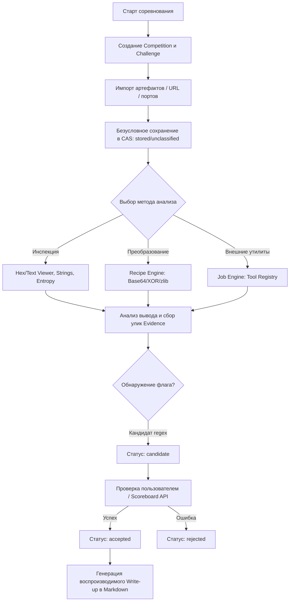

# 02. Анализ бизнес-требований: Платформа CTF Workspace (Jeopardy)

**Документ**: Бизнес-требования и спецификация сценариев использования (BA Specification)  
**Версия**: 1.0.0-mvp  
**Статус**: APPROVED  
**Связанные документы**: `01-product-discovery-manager.md`, `project_state.json`  

---

## 1. Введение и анализ требований PRD

### 1.1. Контекст трансформации
Продукт трансформируется из узкопрофильного Windows-форензик инструмента в модульную, воспроизводимую рабочую станцию участника Jeopardy CTF (категории: Web, Crypto, Reverse, Pwn, Forensics, Stego, OSINT, Misc). Ключевая ценность — устранение хаоса разрозненных терминалов, потерянных скриптов и несохраненных шагов через единое изолированное рабочее пространство со сквозной трассировкой доказательств.

### 1.2. Разрешение противоречий, неопределенностей и допущений
1. **Совместимость моделей DFIR и CTF**:
   * *Проблема*: Существующая схема БД базируется на понятии `Case` (инцидент). В CTF оперируют `Competition` и `Challenge`.
   * *Решение*: Аддитивная схема миграции. Существующие `Cases` мигрируют в сущности `Competition` типа `legacy_dfir`, а инциденты — в задачи `Challenge`. Старые таблицы сохраняются через представления (SQL Views), гарантируя нулевую потерю данных расследований.
2. **Жизненный цикл и статус флагов**:
   * *Проблема*: Автоматическое распознавание строк по регулярному выражению (например, `CTF{...}`) часто дает ложные срабатывания в бинарных данных или обфусцированном коде.
   * *Решение*: Найденное совпадение получает статус `candidate`. Переход в статус `accepted` происходит исключительно по явному действию пользователя (ручной ввод/подтверждение) или успешному ответу внешней платформы (CTFd API). При неверном сабмите флаг помечается как `rejected`.
3. **Обработка нераспознанных и поврежденных файлов**:
   * *Проблема*: Строгие парсеры forensic-артефактов падают при загрузке неизвестных или намеренно модифицированных файлов тасок.
   * *Решение*: Любой файл безусловно сохраняется в Content-Addressed Storage (CAS) со статусом `stored/unclassified`. Отсутствие сигнатурного парсера не блокирует анализ: файл сразу доступен в Hex/Text viewer, Strings и Recipe engine.
4. **Изоляция и завершение зависших процессов**:
   * *Проблема*: CTF-инструменты часто зависают, уходят в бесконечные циклы или форкают дочерние процессы.
   * *Решение*: Запуск строго через типизированные аргументы (`argv` без вызова shell-оболочки). Завершение по таймауту или кнопке Stop выполняет честное уничтожение всего дерева процессов (`taskkill /T /F` на Windows, `kill -- -PID` на Linux/Unix).
5. **Маскирование секретов и конфиденциальности**:
   * *Проблема*: Токены доступа к CTFd, пароли к сервисам и приватные ключи могут утечь в открытые write-up или логи.
   * *Решение*: Автоматическая санитизация: значения полей с секретами заменяются на плейсхолдеры `[REDACTED:token_name]` в логах выполнения и черновиках отчетов.

---

## 2. Персоны пользователей и ролевая модель

### 2.1. Пользовательские персоны
* **Персона 1: Алекс «Pwn & Rev Ninja» (Senior CTF Player)**:
  * *Потребности*: Быстрый запуск бинарников в изолированном окружении, анализ PE/ELF заголовков, дизассемблирование, интеграция с декомпилятором, запуск скриптов на Python (pwntools) с контролем сетевых портов.
  * *Боли*: Засорение хостовой системы недоверенными бинарниками, зависание эксплоитов, потеря точных payload между раундами.
* **Персона 2: Елена «DFIR & Forensics Specialist» (SecOps / CTF Forensics)**:
  * *Потребности*: Анализ сетевых дампов (PCAP/PCAPNG), журналов EVTX, дампов оперативной памяти (Volatility), извлечение скрытых данных из стеганографии.
  * *Боли*: Огромные объемы дампов (сотни мегабайт), падение интерфейса при просмотре сырых байтов, отсутствие таймлайна событий.
* **Персона 3: Дмитрий «Crypto & Web Explorer» (Junior/Mid CTF Player, Студент ИБ)**:
  * *Потребности*: Быстрое декодирование цепочек (Base64 -> XOR -> URL -> zlib), работа с HTTP запросами (Repeater), ведение заметок и автоматическая сборка воспроизводимого Write-up для команды.
  * *Боли*: Рутинное копирование между 10 онлайн-инструментами (CyberChef, dcode), потеря контекста решения задачи через 2 часа после старта.

### 2.2. Ролевая модель системы
1. **User / Analyst (Оператор)**: Владелец рабочего пространства. Создает соревнования, ставит задачи, управляет артефактами, запускает инструменты, подтверждает флаги, экспортирует отчеты.
2. **Job Runner Engine (Локальный исполнитель)**: Изолированный бэкенд-сервис исполнения. Отвечает за контроль жизненного цикла внешних утилит, сбор stdout/stderr, мониторинг лимитов памяти/времени и отмену процессов.
3. **CAS & Storage Subsystem (Хранилище)**: Подсистема неизменяемого хранения артефактов на базе хэшей (BLAKE3/SHA-256) и транзакционная база метаданных SQLite.

---

## 3. Сквозные бизнес-процессы (Business Workflows)

### 3.1. BP-01: Создание соревнования и импорт задачи
1. Пользователь создает сущность `Competition` (название, даты, ссылка на платформу, формат флага по умолчанию, например `^flag\{[a-zA-Z0-9_\-]+\}$`).
2. В соревновании создается карточка `Challenge` (название, категория, описание, сетевой таргет `host:port`, ссылка на скачивание).
3. Пользователь загружает файлы задачи (архивы, бинарники, дампы).
4. Система вычисляет BLAKE3 и SHA-256, сохраняет файл в CAS, присваивает статус `stored/unclassified` и связывает с задачей.

### 3.2. BP-02: Исследование артефакта и запуск конвейера трансформаций
1. Пользователь открывает артефакт в рабочей области задачи.
2. Система подгружает метаданные и первые 64 КБ чанка для мгновенного отображения Hex/Text без блокировки интерфейса.
3. При необходимости распаковки архива запускается безопасный экстрактор с проверкой Zip-Slip и ограничением коэффициента сжатия.
4. Пользователь составляет цепочку преобразований (Recipe Pipeline: `URL Decode -> Base64 Decode -> XOR(key) -> Decompress`).
5. Результат каждого шага кешируется; итоговый результат может быть сохранен как производный артефакт (`derived_artifact`).

### 3.3. BP-03: Выполнение инструмента через Job Engine
1. Пользователь выбирает утилиту из каталога инструментов (Tool Registry).
2. UI генерирует строго типизированную форму аргументов; пользователь задает параметры без возможности прямой шелл-инъекции.
3. Job Engine запускает дочерний процесс, перехватывает потоки `stdout`/`stderr` и выводит их в реальном времени.
4. Пользователь может прервать операцию в любой момент (Stop -> `Process Tree Kill`).
5. По завершении статус задачи переходит в `completed`, `failed` или `cancelled`. Все сгенерированные файлы регистрируются в CAS.

### 3.4. BP-04: Управление гипотезами и валидация флагов
1. Пользователь фиксирует гипотезу в scratchpad задачи (например, «Lsb-стеганография в красном канале»).
2. При обнаружении строки, соответствующей паттерну флага, система регистрирует сущность `flag_candidate`.
3. Пользователь сверяет флаг с платформой соревнования или отправляет через интеграцию.
4. При успехе флаг переводится в `accepted`, задача помечается как решенная (`solved = true`), фиксируется время решения.

### 3.5. BP-05: Сборка и экспорт Write-up
1. Пользователь инициирует экспорт решения.
2. Система собирает хронологию: метаданные таски, оригинальные артефакты и их хэши, последовательность успешных рецептов, команды Job Engine, заметки и подтвержденный флаг.
3. Формируется единый структурированный документ в формате Markdown с сохранением скриптов воспроизведения решения.

---

## 4. Каталог Use Cases (UC-01 .. UC-08)

### UC-01: Создание соревнования и управление задачами
* **Основной актор**: CTF-игрок.
* **Предусловие**: Пользователь открыл приложение.
* **Основной поток**:
  1. Пользователь нажимает «Создать соревнование», вводит имя (`VolgaCTF 2026`), шаблон флага (`^volt\{.*\}$`).
  2. Внутри соревнования нажимает «Добавить задачу», указывает категорию (`Web`), имя (`CookieMonster`), очки (`150`), сетевой таргет (`http://10.10.1.5:8080`).
  3. Задача появляется в сетке категорий в статусе `in_progress`.
* **Постусловие**: Соревнование и задача сохранены в SQLite; рабочая директория задачи создана.

### UC-02: Прием и дедупликация произвольного артефакта в CAS
* **Основной актор**: CTF-игрок.
* **Предусловие**: Задача создана и открыта.
* **Основной поток**:
  1. Пользователь перетаскивает файл `dump.bin` (350 МБ) в окно задачи.
  2. Система вычисляет BLAKE3/SHA-256 хеши в фоновом потоке.
  3. Проверяется наличие хеша в CAS: если дубликат найден, создается ссылка `challenge_artifact` без дублирования байтов на диске.
  4. Если файл новый, тело пишется в CAS-хранилище, MIME-тип определяется эвристически или устанавливается в `application/octet-stream`.
  5. Артефакт получает статус `stored/unclassified`.
* **Постусловие**: Артефакт доступен в списке файлов задачи со статусом целостности.

### UC-03: Безопасное извлечение вложенных файлов из архива
* **Основной актор**: CTF-игрок.
* **Предусловие**: В задачу импортирован архив (`challenge.zip`).
* **Основной поток**:
  1. Пользователь выбирает действие «Распаковать архив».
  2. Система валидирует структуру архива: проверяет отсутствие относительных путей (`../`), абсолютных путей и символических ссылок на внешние каталоги.
  3. Система проверяет суммарный распакованный объем (лимит коэффициента 100:1, макс. 2 ГБ).
  4. Файлы распаковываются во внутреннюю папку задачи и регистрируются в CAS как производные артефакты с указанием родителя.
* **Альтернативный поток (Zip-Slip / Bomb)**: При обнаружении выхода за границы или превышении лимита распаковка немедленно прерывается с ошибкой `ARCHIVE_SECURITY_VIOLATION`.

### UC-04: Исследование бинарного артефакта в Hex/Text Viewer
* **Основной актор**: CTF-игрок.
* **Предусловие**: Артефакт сохранен в CAS.
* **Основной поток**:
  1. Пользователь открывает просмотрщик артефакта.
  2. Приложение загружает заголовочный чанк и график энтропии по 4-килобайтным блокам.
  3. При скроллинге подгружаются необходимые диапазоны байтов через виртуализированный список (без загрузки всего файла в память).
  4. Пользователь выполняет поиск подстроки или шестнадцатеричной последовательности.
  5. Найденные совпадения подсвечиваются с указанием точного hex-смещения (offset).
* **Постусловие**: Память UI остается стабильной ($\le 120$ МБ RAM при файле 500 МБ).

### UC-05: Конструирование и применение цепочки преобразований (Recipe)
* **Основной актор**: CTF-игрок.
* **Предусловие**: Пользователь выделил строку или выбрал артефакт.
* **Основной поток**:
  1. Пользователь добавляет операции в цепочку: `From Hex` -> `XOR(key=0x42)` -> `Gunzip`.
  2. Движок рецептов применяет шаги последовательно, отображая промежуточный превью-результат.
  3. В результирующем тексте срабатывает автоматический парсер регулярных выражений флага.
  4. Пользователь сохраняет рецепт в библиотеку задачи и регистрирует результат как новый артефакт.
* **Постусловие**: Рецепт сохранен в БД и доступен для воспроизведения в write-up.

### UC-06: Запуск внешнего инструмента с контролем жизненного цикла
* **Основной актор**: CTF-игрок.
* **Предусловие**: В Tool Registry зарегистрирован адаптер (например, `tshark` или `strings`).
* **Основной поток**:
  1. Пользователь выбирает инструмент и передает входной артефакт в виде параметра.
  2. Формируется изолированный массив параметров `[path, "-r", input_file, "-T", "json"]`.
  3. Job Engine запускает процесс, привязывает таймер таймаута (например, 120 сек) и начинает стриминг `stdout`.
  4. Пользователь наблюдает вывод в логе. При необходимости нажимает кнопку «Прервать».
  5. Job Engine посылает сигнал прерывания всему дереву дочерних процессов.
* **Постусловие**: Процессы остановлены, ресурсы освобождены, статус джоба зафиксирован (`completed` или `cancelled`).

### UC-07: Управление гипотезами и кандидатами на флаг
* **Основной актор**: CTF-игрок.
* **Предусловие**: Задача в процессе решения.
* **Основной поток**:
  1. Система при сканировании вывода джоба обнаруживает паттерн `flag{crypto_is_fun_2026}`.
  2. Появляется плашка кандидата флага со статусом `candidate` и ссылкой на исходный шаг/артефакт.
  3. Пользователь проверяет флаг на платформе CTF.
  4. Пользователь нажимает кнопку «Принять (Accepted)».
  5. Статус задачи обновляется на `Solved`, фиксируется время закрытия таски.
* **Альтернативный поток**: Пользователь нажимает «Отклонить (Rejected)» — кандидат помечается как ложное срабатывание и скрывается из активных.

### UC-08: Экспорт верифицированного Write-up
* **Основной актор**: CTF-игрок.
* **Предусловие**: Задача имеет подтвержденный флаг (`accepted`).
* **Основной поток**:
  1. Пользователь нажимает кнопку «Сгенерировать Write-up».
  2. Система генерирует документ Markdown, содержащий: метаданные задачи, список исходных файлов (с SHA-256), цепочку ключевых гипотез, выполненные рецепты преобразований, команды консоли и финальный флаг.
  3. Секретные токены и пароли автоматически заменяются на плейсхолдеры.
  4. Пользователь редактирует вводный комментарий и нажимает «Экспорт в .md».
* **Постусловие**: Файл write-up сохранен на диск и прикреплен к архиву соревнования.

---

## 5. Epics и User Stories для MVP (Фазы G0–G3)

### Epic EP-00: Baseline Stability, Migration & CAS Storage (Gate G0)

#### US-00.1: Аддитивная миграция базы данных и совместимость с DFIR
* **Как** исследователь безопасности, ранее использовавший платформу для расследований,
* **Я хочу**, чтобы при обновлении схемы БД мои существующие дела и артефакты автоматически стали доступны в новом CTF-воркспейсе,
* **Для того чтобы** не потерять исторические данные расследований и наработки.
* **Критерии приемки (Given-When-Then)**:
  * **Given**: База данных SQLite предыдущей версии с таблицами `cases`, `evidence`, `observations`.
  * **When**: Приложение запускается с новым кодом миграции схемы.
  * **Then**: Создается резервная копия БД `app.db.bak`, применяются аддитивные миграции (добавление таблиц `competitions`, `challenges`, `flag_candidates`), создаются совместимые представления (SQL Views), и ни одна старая запись не удаляется.

#### US-00.2: Универсальный Ingestion и отказоустойчивое сохранение в CAS
* **Как** CTF-игрок,
* **Я хочу** загружать в задачу файлы любого формата и состояния целостности,
* **Для того чтобы** они гарантированно сохранялись в хранилище без падений парсера.
* **Критерии приемки**:
  * **Given**: Поврежденный или нестандартный бинарный файл `corrupted.dat` размером 100 МБ.
  * **When**: Пользователь импортирует файл в карточку задачи.
  * **Then**: Файл сохраняется в CAS с вычислением хэшей BLAKE3 и SHA-256, получает статус `stored/unclassified`, и в UI отображается карточка файла с возможностью открыть Hex-просмотрщик.

---

### Epic EP-01: CTF Workspace & Challenge Hierarchy (Gate G1)

#### US-01.1: Управление сущностями Competition и Challenge
* **Как** капитан или сольный игрок CTF,
* **Я хочу** организовывать задачи по соревнованиям, категориям и уровню сложности,
* **Для того чтобы** структурированно вести командную или индивидуальную работу.
* **Критерии приемки**:
  * **Given**: Открытый раздел соревнований в приложении.
  * **When**: Пользователь создает соревнование с указанием названия и регулярного выражения флага (`^CTF\{.*\}$`), а затем добавляет задачу категории `Crypto`.
  * **Then**: В БД создаются связанные записи, карточка задачи отображается в соответствующей колонке категорий, а контекст файлов задачи изолирован от других задач.

#### US-01.2: Хранение сетевых таргетов и учетных данных задачи
* **Как** CTF-игрок,
* **Я хочу** фиксировать в свойствах задачи хост, порт, URL и временные учетные данные,
* **Для того чтобы** быстро подставлять их в команды запуска и не искать в чатах.
* **Критерии приемки**:
  * **Given**: Задача категории `Web` или `Pwn`.
  * **When**: Пользователь вводит сетевой таргет `nc ctf.example.com 1337` или `http://target.ctf:8000` и тестовые креды `user:pass`.
  * **Then**: Данные сохраняются в контексте задачи, валидируются на синтаксис хост/порт и становятся доступными в виде переменных подстановки (`{{target.host}}`, `{{target.port}}`) для инструментов.

---

### Epic EP-02: Job Engine & Tool Registry (Gate G2)

#### US-02.1: Безопасный запуск CLI-инструментов через структурированный массив аргументов
* **Как** исследователь безопасности,
* **Я хочу** запускать внешние CLI-утилиты через типизированный адаптер,
* **Для того чтобы** исключить риск случайной или намеренной командной инъекции (Command Injection).
* **Критерии приемки**:
  * **Given**: Зарегистрированный в Tool Registry инструмент `strings` с аргументами.
  * **When**: Пользователь передает имя файла, содержащее пробелы и спецсимволы (например, `flag; rm -rf.bin`).
  * **Then**: Бэкенд вызывает исполняемый файл напрямую с передачей аргументов массивом `["-n", "8", "flag; rm -rf.bin"]` без участия системной командной строки (`sh -c` / `cmd.exe`).

#### US-02.2: Принудительное прерывание дерева процессов (Process Tree Kill)
* **Как** CTF-игрок,
* **Я хочу** остановить зависший фаззер или инструмент анализа одной кнопкой,
* **Для того чтобы** освободить процессор и память рабочей станции.
* **Критерии приемки**:
  * **Given**: Запущенная задача `job-102`, породившая несколько дочерних процессов.
  * **When**: Пользователь нажимает «Прервать» или истекает установленный таймаут выполнения (например, 60 с).
  * **Then**: Job Engine посылает сигнал принудительного завершения всему дереву процессов (`taskkill /T /F` на Windows или `SIGKILL` группе процессов на Linux), статус джоба меняется на `cancelled`, а UI немедленно разблокируется.

#### US-02.3: Маскирование чувствительных данных в журналах выполнения
* **Как** участник CTF, заботящийся о безопасности своих учетных записей,
* **Я хочу**, чтобы мои персональные API-ключи и пароли к инфраструктуре маскировались в логах,
* **Для того чтобы** они случайно не попали в публичный write-up или демонстрацию экрана.
* **Критерии приемки**:
  * **Given**: Задача с заданным токеном авторизации `CTF_AUTH_BEARER=secret_token_12345`.
  * **When**: Запущенный скрипт выводит строку авторизации в `stdout` или `stderr`.
  * **Then**: Система перед сохранением в журнал и отображением в UI заменяет значение токена на `[REDACTED:CTF_AUTH_BEARER]`.

---

### Epic EP-03: Common Analysis, Recipes & Flag Lifecycle (Gate G3 - MVP)

#### US-03.1: Высокопроизводительный виртуализированный Hex и Text просмотрщик
* **Как** аналитик реверса и форензики,
* **Я хочу** просматривать и искать данные в файлах размером до 500 МБ без лагов интерфейса,
* **Для того чтобы** исследовать структуры данных и находить скрытые маркеры.
* **Критерии приемки**:
  * **Given**: Артефакт размером 450 МБ в CAS.
  * **When**: Пользователь открывает файл в Hex Viewer и быстро прокручивает его до середины.
  * **Then**: Время отрисовки любого экрана составляет менее 50 мс, данные загружаются потоковыми блоками, общее потребление оперативной памяти процессом UI не превышает 150 МБ.

#### US-03.2: Интерактивный конвейер рецептов трансформаций данных
* **Как** решатель криптографических и стеганографических задач,
* **Я хочу** комбинировать функции декодирования и распаковки в интерактивный конвейер,
* **Для того чтобы** последовательно снимать слои обфускации без ручного написания скриптов.
* **Критерии приемки**:
  * **Given**: Закодированная строка `789c0bc9c82c5600a2448592d4e21285e292a2ccbc7400494b0789`.
  * **When**: Пользователь применяет цепочку рецепта: `From Hex` -> `Zlib Inflate`.
  * **Then**: В окне предварительного просмотра мгновенно отображается раскодированный текст, а шаг рецепта сохраняется в историю задачи.

#### US-03.3: Безопасная распаковка архивов с защитой от атак
* **Как** пользователь платформы,
* **Я хочу** безопасно распаковывать скачанные архивы задач прямо в рабочее пространство,
* **Для того чтобы** не подвергать опасности хостовую систему вредоносными архивами.
* **Критерии приемки**:
  * **Given**: Загруженный ZIP-архив, содержащий файл с путем `../../../../Windows/System32/evil.dll` или бомбу декомпрессии (42.zip).
  * **When**: Пользователь нажимает «Извлечь файлы».
  * **Then**: Извлечение блокируется с кодом ошибки `SECURITY_PATH_TRAVERSAL` или `DECOMPRESSION_RATIO_EXCEEDED`, ни один файл вне каталога задачи не создается, а инцидент логируется.

#### US-03.4: Жизненный цикл обнаружения и валидации флага
* **Как** CTF-игрок,
* **Я хочу**, чтобы система находила кандидатов в флаги и позволяла подтвердить решение,
* **Для того чтобы** статус таски автоматически обновлялся и формировался итог решения.
* **Критерии приемки**:
  * **Given**: Текст вывода инструмента, содержащий строку `congrats: CTF{s1mple_fl4g_v4lue}`.
  * **When**: Фоновый анализатор сопоставляет текст с шаблоном флага соревнования.
  * **Then**: В интерфейсе создается карточка `flag_candidate` со статусом `candidate`. При нажатии пользователем кнопки «Принять» статус меняется на `accepted`, задача помечается флагом `solved=true`, и фиксируется время решения.

---

## 6. Бизнес-правила (Business Rules)

* **BR-01 (Flag Verification Lifecycle)**: Строка, совпадающая с регулярным выражением флага, является исключительно `candidate`. Флаг никогда не помечается как `accepted` автоматически без подтверждения пользователя или положительного ответа внешнего API платформы.
* **BR-02 (WORM CAS Storage)**: Все оригинальные артефакты неизменяемы (Write Once, Read Many). Любое преобразование порождает новый производный артефакт (`derived_artifact`) с явной ссылкой на родителя и идентификатор шага рецепта.
* **BR-03 (Unclassified File Tolerance)**: Система обязана успешно сохранять любые файлы, даже если для них нет парсера или они повреждены. Статус по умолчанию — `stored/unclassified`.
* **BR-04 (Sanitized Command Invocation)**: Запрещено выполнять команды через интерполяцию строк в shell (`sh -c "$CMD"`). Вызов внешних процессов допустим только через строго типизированные списки аргументов `Vec<String>`.
* **BR-05 (Secret Masking)**: Пароли, токены авторизации и конфиденциальные параметры окружения должны маскироваться в логах выполнения и черновиках write-up шаблоном `[REDACTED:<KEY>]`.
* **BR-06 (Archive Ingestion Safety Limits)**:
  * Максимальный коэффициент сжатия: 100:1.
  * Максимальный суммарный объем распакованных данных за одну операцию: 2 ГБ.
  * Любые относительные сегменты путей (`..`), абсолютные пути (`/`, `C:\`) и спецсимволы в именах файлов внутри архивов принудительно санируются или блокируются.

---

## 7. Граничные условия, сценарии ошибок и системные ограничения

### 7.1. Обработка ошибок (Error Matrix)

| Код ошибки | Условие возникновения | Реакция системы | Действие для пользователя |
|---|---|---|---|
| `ERR_CAS_DUP_HASH` | Загрузка файла с уже существующим хэшем BLAKE3 | Повторное сохранение байтов не выполняется; создается связь с задачей | Уведомление: «Файл уже присутствует в хранилище, добавлена ссылка» |
| `ERR_JOB_TIMEOUT` | Инструмент превысил лимит времени выполнения | Принудительное завершение дерева процессов (`kill tree`), сбор частичного stdout/stderr | Статус джоба `timed_out`, предложение увеличить лимит времени |
| `ERR_PROC_OOM` | Инструмент превысил лимит выделенной памяти | Прерывание процесса с фиксацией кода ошибки ОС | Статус джоба `failed_oom`, лог содержит зафиксированный пик памяти |
| `ERR_ARCHIVE_SLIP` | Архив содержит пути с выходом за целевой каталог | Полная отмена распаковки, удаление временных файлов | Алерт безопасности: «Обнаружена попытка Path Traversal в архиве» |
| `ERR_REGEX_SYNTAX` | Пользователь ввел некорректный синтаксис regex | Валидация на клиенте перед сохранением шаблона | Поле подсвечивается красным с описанием синтаксической ошибки |

### 7.2. Системные ограничения
1. **Объем отображаемых файлов**: Просмотрщик файлов поддерживает непрерывное отображение через виртуализацию для файлов размером до 500 МБ. Файлы более 500 МБ открываются только в режиме блочной навигации или через CLI-инструменты.
2. **Параллелизм джобов**: По умолчанию количество одновременно запущенных фоновых CLI-инструментов на хосте ограничено количеством физических ядер процессора ($N$) во избежание деградации рабочей станции.
3. **Размер Write-up**: Результирующий Markdown документ с встроенными выводами шагов и метаданными не должен превышать 10 МБ (крупные логи сохраняются внешними ссылками на CAS).
