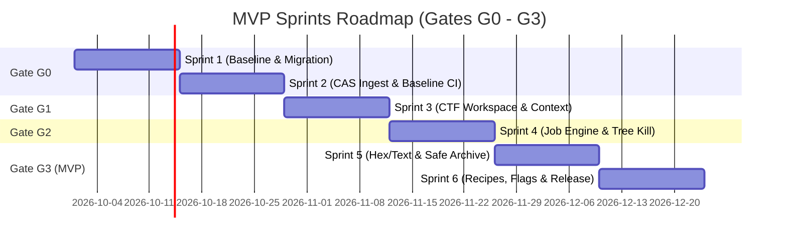
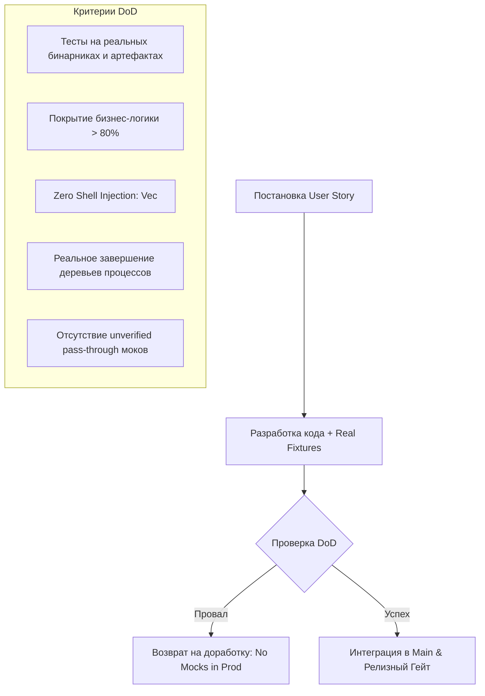

# 03. Стратегия продукта, Product Backlog и Sprint-план: CTF Unified Workspace Platform

**Документ**: Product Development Strategy, Backlog & Release Roadmap (PM Specification)  
**Версия**: 1.0.0-draft  
**Менеджер продукта**: Роль 03 (Product Manager)  
**Статус**: APPROVED  
**Связанные документы**: `01-product-discovery-manager.md`, `02-business-analyst.md`, `project_state.json`

---

## 1. Продуктовая стратегия и релизные горизонты

Платформа эволюционирует от форензик-инструмента расследования инцидентов к модульному рабочему пространству участника Jeopardy CTF с неизменяемым хранилищем улик, воспроизводимым конвейером трансформаций и безопасным запуском инструментов.


### 1.1. Матрица релизных фаз

| Фаза | Гейты | Ключевые возможности | Критерий готовности фазы |
|---|---|---|---|
| **MVP** | G0–G3 | Неизменяемое CAS (BLAKE3), аддитивная миграция DFIR, иерархия соревнований/задач, Job Engine с `taskkill /T`, виртуализированный Hex/Text до 500 МБ, Recipe Engine (Base64/Hex/XOR/zlib), защита архивов (Zip-Slip/Bomb), статус флага `candidate` $\to$ `accepted`. | Решение базовой Jeopardy-задачи (Crypto/Forensics) от импорта файла до верификации флага без утечек памяти и зависаний. |
| **v1.0** | G4–G6 | Анализ сетевых дампов PCAP/PCAPNG, фильтры EVTX, интеграция Volatility 3, стего-анализ (RGB битовые плоскости, спектрограммы), Web Repeater & cURL импорт, Crypto Solver (модулярная арифметика, классические шифры, Python/Sage). | Полный цикл решения соревновательных блоков категорий Forensics, Stego, Web и Crypto. |
| **v2.0** | G7–G10 | Парсер PE/ELF заголовков, интеграция внешних декомпиляторов (Ghidra/IDA), Pwn Sandbox (WSL2/контейнеры, pwntools runner), граф связей улик OSINT, автоматический генератор воспроизводимых Write-up в Markdown. | Комплексная автономная среда для соревнований международного уровня (Reverse, Pwn, OSINT). |

---

## 2. Полный Product Backlog

Оценка трудоемкости в Story Points (SP) по шкале Фибоначчи: 1, 2, 3, 5, 8, 13. Суммарный объем MVP: **118 SP**.

### Эпики MVP (G0 — G3)

| ID | Название эпика | Описание | Приоритет | SP | Гейт |
|---|---|---|---|---|---|
| **EP-00** | Baseline Stability & CAS Storage | Аудит БД, аддитивные миграции DFIR $\to$ CTF, CAS WORM-хранилище, статус `stored/unclassified`. | **Must** | 21 | G0 |
| **EP-01** | CTF Workspace & Hierarchy | Соревнования, задачи, сетевые координаты, изоляция контекстов, санитизация секретов. | **Must** | 21 | G1 |
| **EP-02** | Job Engine & Tool Registry | Диспетчер процессов с типизированным `argv`, streaming stdout/stderr, Process Tree Kill, маскирование токенов. | **Must** | 34 | G2 |
| **EP-03** | Common Analysis, Recipes & Flags | Виртуализированный Hex/Text (до 500 МБ), безопасная распаковка ZIP, конвейер рецептов, жизненный цикл флага. | **Must** | 42 | G3 |

### Эпики последующих версий (v1.0 — v2.0)

| ID | Название эпика | Описание | Приоритет | SP | Релиз |
|---|---|---|---|---|---|
| **EP-04** | Forensics & Stego Workbench | Парсер PCAP/PCAPNG, сессии TCP/HTTP, таймлайн EVTX, адаптер Volatility 3, битовые плоскости LSB, спектрограммы. | **Should** | 55 | v1.0 (G4) |
| **EP-05** | Web & Crypto Workbenches | Web HTTP Workbench, cURL импорт, cookie/header jar, diff ответов, модульная арифметика, XOR-брутфорс, Python runner. | **Should** | 55 | v1.0 (G5-G6) |
| **EP-06** | Reverse & Pwn Sandbox | Инспектор PE/ELF, интеграция декомпиляторов, runner pwntools в disposable-окружении (WSL2/контейнер), анализ crash dumps. | **Could** | 89 | v2.0 (G7-G8) |
| **EP-07** | OSINT & Write-up Generator | Граф улик, сбор метаданных, воспроизводимый экспорт Write-up в Markdown со всеми хэшами, рецептами и логами. | **Should** | 34 | v2.0 (G9-G10) |

---

### Детализация пользовательских историй MVP (EP-00 — EP-03)

```
[EP-00] Baseline Stability, Migration & CAS Storage (21 SP)
├── FEAT-00.1: Аддитивная миграция данных
│   ├── US-00.1.1: Автоматический бэкап и аддитивная схема миграции SQLite (M, 5 SP)
│   └── US-00.1.2: Создание SQL Views для совместимости со старыми DFIR Cases (M, 3 SP)
└── FEAT-00.2: Content-Addressed Storage (CAS)
    ├── US-00.2.1: WORM CAS хранилище на базе BLAKE3 и SHA-256 (M, 8 SP)
    └── US-00.2.2: Отказоустойчивый импорт файлов со статусом stored/unclassified (M, 5 SP)

[EP-01] CTF Workspace & Challenge Hierarchy (21 SP)
├── FEAT-01.1: Управление структурой CTF
│   ├── US-01.1.1: CRUD соревнований (Competition) и задач (Challenge) с категориями (M, 8 SP)
│   └── US-01.1.2: Изолированное хранение артефактов и заметок по задачам (M, 5 SP)
└── FEAT-01.2: Сетевые координаты и секреты
    ├── US-01.2.1: Валидация и парсинг сетевых таргетов (host/port/URL) (M, 3 SP)
    └── US-01.2.2: Хранилище контекстных переменных и шаблонная подстановка (M, 5 SP)

[EP-02] Job Engine & Tool Registry (34 SP)
├── FEAT-02.1: Tool Registry & Command Sanitization
│   ├── US-02.1.1: Декларативный реестр инструментов (JSON/YAML манифесты) (M, 5 SP)
│   └── US-02.1.2: Безопасный запуск процессов строго через массив аргументов Vec<String> (M, 8 SP)
├── FEAT-02.2: Жизненный цикл процессов
│   ├── US-02.2.1: Потоковый сбор и буферизация stdout/stderr в реальном времени (M, 8 SP)
│   └── US-02.2.2: Принудительное завершение дерева процессов (Process Tree Kill) (M, 8 SP)
└── FEAT-02.3: Безопасность выполнения
    └── US-02.3.1: Маскирование чувствительных данных [REDACTED:<KEY>] в логах (S, 5 SP)

[EP-03] Common Analysis, Recipes & Flag Lifecycle (42 SP)
├── FEAT-03.1: Просмотр и навигация по артефактам
│   ├── US-03.1.1: Виртуализированный Hex/Text просмотрщик для файлов до 500 МБ (M, 8 SP)
│   ├── US-03.1.2: Потоковый расчет энтропии блоками по 4 КБ (S, 5 SP)
│   └── US-03.1.3: Поиск подстрок и шестнадцатеричных последовательностей со смещениями (M, 5 SP)
├── FEAT-03.2: Безопасность архивов
│   └── US-03.2.1: Безопасный распаковщик архивов с защитой от Zip-Slip и Zip-Bomb (M, 8 SP)
├── FEAT-03.3: Recipe Transformation Engine
│   ├── US-03.3.1: Модульный конвейер операций (Hex, Base64, URL, XOR, zlib) (M, 8 SP)
│   └── US-03.3.2: Сохранение результатов трансформации как производных артефактов (M, 3 SP)
└── FEAT-03.4: Жизненный цикл флага
    └── US-03.4.1: Распознавание кандидатов по regex и ручной переход candidate -> accepted/rejected (M, 5 SP)
```

---

## 3. План спринтов: Спринты 1–6 (Roadmap до MVP)

Длительность спринта: 2 недели. Расчетная скорость команды (Velocity): 18–22 SP на спринт.



### Спринт 1: Аудит БД и миграция DFIR $\to$ CTF
* **Цель спринта**: Обеспечить целостность данных предыдущей версии, создать резервную копию и применить аддитивную схему БД без удаления исторических таблиц.
* **Состав работ**:
  * `US-00.1.1`: Механизм snapshot-бэкапа БД перед запуском миграций (5 SP).
  * `US-00.1.2`: Аддитивные миграции: таблицы `competitions`, `challenges`, `challenge_artifacts`, `flag_candidates`, представления `legacy_cases_view` (3 SP).
  * `US-00.2.1` (Часть 1): Структура WORM CAS хранилища на диске, хеширование BLAKE3 (8 SP).
* **Суммарная оценка**: **16 SP**.
* **Результат (Deliverable)**: Миграция выполняется автоматически на тестовых базах DFIR; целостность 100% существующих записей подтверждена тестами.

### Спринт 2: Отказоустойчивый Ingest в CAS и стабилизация CI [GATE G0]
* **Цель спринта**: Реализовать сохранение произвольных файлов любого размера в CAS со статусом `stored/unclassified`; стабилизировать тестовый baseline.
* **Состав работ**:
  * `US-00.2.1` (Часть 2): Дедупликация файлов по хэшу SHA-256/BLAKE3 при импорте (5 SP).
  * `US-00.2.2`: Фоновый импорт поврежденных и неизвестных бинарников без падения приложения (5 SP).
  * Стабилизация CI пайплайна, устранение flakiness в существующих интеграционных тестах (5 SP).
  * Проведение контрольного аудита Gate G0 (3 SP).
* **Суммарная оценка**: **18 SP**.
* **Результат (Deliverable)**: Файлы любого формата импортируются в CAS; пройден Gate G0.

### Спринт 3: CTF Workspace, иерархия и переменные окружения [GATE G1]
* **Цель спринта**: Реализовать доменную модель CTF (Соревнование $\to$ Задачи $\to$ Артефакты), хранение таргетов и шаблонные переменные с защитой секретов.
* **Состав работ**:
  * `US-01.1.1`: CRUD интерфейс и IPC-команды для Competitions и Challenges, фильтрация по категориям (8 SP).
  * `US-01.1.2`: Привязка CAS-артефактов к задачам, изоляция рабочих каталогов тасок (5 SP).
  * `US-01.2.1`: Парсер и валидатор сетевых таргетов (`host:port`, URL, `nc target port`) (3 SP).
  * `US-01.2.2`: Менеджер контекстных переменных задачи (`{{target.host}}`, `{{target.port}}`) (5 SP).
* **Суммарная оценка**: **21 SP**.
* **Результат (Deliverable)**: Пользователь создает соревнование, добавляет задачи разных категорий, задает таргеты и видит изолированные файлы; пройден Gate G1.

### Спринт 4: Job Engine, Tool Registry и Process Tree Kill [GATE G2]
* **Цель спринта**: Создать безопасный исполнитель CLI-утилит без shell-инъекций, с перехватом stdout/stderr и мгновенным снятием дерева процессов.
* **Состав работ**:
  * `US-02.1.1`: Реестр инструментов (Tool Registry) с JSON-манифестами параметров (5 SP).
  * `US-02.1.2`: Исполнитель процессов через прямой вызов системного API с `argv: Vec<String>` без shell (8 SP).
  * `US-02.2.1`: Асинхронный сбор stdout/stderr чанками в реальном времени с буферизацией (8 SP).
  * `US-02.2.2`: Принудительное уничтожение дерева процессов (`taskkill /T /F` на Win, cgroups/SIGKILL на Linux) (8 SP).
  * `US-02.3.1`: Детектор и маскирование секретов `[REDACTED:<KEY>]` в потоках вывода (5 SP).
* **Суммарная оценка**: **34 SP** (фокус всей команды разработчиков ядра).
* **Результат (Deliverable)**: Запуск утилит (`strings`, `file`, сетевые сканеры) с гарантированной отменой по кнопке/таймауту без зомби-процессов; пройден Gate G2.

### Спринт 5: Hex/Text Viewer до 500 МБ и безопасная распаковка ZIP
* **Цель спринта**: Разработать высокопроизводительный виртуализированный просмотрщик файлов и безопасный распаковщик архивов.
* **Состав работ**:
  * `US-03.1.1`: Виртуализированный компонент Hex/Text просмотра с подгрузкой 64 КБ чанков по требованию (8 SP).
  * `US-03.1.2`: Блочный расчет энтропии артефакта (4 КБ окна) для быстрой визуализации шифрования/сжатия (5 SP).
  * `US-03.1.3`: Быстрый поиск байтовых и строковых паттернов со списком смещений (5 SP).
  * `US-03.2.1`: Безопасный модуль распаковки ZIP с проверкой Zip-Slip (`../`), проверкой симлинков и лимитом декомпрессии 100:1 (8 SP).
* **Суммарная оценка**: **26 SP**.
* **Результат (Deliverable)**: Мгновенное открытие бинарников до 500 МБ без зависания UI; безопасная обработка вредоносных тестовых архивов с блокировкой атак.

### Спринт 6: Recipe Engine, Жизненный цикл флага и MVP Релиз [GATE G3]
* **Цель спринта**: Реализовать конвейер преобразований (Recipe Engine), строгий жизненный цикл флагов и интеграционное тестирование всего сценария MVP.
* **Состав работ**:
  * `US-03.3.1`: Модульный движок рецептов (Hex Decode, Base64, URL Decode, XOR single-byte, zlib inflate) (8 SP).
  * `US-03.3.2`: Автоматическая фиксация шагов рецепта и сохранение выходных данных как `derived_artifact` (3 SP).
  * `US-03.4.1`: Автопоиск флагов по regex соревнования $\to$ регистрация `candidate` $\to$ явное подтверждение `accepted`/`rejected` (5 SP).
  * Комплексное сквозное E2E тестирование сценария решения задачи от импорта до флага (5 SP).
* **Суммарная оценка**: **21 SP**.
* **Результат (Deliverable)**: Полнофункциональный MVP релиз; пройден Gate G3.

---

## 4. Критерии приемки контрольных гейтов (Quality Gates Framework)

Каждый гейт является блокирующим. Переход к следующему этапу запрещен при наличии хотя бы одного невыполненного критерия.

### Gate G0: Baseline Stability & Storage Integrity
- [ ] Существующая БД `soc-dfir-platform` успешно мигрирует на новую схему; создается резервная копия файла БД.
- [ ] Ни одна таблица или колонка данных DFIR не удалена; для устаревших структур созданы совместимые SQL Views.
- [ ] CAS-хранилище сохраняет файлы в режиме WORM; контрольные суммы BLAKE3 и SHA-256 совпадают с системными утилитами.
- [ ] Загрузка поврежденных бинарных файлов завершается со статусом `stored/unclassified` без падения бэкенда или зависания UI.
- [ ] Все существующие unit/integration тесты проходят со 100% успехом (green baseline).

### Gate G1: CTF Workspace & Context Isolation
- [ ] Поддерживается полный цикл создания: `Competition` $\to$ `Challenge` $\to$ `Artifact` $\to$ `Notes`.
- [ ] Файлы и заметки одной задачи физически и логически изолированы от других задач соревнования.
- [ ] Корректно валидируются сетевые координаты (IPv4, IPv6, FQDN, порты 1–65535, протоколы `http/https/nc`).
- [ ] Контекстные переменные подставляются в параметры команд без искажения спецсимволов.
- [ ] Секретные значения маскируются в пользовательском интерфейсе и конфигурационных файлах.

### Gate G2: Job Engine, Tool Registry & Process Safety
- [ ] Реестр инструментов валидирует входные параметры согласно строгой JSON-схеме манифестов.
- [ ] Запуск процессов производится **исключительно** через типизированный список `argv: Vec<String>`. Использование командных оболочек (`cmd.exe /c`, `sh -c`) в коде исполнителя строго запрещено.
- [ ] Нажатие кнопки «Прервать» или истечение таймаута гарантированно завершает весь процесс и всех его потомков (`taskkill /T /F` на Windows) за время $\le 500$ мс.
- [ ] Потоки stdout и stderr буферизуются без утечки памяти при непрерывном выводе более 10 МБ текста.
- [ ] Токены и секреты из контекста задачи гарантированно заменяются на `[REDACTED:<KEY>]` во всех логах выполнения.

### Gate G3: MVP Release — Analysis, Recipes & Flag Lifecycle
- [ ] Hex/Text просмотрщик открывает файл размером 500 МБ менее чем за 500 мс; потребление памяти UI процессом не превышает 150 МБ RAM при активном скроллинге.
- [ ] Safe Archive Extractor успешно прерывает распаковку и выдает ошибку безопасности при обнаружении Zip-Slip путей (`../`), символических ссылок на внешние файлы и архивов с коэффициентом сжатия $>100:1$.
- [ ] Recipe Engine последовательно выполняет цепочку из не менее чем 4 операций (например: `From Hex` $\to$ `XOR` $\to$ `Base64` $\to$ `Zlib`) и сохраняет результат в CAS.
- [ ] Строка флага, найденная поиском или регулярным выражением, создается **только** со статусом `candidate`.
- [ ] Переход флага в статус `accepted` происходит **исключительно** по явному подтверждению пользователя или успешному ответу API соревнований. При отклонении статус меняется на `rejected`.

---

## 5. Definition of Done (DoD) и политика верификации

Для предотвращения ложноположительных прохождений тестов, нерабочих моков и иллюзии готовности внедряется единый строгий стандарт Definition of Done.



### 5.1. Базовые критерии Definition of Done
Каждая пользовательская история считается завершенной (**Done**) только при одновременном выполнении следующих условий:
1. **Соответствие критериям приемки**: Все сценарии `Given-When-Then`, описанные в BA-спецификации, проверены и пройдены.
2. **Качество кода и статическая проверка**: Код скомпилирован без `warning` в строгом режиме линтера (`cargo clippy -- -D warnings`), форматирован по стандарту (`rustfmt`).
3. **Тестовое покрытие**:
   * Unit-тесты покрывают не менее 80% бизнес-логики и модулей трансформации данных.
   * Интеграционные тесты проверяют взаимодействие IPC, базы данных SQLite и файловой системы.
4. **Безопасность вызовов**: Статический анализ гарантирует отсутствие конкатенации строк при запуске системных команд (`Command::new` использует только `.args(&[...])`).
5. **Целостность данных**: Аддитивные миграции протестированы на копии реальной базы данных со старыми делами; выполнена проверка сохранения всех хэшей и связей.
6. **Документирование API**: Все новые структуры данных, IPC-события и методы имеют актуальные комментарии и обновлены в документации контрактов.

### 5.2. Строгая политика против фальшивых моков (Anti-Mock & Real Fixtures Policy)
* **Запрет моков в релизном коде**: Запрещено внедрять заглушки, эмулирующие успешный ответ без выполнения реальной работы (hardcoded success).
* **Тестирование на реальных артефактах**:
  * Тесты парсеров и CAS обязаны использовать реальные файлы-фикстуры (бинарники ELF/PE, реальные поврежденные файлы, валидные и невалидные zip-архивы).
  * Тест распаковки архива обязан проверять реальный сгенерированный Zip-Slip архив (`zip-slip.zip`) и реальный gzip-bomb файл.
  * Тест завершения процессов обязан запускать реальный дочерний бинарник, форкающий дочерние процессы (дерево процессов), и проверять их отсутствие в таблице процессов ОС после вызова kill.
* **Изоляция моков**: Моки допустимы исключительно в изолированных модульных тестах для симуляции сбоев внешнего оборудования (например, ошибка записи на диск при переполнении файловой системы).

---

## 6. Метрики производительности, емкости и рисков

### 6.1. Производительность (Performance KPIs)
* Время холодного запуска приложения: $\le 1.5$ с.
* Время открытия артефакта размером 500 МБ в Hex-просмотрщике: $\le 500$ мс (первый экран).
* Скорость потокового расчета хэшей BLAKE3 / SHA-256: $\ge 250$ МБ/с на современных NVMe накопителях.
* Время принудительного снятия дерева процессов (Process Tree Kill): $\le 500$ мс.
* Пиковое потребление оперативной памяти UI при просмотре больших файлов: $\le 150$ МБ.

### 6.2. Управление рисками MVP

| Риск | Вероятность | Влияние | Стратегия смягчения |
|---|---|---|---|
| Повреждение пользовательских данных DFIR при миграции SQLite | Низкая | Критическое | Обязательное создание snapshot-бэкапа `.db.bak` до старта транзакции; использование только `ALTER TABLE ADD COLUMN` и SQL Views. |
| Зависание интерфейса при большом потоке stdout от запущенного инструмента | Средняя | Высокое | Чанкование и троттлинг сообщений IPC (не чаще 60 кадров/сек), кольцевой буфер в памяти. |
| Утечка системных ресурсов из-за незавершенных процессов в фоне | Средняя | Высокое | Привязка каждого Job к Job Object на Windows / Process Group на Linux; завершение при выходе из приложения. |
| Нехватка времени на реализацию специализированных воркбенчей (Web/Pwn) | Высокая | Средняя | Строгий перенос категориальных воркбенчей в v1.0 и v2.0; фокус MVP исключительно на базовом исследовании и рецептах. |

---

## 7. Передача эстафеты следующей роли (Handover)

* **Текущая роль**: 03-product-manager (завершена).
* **Следующая роль**: **04-solution-architect**.
* **Входные данные для архитектора**:
  1. Данный документ `docs/it-company/03-product-manager.md` (Product Backlog, Sprint Plan, Gates G0–G3, DoD).
  2. Спецификация бизнес-анализа `docs/it-company/02-business-analyst.md` (Use Cases, бизнес-правила, обработка ошибок).
  3. Видение продукта `docs/it-company/01-product-discovery-manager.md`.
* **Задачи архитектора**: Разработать целевую системную архитектуру CTF Unified Workspace Platform (модули Rust crates, IPC-протокол, схема БД SQLite, интерфейс CAS, абстракция Job Engine Runner, интеграция изоляции процессов).
