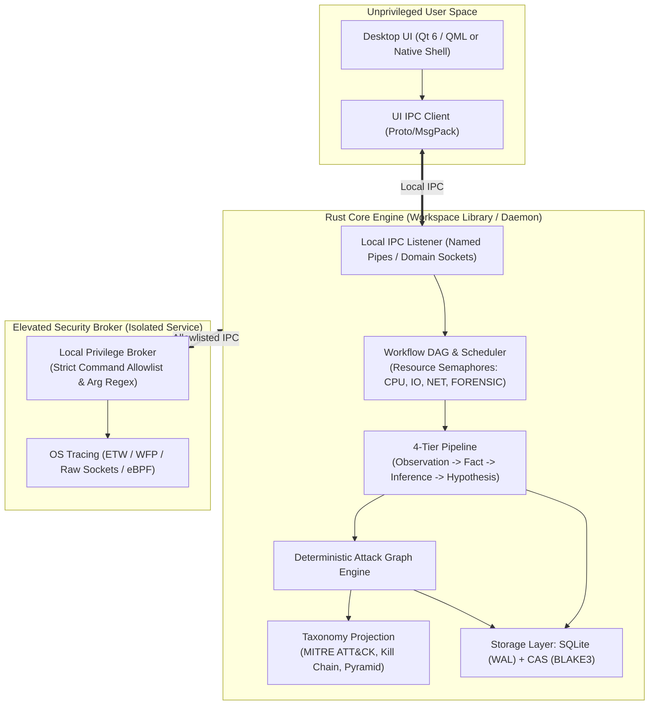

# 04. Solution Architecture Document: Blue Team Cyber Range & SOC/DFIR Platform

**Profile ID**: `PRF-04-SOLARCH`  
**Status**: `COMPLETED`  
**Input**: `docs/it-company/00-requirements-contract.md` & `D:\BlueTeam_CyberRange_TZ_v1.0.docx`

---

## 1. Architectural Style: Modular Workspace Monolith with Local Privilege Separation

The platform is designed as an offline-first, high-performance, deterministic modular system in Rust, split into independent domain crates within a single Cargo Workspace, coupled with a cross-platform desktop UI and an isolated Local Privilege Broker.



---

## 2. Bounded Contexts & Cargo Workspace Structure

```
soc-dfir-platform/
├── Cargo.toml                       # Workspace manifest
├── crates/
│   ├── core-domain/                 # Domain types: Observation, Fact, Entity, Graph, Taxonomy
│   ├── storage-cas/                 # Content-Addressed Storage (BLAKE3/SHA-256 CAS)
│   ├── storage-sqlite/              # Case DB, schema migrations, WAL queries
│   ├── workflow-dag/                # Task DAG, resource semaphores, cancellation tokens
│   ├── tool-adapters/               # Forensic parsers (EVTX, PCAP, Sysmon, Auditd)
│   ├── graph-engine/                # Deterministic graph builder & entity merging
│   ├── taxonomy-projection/         # MITRE ATT&CK, Cyber Kill Chain, Pyramid of Pain
│   ├── privilege-broker/            # Hardened elevated subprocess/broker
│   ├── engine-server/               # Local IPC server exposing Engine API
│   └── ctf-verifier/                # Cyber range challenge/flag evaluation engine
├── ui/                              # Cross-platform Desktop UI
├── docs/it-company/                 # Complete development artifacts & contracts
└── tests/                           # Integration and regression test suites
```

---

## 3. Architecture Decision Records (ADRs)

### ADR-001: Language Selection — Rust for Core Engine
- **Context**: Forensic data processing handles megabytes/gigabytes of untrusted binary inputs (corrupted EVTX, malicious PCAP, malformed headers).
- **Decision**: Rust is selected for 100% of the core engine, parsers, and broker.
- **Consequences**: Memory safety without garbage collection overhead, guaranteed thread safety (Send/Sync), zero-cost abstractions, sub-millisecond query performance.

### ADR-002: Deterministic Rule Engine vs. Probabilistic LLMs
- **Context**: In digital forensics and court testimony, results must be reproducible and legally defensible.
- **Decision**: Rule-based correlation and deterministic graph traversal are strictly enforced. LLM-planners and autonomous generative agents are excluded.
- **Consequences**: Identical input data produces bit-identical graph structures and fact trees every time.

### ADR-003: Separation of Privileges
- **Context**: Live packet sniffing and kernel ETW tracing require administrative rights, but desktop UI frameworks are large and vulnerable to remote code execution.
- **Decision**: The UI runs strictly unprivileged. High-privilege tasks are delegated to `privilege-broker` over local IPC with strict argument regex validation and a static whitelist.
- **Consequences**: Minimizes attack surface; UI compromise cannot escalate to kernel/root.

---

## 4. Git & Branching Strategy
- **Strategy**: Trunk-Based Development with short-lived feature branches (`feat/*`, `fix/*`, `refactor/*`).
- **Commit Convention**: Conventional Commits (`feat:`, `fix:`, `docs:`, `test:`, `chore:`).
- **Quality Gate**: PR requires clean `cargo clippy --all-targets -- -D warnings`, `cargo test`, and 0 audit vulnerabilities.
