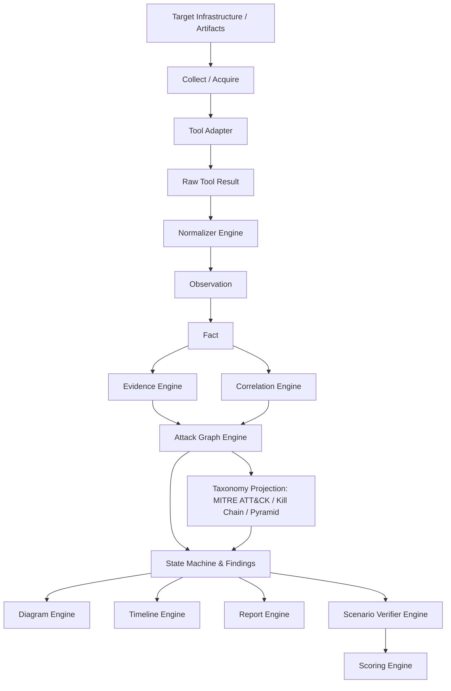

# 04. Solution Architecture Document: Blue Team Cyber Range & SOC/DFIR Platform

**Profile ID**: `PRF-04-SOLARCH`  
**Status**: `FROZEN (Approved at Human Gate 2 on 2026-09-17)`  
**Baseline**: Human Gate 2 Architecture & Contract Gate

---

## 1. Architectural Invariants & Core Principles

1. **Deterministic Execution**: Zero autonomous probabilistic LLM agent loops. Every fact, graph edge, and taxonomy mapping is reproducible and explainable.
2. **Offline-First Desktop Architecture**: Local SQLite (WAL mode) + Content-Addressed Storage (CAS) on BLAKE3 (internal address) + SHA-256 (forensic/external IOC hash).
3. **Privilege Boundary Invariant**:
   - UI runs completely unprivileged.
   - UI cannot execute commands directly or pass raw `argv[]`.
   - Core cannot execute privileged commands directly.
   - Only `privilege-broker` executes predefined, typed `PrivilegedOperation` items after capability verification.
   - Prohibition of `sh -c`, `cmd /c`, arbitrary `PowerShell -Command`, or arbitrary binary execution.
4. **Epistemic Separation**: Strict distinction between `AssertionType` (Fact, Inference, Hypothesis) and `VerificationState` (Candidate, Corroborated, Confirmed, Disproved).
5. **Scale Target**: Designed for 100,000+ graph nodes, 1,000,000+ edges/events, and 1,000,000+ timeline rows using Level of Detail (LoD), clustering, and virtualization.
6. **Platform Tiers**: Windows (Tier 1), Linux (Tier 1), macOS (Tier 2 / Future).
7. **Unsafe Policy**: `#![forbid(unsafe_code)]` enabled globally across all workspace crates; safe wrappers with documented `SAFETY` invariants in isolated `platform-windows`/`platform-linux` crates only.

---

## 2. Master Architectural Pipeline



---

## 3. Cargo Workspace Bounded Contexts

```
blue-team-platform/
├── Cargo.toml                       # Workspace root
├── crates/
│   ├── core-domain/                 # Domain types, UUIDv7, AssertionType, EpistemicState
│   ├── storage-cas/                 # BLAKE3 locator + SHA-256 forensic storage
│   ├── storage-sqlite/              # Relational SQLite WAL engine & migrations
│   ├── workflow-dag/                # Task DAG, conditional edges, 6 resource semaphores
│   ├── normalization-engine/        # RawToolResult -> Normalizer -> Observation[]
│   ├── correlation-engine/          # Heuristic & rule-based Fact correlation
│   ├── evidence-engine/             # Evidence / EvidenceSet aggregate builder
│   ├── tool-adapters/               # Modular collectors & parsers (EVTX, PCAP, etc.)
│   ├── graph-engine/                # Event-derived reproducible Attack Graph with provenance
│   ├── timeline-engine/             # Multi-host forensic event streams
│   ├── taxonomy-projection/         # Versioned ATT&CK, Kill Chain, Pyramid candidates
│   ├── scenario-engine/             # Scenario bundle loader & runner
│   ├── scenario-verifier/           # Ground Truth isolated evaluation
│   ├── scoring-engine/              # Explainable multidimensional scoring
│   ├── diagram-engine/              # Visual projections, snapshots & layout models
│   ├── report-engine/               # Incident summary, STIX 2.1, PDF/JSON export
│   ├── privilege-broker/            # Hardened service with capability & typed operations
│   ├── ipc-protocol/                # Versioned JSON-RPC schemas & event streams
│   ├── platform-windows/            # Tier 1 Windows native hooks (ETW/WFP)
│   └── platform-linux/              # Tier 1 Linux native hooks (eBPF/proc)
└── apps/
    └── desktop-app/                 # Unprivileged 3-pane cross-platform GUI
```

---

## 4. Architecture Decision Records (ADR Summary)

- **ADR-001: Language & Memory Safety**: Rust core workspace with `#![forbid(unsafe_code)]` default.
- **ADR-002: Deterministic Rule Pipeline**: Rejection of autonomous LLM planners in favor of deterministic state machines and graph correlation.
- **ADR-003: Typed Privileged Operations**: Rejection of command/executable whitelists; replacement with strict typed `PrivilegedOperation` and capability-based access control.
- **ADR-004: Dual-Hash & Append-Only Storage**: BLAKE3 for high-speed CAS lookup + SHA-256 for forensic integrity; append-only Chain of Custody events.
- **ADR-005: Ground Truth Isolation**: Scenario ground truth packages are encrypted/sealed and accessible solely by `scenario-verifier`, inaccessible to user/player database.
