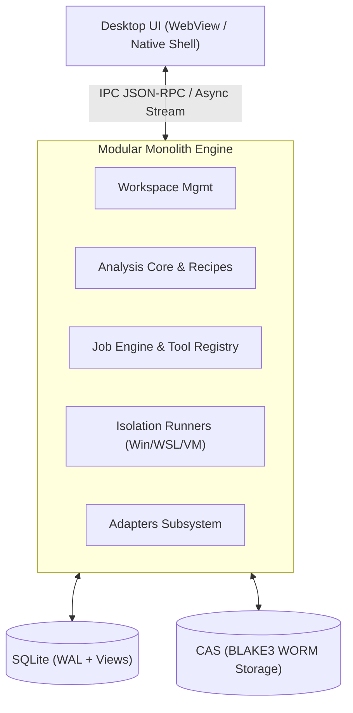
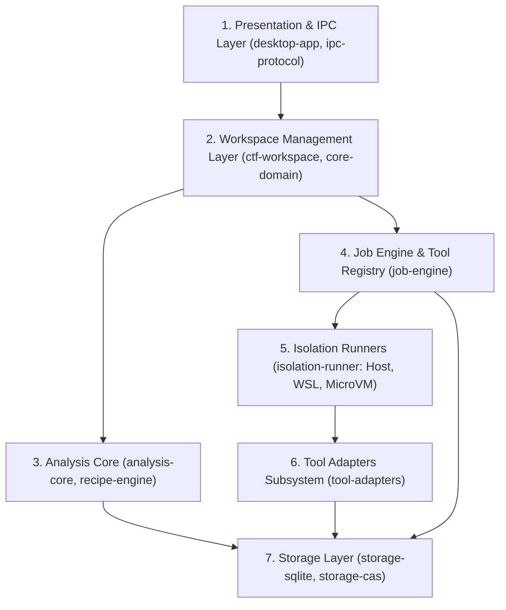
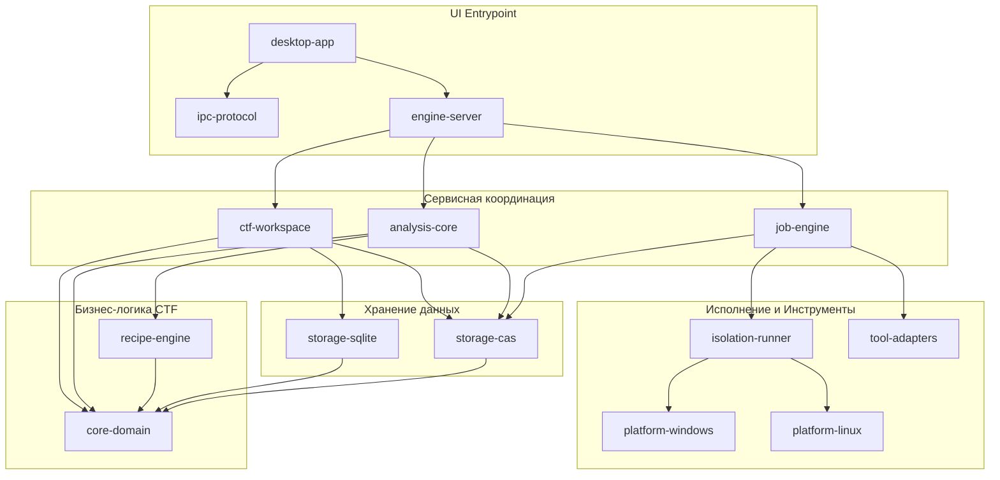
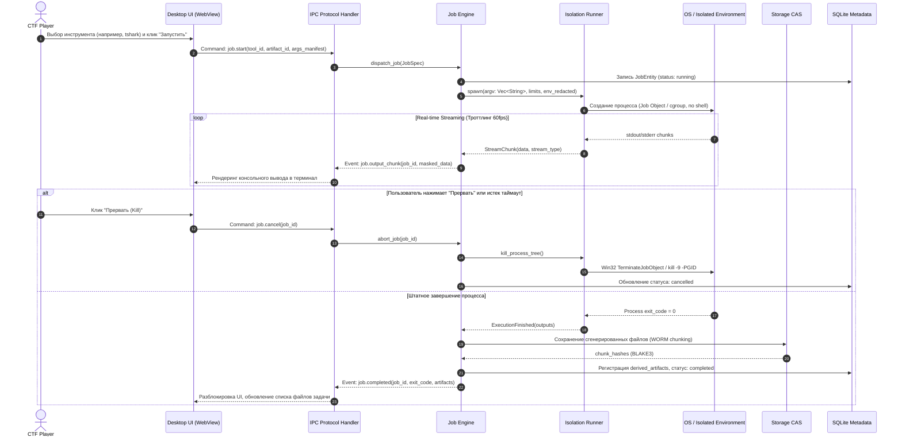

# 04. Системная архитектура: CTF Unified Workspace Platform

**Документ**: Архитектурная спецификация решения (Solution Architecture Document / SAD)  
**Версия**: 1.0.0-draft  
**Архитектор**: Роль 04 (Solution Architect)  
**Статус**: APPROVED  
**Связанные документы**: [`01-product-discovery-manager.md`](file:///C:/Users/Siroj/Projects/soc-dfir-platform/docs/it-company/01-product-discovery-manager.md), [`02-business-analyst.md`](file:///C:/Users/Siroj/Projects/soc-dfir-platform/docs/it-company/02-business-analyst.md), [`03-product-manager.md`](file:///C:/Users/Siroj/Projects/soc-dfir-platform/docs/it-company/03-product-manager.md), [`project_state.json`](file:///C:/Users/Siroj/Projects/soc-dfir-platform/docs/it-company/project_state.json)

---

## 1. Архитектурное видение и обоснование стека

### 1.1. Архитектурный стиль: Modular Monolith в Rust (Cargo Workspace)
Целевая система строится как **Модульный Монолит (Modular Monolith)** на языке Rust в рамках единого Cargo Workspace с гибридной презентацией (Desktop Native Shell + WebView IPC). Вся ключевая бизнес-логика разделена на строго разграниченные, слабосвязанные крейты (crates) с компиляционной изоляцией контрактов.



### 1.2. Обоснование отказа от распределенных технологий
Архитектурное решение явно исключает микросервисы, Apache Kafka, gRPC-кластеры и распределенные СУБД (PostgreSQL/Cassandra) по следующим причинам:
1. **Десктопный сценарий использования**: Продукт — автономное рабочее место CTF-игрока. Игрок работает на ноутбуке/рабочей станции, нередко в условиях оффлайн-соревнований, изолированных CTF-сеток (Air-Gapped / VPN) без внешнего доступа.
2. **Нулевой операционный оверхед (Zero-Ops)**: Требование разворачивать Docker Compose с Kafka, Zookeeper/KRaft и Postgres убьет UX. Приложение обязано запускаться мгновенно из одного исполняемого файла или портативного инсталлятора.
3. **Производительность и субмиллисекундная латентность**: Локальные Rust-каналы (`tokio::sync::mpsc`, `broadcast`) передают миллионы событий в секунду с околонулевыми накладными расходами памяти, тогда как сетевые брокеры внесут сериализационный лаг и потребление сотен мегабайт RAM.
4. **Консистентность данных**: SQLite в режиме WAL (Write-Ahead Logging) с локальным CAS обеспечивает надежные ACID-транзакции без распределенного консенсуса (Raft/Paxos).

---

## 2. Архитектурные слои системы



### 2.1. Layer 1: Presentation & IPC Layer (`desktop-app`, `ipc-protocol`)
- Отвечает за окно приложения (WebView/Tauri-style или нативный фреймворк) и рендеринг интерфейса.
- Коммуникация с бэкендом через строго типизированный IPC-протокол:
  - **Команды (Request-Response)**: асинхронные вызовы с UUID-корреляцией.
  - **События (Streaming Events)**: push-уведомления (stdout/stderr чанки, статус джобов, прогресс хэширования) через кольцевые буферы с троттлингом (до 60 кадров/с).

### 2.2. Layer 2: Workspace Management Layer (`ctf-workspace`, `core-domain`)
- Управляет иерархией сущностей: `Competition` $\to$ `Challenge` $\to$ `Artifact` $\to$ `Finding` / `Hypothesis` / `FlagCandidate`.
- **Изоляция контекстов**: задачи изолированы; временные файлы, переменные окружения и артефакты одной задачи недоступны другой.
- **Data Redaction**: автоматическое маскирование секретов и токенов (`[REDACTED:<KEY>]`) перед выводом в UI и записью в логи.

### 2.3. Layer 3: Analysis Core (`analysis-core`, `recipe-engine`)
- **Ingestion**: прием произвольных файлов без падений. Если формат неизвестен, артефакт сохраняется как `stored/unclassified`.
- **Хэширование и целостность**: синхронный/потоковый расчет BLAKE3 (основной ключ CAS) и SHA-256 (совместимость).
- **Lineage DAG**: направленный граф трансформаций улик. Каждый производный артефакт ссылается на родительский `artifact_id` и `step_id`.
- **Recipe Engine**: конвейер обратимых и необратимых преобразований (Hex, Base64, URL, XOR, zlib, ROT13) с превью и автопоиском флагов.

### 2.4. Layer 4: Job Engine & Tool Registry (`job-engine`)
- **Tool Registry**: каталог манифестов инструментов (входные аргументы, поддерживаемые типы артефактов, требования к ОС).
- **Execution Dispatcher**: очередь задач с пулом воркеров (ограничение: не более $N$ физических ядер).
- **Безопасность запуска**: передача аргументов строго массивом `argv: Vec<String>` напрямую в системные вызовы создания процесса. Никакой интерполяции shell-строк (`sh -c`, `cmd.exe /c`).
- **Bounded Buffers**: кольцевой буфер вывода (по умолчанию 10 МБ на процесс) с сохранением начала и хвоста при переполнении.
- **Process Tree Termination**: честное убийство всего поддерева процессов (Job Object на Windows, cgroups / `killpg` на Linux).

### 2.5. Layer 5: Isolation Runners Subsystem (`isolation-runner`)
Абстракция `Trait Runner` с 3 уровнями изоляции (Execution Profiles):
1. **Level 0 (Host Native)**: доверенные системные утилиты (`strings`, `file`, локальные скрипты) с запуском через Windows Job Objects (лимиты CPU/Memory/No-Child-Escape).
2. **Level 1 (Linux WSL2 / Local Container)**: консольные Linux-утилиты (`tshark`, `binwalk`, `gdb`, `pwntools`) в среде WSL2 или изолированном контейнере с read-only bind mount исходных артефактов.
3. **Level 2 (Disposable MicroVM / Sandbox)**: анализ подозрительных бинарников и запуск эксплоитов в одноразовой легковесной VM (Hyper-V / Cloud-Hypervisor / Firecracker) с изолированной виртуальной сетью и мгновенным откатом снимка (snapshot discard).

### 2.6. Layer 6: Tool Adapters Subsystem (`tool-adapters`)
- Модульные адаптеры к внешнему ПО: Forensics (`tshark`, `volatility3`), Stego (`stegsolve`, `zsteg`), Web (`curl-engine`, `repeater`), Crypto (`sagemath-bridge`, `python-crypto`), Reverse (`ghidra-headless`, `radare2`).
- Нормализация вывода CLI в типизированные сущности (JSON-структуры, списки сетевых потоков, табличные улики).

### 2.7. Layer 7: Storage Layer (`storage-sqlite`, `storage-cas`)
- **Metadata DB (SQLite)**: транзакционное хранилище связей, истории, рецептов, заметок и настроек. Режим `PRAGMA journal_mode=WAL`, `synchronous=NORMAL`.
- **Аддитивная совместимость с DFIR**: сохранение старых таблиц расследований; создание SQL Views (`legacy_cases_view`) для ретро-совместимости.
- **Content-Addressed Storage (CAS)**: неизменяемое (WORM) файловое хранилище. Имя файла = BLAKE3 хэш (`.cas/data/ab/cd/abcdef...`). Поддержка блочного чтения (64 КБ чанки) для мгновенного скроллинга файлов до 500 МБ.

---

## 3. Структура Cargo Workspace и реорганизация крейтов

Все крейты расположены в директории `crates/`. Сохраняется полная обратная совместимость с существующими модулями `soc-dfir-platform`, расширяемыми CTF-функционалом:

```
crates/
├── [Существующие и обновляемые DFIR/Core крейты]
│   ├── core-domain/          # Доменные сущности (Case, Evidence, Observation + Competition, Challenge, FlagCandidate)
│   ├── storage-sqlite/       # SQLite движок, аддитивные миграции, SQL Views для legacy Cases
│   ├── storage-cas/          # Неизменяемое блочное CAS хранилище на BLAKE3/SHA-256
│   ├── tool-adapters/        # Адаптеры CLI-утилит (Forensics, Stego, Web, Crypto)
│   ├── ipc-protocol/         # Типизированные контракты JSON-RPC и Streaming Events
│   ├── engine-server/        # Маршрутизатор сервисов монолита, управление жизненным циклом
│   ├── desktop-app/          # Нативный Shell + WebView контейнер, биндинги IPC
│   ├── workflow-dag/         # Граф выполнения шагов анализа и происхождения улик
│   ├── platform-windows/     # Специфика Win32: Job Objects, точные taskkill деревьев
│   ├── platform-linux/       # Специфика Linux/WSL: cgroups v2, process group kill
│   ├── privilege-broker/     # Безопасное повышение привилегий при необходимости
│   └── report-engine/        # Генератор Write-up (Markdown) и DFIR отчетов
│
├── [Новые целевые крейты CTF платформы]
│   ├── ctf-workspace/        # Менеджер соревнований, задач, категорий и скоринга
│   ├── analysis-core/        # Движок инспекции (Hex/Text), блочной энтропии и Ingest
│   ├── recipe-engine/        # Конвейер цепочек трансформаций (Base64, Hex, XOR, zlib)
│   ├── job-engine/           # Диспетчер очередей, лимитов, буферизации логов и отмены
│   └── isolation-runner/     # Абстракция и среды выполнения (Native, WSL2, MicroVM)
│
└── [Специализированные аналитические крейты (сохранены)]
    ├── timeline-engine/      # Временные шкалы событий
    ├── graph-engine/         # Графы связей улик и сетевых узлов
    ├── scoring-engine/       # Скоринг и валидация флагов
    ├── scan-engine/          # Сканирование артефактов
    ├── normalization-engine/ # Приведение разнородных логов к ECS/OCSF
    ├── correlation-engine/   # Корреляция индикаторов компрометации
    ├── evidence-engine/      # Управление цепочкой сохранности (Chain of Custody)
    ├── scenario-engine/      # Проверочные сценарии
    ├── scenario-verifier/    # Верификатор шагов
    ├── diagram-engine/       # Построение диаграмм
    ├── taxonomy-projection/  # Проекции таксономий MITRE ATT&CK
    └── vulnerability-engine/ # Анализ уязвимостей
```

### 3.1. Матрица ключевых зависимостей между крейтами (DAG)



---

## 4. Сквозные потоки взаимодействия компонентов (Interaction Flows)

### 4.1. Поток выполнения инструмента (UI $\to$ Job Engine $\to$ Runner $\to$ CAS $\to$ UI)



### 4.2. Поток безопасного Ingestion и виртуализированного Hex-просмотра (до 500 МБ)
1. **Drop файла в окно задачи**: UI передает путь или файловый дескриптор через IPC `artifact.import`.
2. **Фоновое хэширование**: Потоковый ридер блоками по 1 МБ вычисляет параллельно BLAKE3 и SHA-256 без загрузки файла целиком в RAM.
3. **CAS Dedup & Store**: Если хэш уже существует в CAS — байты не копируются, в SQLite добавляется связь `challenge_artifacts`. Если нет — файл перемещается/копируется в `.cas/data/` со статусом `stored/unclassified`.
4. **Виртуализированный просмотр**:
   - UI запрашивает только видимый диапазон: `cas.read_slice(hash, offset: 0, length: 65536)`.
   - Бэкенд возвращает 64 КБ чанк за $<1$ мс через `File::seek` + `read_exact`.
   - Потребление памяти фронтенда остается постоянным ($\le 120$ МБ) вне зависимости от размера исходного файла (100 МБ или 500 МБ).

---

## 5. Производительность, масштабируемость и отказоустойчивость

### 5.1. Паттерны производительности (Performance Patterns)
* **Zero-Copy & Memory-Mapped I/O**: Чтение больших файлов для расчета энтропии и поиска сигнатур через `memmap2` (с валидацией размера и безопасной обработкой `SIGBUS` на Unix / structured exception handling на Windows).
* **Chunked Streaming**: Передача консольного вывода инструментов чанками фиксированного размера (не более 16 КБ на сообщение IPC) с буферизацией в течение 16 мс (троттлинг 60 fps для UI).
* **Bounded Output Ring Buffers**: Ограничение вывода процессов в оперативной памяти: хранятся первые 2 МБ (head) и последние 8 МБ (tail). При переполнении средняя часть сбрасывается в CAS-дамп, а счетчик `dropped_bytes` информирует пользователя.
* **Virtualized UI Grid**: Hex/Text просмотрщик рендерит в DOM только строки, попадающие в видимый Viewport плюс 10 строк буфера сверху и снизу (виртуализация DOM).

### 5.2. Паттерны отказоустойчивости (Fault-Tolerance Patterns)
* **Crash Resilience (Изоляция сбоев)**: Сбой или аварийное завершение внешнего инструмента (segfault, abort, panic) не приводит к падению движка монолита. Ошибка ловится воркером `job-engine`, фиксируется код возврата и дамп stderr, джоб переходит в `failed`.
* **Zombie Process Reaper**: При аварийном завершении UI или основного приложения все дочерние процессы автоматически уничтожаются операционной системой:
  - *Windows*: Все порожденные процессы привязываются к Windows `JobObject` с флагом `JOB_OBJECT_LIMIT_KILL_ON_JOB_CLOSE`. При закрытии дескриптора ОС принудительно гасит все дочерние деревья.
  - *Linux*: Установка атрибута `PR_SET_PDEATHSIG` (`SIGKILL`) для каждого дочернего процесса при смерти родителя.
* **Транзакционный CAS Ingest**: Запись в CAS осуществляется во временный файл (`.cas/tmp/<uuid>`). Только после успешного завершения записи и валидации контрольной суммы BLAKE3 выполняется атомарный `rename` в целевой путь `.cas/data/<prefix>/<hash>`. Это исключает повреждение хранилища при внезапном отключении питания.
* **Аддитивная целостность SQLite**: При запуске приложения инициируется проверка целостности (`PRAGMA integrity_check`). Перед каждой миграцией создается файл моментального снимка `app.db.bak-<timestamp>`.

---

## 6. Границы ответственности и матрица передачи задач (Handover)

| Роль | Входной артефакт | Зона ответственности и ожидаемый результат |
|---|---|---|
| **05-security-architect** | `04-solution-architect.md` | Модель угроз (STRIDE), безопасность изоляции Runner-ов, защита от Zip-Slip/Bomb, правила санитизации `[REDACTED]`, политика CSP для WebView. |
| **06-tech-lead** | `04-solution-architect.md` | Выбор версий зависимостей, настройка CI/CD, правила линтинга, определение общих Rust-трейтов и модульных контрактов. |
| **07-database-architect** | `04-solution-architect.md`, `02-business-analyst.md` | Детальная DDL-схема SQLite (индексы, внешние ключи, аддитивные миграции, SQL Views для совместимости со старыми `cases`). |

> [!IMPORTANT]
> Настоящий документ фиксирует системную архитектуру. Разработка кода и конкретных DDL-скриптов базы данных зарезервирована за последующими ролями конвейера.
