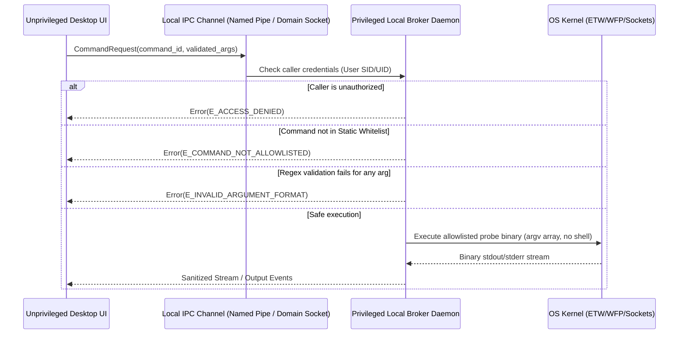

# 05. Security Architecture Document: Blue Team Cyber Range & SOC/DFIR Platform

**Profile ID**: `PRF-05-SECARC`  
**Status**: `COMPLETED`  
**Input**: `docs/it-company/00-requirements-contract.md` & `docs/it-company/04-solution-architect.md`

---

## 1. Threat Modeling (STRIDE Analysis)

| Threat Category | Potential Vector | Mitigation in Architecture | Verification Method |
|---|---|---|---|
| **Spoofing** | Unauthorized client issuing commands to Local Broker. | OS-level IPC access control lists (ACLs): Windows named pipes restricted to current user SID + admin; Unix sockets set to `0600`. | Integration test verifying IPC rejection from other accounts. |
| **Tampering** | Modification of evidence or forensic case files on disk. | Content-Addressed Storage (CAS) with BLAKE3/SHA-256 immutable hashes and append-only audit trail in SQLite WAL. | Cryptographic verification job (`verify_case_integrity`). |
| **Repudiation** | Analyst or CTF participant disputes action or finding. | Complete Chain of Custody logging with monotonic timestamps and actor ID. | Audit log validation tests. |
| **Information Disclosure** | Memory dump or PCAP containing sensitive credentials read by unprivileged process. | File permissions enforced at OS layer; ephemeral working files wiped securely upon case closure. | Security integration tests for file permissions. |
| **Denial of Service** | Maliciously crafted PCAP (decompression bomb / circular reference) causing OOM or CPU freeze. | Parser execution limits (time budget, memory limit) inside Workflow DAG semaphores; streaming parser architecture. | Fuzzing tests with malformed PCAP/EVTX. |
| **Elevation of Privilege** | Command injection via tool parameters in Broker. | Static command allowlist (only approved binaries); `argv[]` execution without shell expansion; regex parameter validation. | Static and dynamic injection audit. |

---

## 2. Privilege Boundary & Broker Security Contract

---

## 3. Sandboxing & Ingestion Safety
- **No Shell Execution**: `Command::new(binary).args(args)` exclusively; never invoke `sh -c` or `cmd.exe /c`.
- **Memory Safety**: Parsers written in pure Rust with `#![deny(unsafe_code)]` in all parsing crates (`tool-adapters`, `core-domain`).
- **Path Traversal Defense**: All artifact paths stored in CAS are computed strictly from content hash (`cas/ab/cd/abcdef...`); external file names are never used directly as filesystem paths.
- **Resource Quotas**: Ingestion processes run with explicit memory limits (e.g. 2 GB max per task) and watchdog timeouts.
