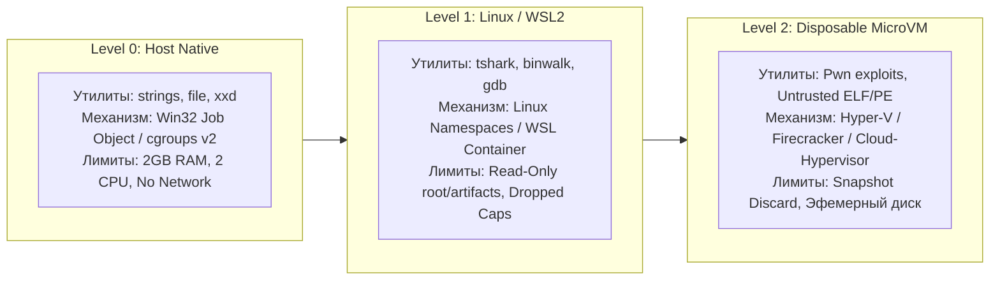

# 05. Модель угроз и архитектурные требования безопасности: CTF Unified Workspace Platform

**Документ**: Архитектурная спецификация безопасности (Security Architecture Document & Threat Model)  
**Версия**: 1.0.0  
**Архитектор**: Роль 05 (Security Architect)  
**Статус**: APPROVED  
**Связанные документы**: [`01-product-discovery-manager.md`](file:///C:/Users/Siroj/Projects/soc-dfir-platform/docs/it-company/01-product-discovery-manager.md), [`02-business-analyst.md`](file:///C:/Users/Siroj/Projects/soc-dfir-platform/docs/it-company/02-business-analyst.md), [`04-solution-architect.md`](file:///C:/Users/Siroj/Projects/soc-dfir-platform/docs/it-company/04-solution-architect.md), [`project_state.json`](file:///C:/Users/Siroj/Projects/soc-dfir-platform/docs/it-company/project_state.json)

---

## 1. Введение и контекст безопасности CTF-платформы

В отличие от стандартного прикладного ПО, платформа **CTF Unified Workspace Platform** изначально проектируется для регулярной обработки заведомо враждебных артефактов и взаимодействия с потенциально опасными удаленными средами. В рамках соревнований (Jeopardy / Attack-Defense) анализируются:
- Реальное и учебное вредоносное ПО (Malware, Rootkits, Ransomware, Shellcode).
- Специально сформированные эксплоиты (Memory corruption, ROP-цепочки, Type confusion, Polyglot payloads).
- Деструктивные архивы (Zip-bombs, Zip-Slip, Symlink bombs).
- Вредоносный веб-контент (Hostile JavaScript, Blind XSS, SSRF triggers, CSRF, SVG-эксплоиты).
- Враждебные удаленные сокеты и сетевые сервисы, собирающие метаданные об атакующем.

**Главный постулат безопасности (Zero Trust Ingestion & Execution)**: Любой входящий артефакт, имя файла, строка вывода или сетевой ответ считается враждебным. Платформа должна обеспечивать сохранность рабочей станции исследователя, целостность накопленных улик и конфиденциальность учетных данных.

---

## 2. Границы доверия и диаграмма потоков данных (Trust Boundaries & DFD)

Система делится на 4 изолированных домена безопасности с 5 ключевыми границами доверия (Trust Boundaries, TB):

```mermaid
flowchart TB
    subgraph Untrusted_External["Внешний недоверенный периметр"]
        EXT_FILE["Недоверенные файлы / Архивы"]
        CTF_NET["Внешняя сеть CTF / Инфраструктура соревнований"]
    end

    subgraph Presentation_Domain["Презентационный домен"]
        WEBVIEW["Desktop WebView (Sandboxed Renderer)"]
    end

    subgraph Core_Engine_Domain["Доверенный домен ядра (Core Engine / Host)"]
        IPC_GATE["IPC Gateway (JSON-RPC)"]
        CORE_ORCH["Core Monolith Engine (Rust)"]
        SQLITE_DB[("SQLite Metadata (ACID/WAL)")]
        CAS_STORAGE[("CAS WORM Storage (BLAKE3)")]
    end

    subgraph Execution_Domain["Домен изолированного выполнения (Runners)"]
        HOST_RUNNER["Level 0: Host Native (Job Objects / cgroups)"]
        WSL_RUNNER["Level 1: Linux Container / WSL2 Runner"]
        VM_RUNNER["Level 2: Disposable MicroVM (Hyper-V/Firecracker)"]
    end

    EXT_FILE -.->|TB-1: Ingestion & Sanitize| CORE_ORCH
    CTF_NET -.->|TB-4: Network Scoping Egress| CORE_ORCH
    WEBVIEW <==>|TB-2: Strict IPC Contracts & CSP| IPC_GATE
    IPC_GATE <--> CORE_ORCH
    CORE_ORCH <--> SQLITE_DB
    CORE_ORCH <--> CAS_STORAGE
    CORE_ORCH ===>|TB-3: Zero Shell argv & Limits| HOST_RUNNER
    CORE_ORCH ===>|TB-3: Strict Bind Mounts (RO)| WSL_RUNNER
    CORE_ORCH ===>|TB-5: VM Boundary (Snapshot Discard)| VM_RUNNER
    HOST_RUNNER -.->|Scoped Egress| CTF_NET
    WSL_RUNNER -.->|Scoped Egress| CTF_NET
    VM_RUNNER -.->|Isolated Egress| CTF_NET
```

### Спецификация границ доверия
- **TB-1 (Ingestion Boundary)**: Граница между внешней средой (диск/сеть) и хранилищем CAS. Блокирует деструктивные структуры архивов и аномальные метаданные до сохранения на диск.
- **TB-2 (UI/Renderer Boundary)**: Граница между WebView рендерером и ядром Rust. Исключает повышение привилегий через веб-уязвимости рендерера (DOM XSS -> Host RCE).
- **TB-3 (Host Execution Boundary)**: Граница между ядром платформы и запускаемыми консольными утилитами хоста (strings, binwalk, tshark). Контролирует аргументы, переменные окружения и системные ресурсы.
- **TB-4 (Network Scoping Boundary)**: Граница между инструментами анализа и локальной/внешней сетью. Запрещает неконтролируемые утечки и сканирование локальной сети пользователя.
- **TB-5 (Disposable Sandbox Boundary)**: Граница аппаратной виртуализации (MicroVM). Предназначена для запуска недоверенного исполняемого кода (Pwn/Malware) с гарантией изоляции хостовой ОС.

---

## 3. Классификация данных (Data Classification)

| Класс | Наименование | Состав данных | Требования к конфиденциальности и целостности |
|---|---|---|---|
| **D-1** | **Public CTF Data** | Условия задач, публичные артефакты, дампы трафика, бинарники, выводы CLI-утилит. | Контроль целостности WORM (BLAKE3). Общедоступны внутри рабочего пространства, допускается экспорт. |
| **D-2** | **Internal Work State** | Заметки исследователя, дерево гипотез, связи улик, черновые рецепты трансформаций. | Защита от модификации внешними процессами. Хранятся в локальной SQLite, доступ строго через ядро. |
| **D-3** | **Sensitive Credentials & Flags** | API-ключи CTFd/HTB, пароли, SSH-ключи, cookies сессий, токены VPN, найденные валидные флаги. | **Строгая санитизация**. Запрет сохранения в открытом виде в stdout/stderr/CAS/Write-up. Автомаскирование `[REDACTED]`. |

---

## 4. Комплексная модель угроз STRIDE

| Категория STRIDE | Угроза и вектор атаки | Затронутый компонент | Архитектурная мера противодействия |
|---|---|---|---|
| **Spoofing (S)** | Подделка идентификатора артефакта или подмена исходных улик для фальсификации расследования. | `storage-cas`, `storage-sqlite` | Контентно-адресуемое хранилище (CAS) на базе криптографического хэша **BLAKE3**. Неизменяемость файлов (WORM) с проверкой хэша при каждом обращении. |
| **Spoofing (S)** | Спуфинг IPC-команд или подделка RPC-сообщений неавторизованным локальным процессом. | `desktop-app`, `ipc-protocol` | Двусторонняя аутентификация через уникальный одноразовый сессионный токен ядра (IPC Handshake Token), передаваемый через защищенный дескриптор при запуске. |
| **Tampering (T)** | Zip-Slip: перезапись системных бинарников хоста (`cmd.exe`, shared libs) при распаковке архива задачи. | `analysis-core`, Filesystem | Запрет относительных путей (`..`), абсолютных путей и символических ссылок. Строгая валидация канонического пути целевого каталога (SEC-ARCH-02). |
| **Tampering (T)** | Модификация манифестов инструментов или локальных рецептов для скрытого внедрения вредоносного кода. | `job-engine`, `recipe-engine` | Манифесты инструментов жестко вкомпилированы в бинарник ядра либо подписаны HMAC ключом платформы. База метаданных SQLite валидируется через `PRAGMA integrity_check`. |
| **Repudiation (R)** | Невозможность доказать источник артефакта или факт генерации флага в процессе анализа. | `workflow-dag`, `report-engine` | Непрерывный Lineage DAG: каждый артефакт строго привязан к `parent_artifact_id`, `tool_id`, `args_hash`, `timestamp_utc` и хэшу `BLAKE3`. |
| **Information Disclosure (I)** | Утечка токенов платформ, паролей или локальных SSH-ключей через вывод утилит в Write-up или UI. | `job-engine`, `report-engine` | Real-time потоковое маскирование секретов (`[REDACTED:<ID>]`) до записи в SQLite, CAS и отправки в IPC (SEC-ARCH-06). |
| **Information Disclosure (I)** | SSRF / Local Network Pivoting: вредоносный веб-сервис или pcap заставляет локальный инструмент сканировать LAN/Loopback хоста. | `tool-adapters`, `isolation-runner` | Network Scoping Policy: ограничение сетевых сокетов только явно заданными таргетами челленджа, блокировка RFC 1918 / Loopback (SEC-ARCH-04). |
| **Denial of Service (D)** | Zip-Bomb / Decompression Bomb (архив в 42 КБ разворачивается в 4.5 ТБ), переполнение диска. | `analysis-core`, Filesystem | Квотирование распаковки: лимит суммарного размера, коэффициент сжатия max 1:100, лимит количества декомпрессированных файлов (SEC-ARCH-02). |
| **Denial of Service (D)** | Fork-Bomb / Бесконечный цикл в бинарнике Pwn, исчерпание RAM/CPU хостовой системы. | `isolation-runner`, OS | Лимиты Windows Job Objects и Linux cgroups: ограничение RAM, CPU-квоты, ограничение числа процессов, принудительный таймаут с жестким kill поддерева (SEC-ARCH-03). |
| **Elevation of Privilege (E)** | Shell Injection: внедрение метасимволов (`;`, `|`, `$(...)`) через имена файлов артефактов при вызове CLI. | `job-engine`, OS Processes | Полный отказ от шелл-оболочек: запуск строго через `argv: Vec<String>` без интерполяции строк (SEC-ARCH-01). |
| **Elevation of Privilege (E)** | Escape из WebView в хостовую ОС через вредоносный рендеринг HTML/SVG задачи (XSS -> RCE). | `desktop-app` (WebView) | Полное отключение Node/Native Integration в WebView, строгая CSP (`default-src 'none'`), изоляция рендеринга внешнего HTML в sandboxed iframe (SEC-ARCH-05). |
| **Elevation of Privilege (E)** | Побег эксплоита из пользовательского пространства при запуске боевого Pwn-бинарника. | `isolation-runner` | Изоляция Level 2: запуск строго в одноразовой MicroVM с эфемерным диском и уничтожением снапшота при завершении (SEC-ARCH-03). |

---

## 5. Детальные архитектурные требования безопасности

### SEC-ARCH-01: Zero Shell Injection Policy
* **Запрет системных оболочек**: Категорически запрещен вызов бинарников через интерпретаторы командной строки (`sh`, `bash`, `zsh`, `cmd.exe`, `powershell.exe`).
* **Прямая передача аргументов**: Порождение процессов выполняется исключительно через API прямого системного вызова с передачей массива строк:
  ```rust
  // Допустимо:
  std::process::Command::new(executable_path)
      .args(&validated_argv)
      .envs(&sanitized_env)
      .spawn()
  ```
* **Белый список и валидация аргументов**: Для всех зарегистрированных утилит Tool Registry задает декларативную схему допустимых флагов. Аргументы валидируются на наличие недопустимых управляющих байтов (NULL-байты, управляющие последовательности терминала ANSI escape, если они не экранированы).
* **Санитизация переменных окружения**: Из среды исполнения дочерних процессов принудительно удаляются опасные переменные инъекции: `LD_PRELOAD`, `LD_LIBRARY_PATH`, `PYTHONPATH`, `NODE_OPTIONS`, `PERL5LIB`, `RUBYOPT`, `BASH_ENV`.

### SEC-ARCH-02: Archive Ingestion Safety (Anti Zip-Slip & Anti Zip-Bomb)
При распаковке любых контейнеров и архивов (ZIP, TAR, GZ, 7Z, BZ2) движок `analysis-core` обязан применять следующие детерминированные защитные механизмы:
1. **Предотвращение Zip-Slip (Path Traversal)**:
   - Имя каждого элемента архива очищается от относительных префиксов (`/`, `\`, `c:`, `..`).
   - Перед записью файла вычисляется канонический путь распаковки: `target_path = base_extract_dir.join(cleaned_relative_path)`.
   - Проверяется условие: `canonicalize(target_path).starts_with(canonicalize(base_extract_dir))`. В случае несовпадения распаковка немедленно прерывается с ошибкой `SecurityViolation: Path Traversal Attempt`.
2. **Блокировка символических и жестких ссылок**:
   - Извлечение symlink и hardlink запрещено. При обнаружении ссылки в архиве файл либо пропускается с предупреждением в аудит, либо создается пустой плейсхолдер нулевой длины. Это исключает атаки Arbitrary File Read через symlink на `/etc/shadow` или `C:\Windows\System32`.
3. **Защита от Zip-Bomb (Resource Quotas)**:
   - **Max Total Uncompressed Size**: не более 5 ГБ суммарно (или настраиваемый лимит задачи).
   - **Max Single File Size**: не более 2 ГБ.
   - **Max Compression Ratio**: отслеживание коэффициента `uncompressed_size / compressed_size`. Если коэффициент превышает **100:1**, процесс немедленно прерывается.
   - **Max File Count**: не более 10 000 файлов в рамках одной распаковки.
   - **Recursion Limit**: автоматическая рекурсивная распаковка вложенных архивов ограничена глубиной **2 уровня**.

### SEC-ARCH-03: Process Isolation & Resource Boundaries
Система реализует трехуровневую матрицу изоляции запускаемых инструментов:



1. **Windows Platform (Level 0)**:
   - Все порожденные процессы помещаются в Win32 `JobObject`.
   - Флаги: `JOB_OBJECT_LIMIT_KILL_ON_JOB_CLOSE` (уничтожение поддерева при закрытии дескриптора), `JOB_OBJECT_LIMIT_ACTIVE_PROCESSES` (max 32 процесса, защита от fork-bomb), `JOB_OBJECT_LIMIT_JOB_MEMORY` (по умолчанию max 2 ГБ).
   - Флаг безопасности: запрет обхода Job Object дочерними процессами (`JOB_OBJECT_LIMIT_BREAKAWAY_OK` отключен).
2. **Linux / WSL2 Platform (Level 1)**:
   - Запуск с атрибутом `PR_SET_PDEATHSIG = SIGKILL` (дочерний процесс мгновенно погибает при сбое родителя).
   - Изоляция через Namespaces (`unshare`: Mount, PID, IPC, UTS). Исходные артефакты монтируются строго в режиме **Read-Only** (`mount -o ro`). Временная запись разрешена только в эфемерный `tmpfs` ограниченного объема.
   - Сброс привилегий: запуск от непривилегированного пользователя `ctf-sandbox`, сброс capabilities (`cap_drop_all`).
3. **Disposable MicroVM (Level 2 — Pwn / Dynamic Analysis)**:
   - Запуск подозрительного исполняемого кода категории Reverse/Pwn изолируется на аппаратном уровне (MicroVM).
   - Файловая система виртуальной машины функционирует в режиме Copy-on-Write (CoW).
   - По завершении анализа или нажатии кнопки «Stop» снимок состояния сбрасывается (**Snapshot Discard**), диск очищается, никакие артефакты не сохраняются на хост без явного подтверждения пользователя.
4. **Гарантированное уничтожение дерева процессов (Forced Process Tree Termination)**:
   - Принудительная отмена джоба инициирует не одиночный `SIGTERM`, а каскадное уничтожение всей группы процессов:
     * *Windows*: `TerminateJobObject(hJob, 1)`.
     * *Linux*: `kill(-pgid, SIGKILL)` с последующей зачисткой cgroup.

### SEC-ARCH-04: Network Egress & Scoping Control
* **Challenge Scoping Enforcement**: Все исходящие сетевые запросы из встроенных инструментов (Web Workbench, Repeater, Pwntools runner) ограничены объявленным скоупом задачи (`target_host`, `target_port`).
* **Anti-SSRF & Anti-LAN Pivoting**:
  - По умолчанию блокируются сетевые запросы к приватным и служебным диапазонам хоста:
    * Loopback: `127.0.0.0/8`, `::1`.
    * Private Networks (RFC 1918): `10.0.0.0/8`, `172.16.0.0/12`, `192.168.0.0/16`.
    * Carrier-Grade NAT (RFC 6598): `100.64.0.0/10`.
    * Link-Local: `169.254.0.0/16`, `fe80::/10`.
    * Cloud Metadata: `169.254.169.254`.
  - Запросы к указанным диапазонам разрешаются исключительно в случае явного добавления хоста в `Challenge Scoping Configuration` (например, для задач на эксплуатацию локального софта).
* **DNS Rebinding Protection**: Адрес хоста разрешается (DNS resolve) перед валидацией. Сетевой сокет привязывается напрямую к валидированному IP-адресу, исключая атаку с подменой DNS-записи в момент отправки HTTP/TCP запроса.
* **Изоляция локального перехватчика трафика**: Встроенный HTTP/HTTPS прокси-сервер слушает сокет строго на выделенном виртуальном интерфейсе песочницы, исключая перехват системного трафика хостовой ОС исследователя.

### SEC-ARCH-05: Desktop WebView Security
Интерфейс приложения строится на базе WebView контейнера. Чтобы исключить RCE через недоверенный контент (например, при просмотре вредоносного HTML-ответа или SVG):
1. **Строгая Content Security Policy (CSP)**:
   ```http
   Content-Security-Policy: default-src 'none'; 
       script-src 'self'; 
       style-src 'self' 'unsafe-inline'; 
       img-src 'self' data: blob:; 
       font-src 'self'; 
       connect-src 'self' ipc:; 
       frame-src 'none'; 
       object-src 'none'; 
       base-uri 'none'; 
       form-action 'none';
   ```
2. **Отключение системных интеграций**:
   - `nodeIntegration: false` (полный запрет доступа к Node.js API в окне рендера).
   - `contextIsolation: true` (изоляция контекста выполнения скриптов).
   - `enableRemoteModule: false`.
   - Запрет навигации: WebView перехватывает любые попытки перехода по внешним ссылкам (`will-navigate`, `new-window`) и блокирует их либо открывает во внешнем системном браузере по согласию пользователя.
3. **Безопасный рендеринг недоверенного HTML/SVG (Payload & Response Viewer)**:
   - Любой HTML/SVG, полученный из артефактов CTF или сетевых ответов, рендерится строго внутри изолированного `iframe` с атрибутами песочницы:
     ```html
     <iframe sandbox="allow-forms" srcdoc="..."></iframe>
     ```
   - Флаги `allow-scripts`, `allow-same-origin`, `allow-top-navigation` **запрещены**. Это исключает выполнение JavaScript из исследуемых эксплоитов в контексте приложения.
4. **Валидация протокола IPC**: Все входящие сообщения IPC валидируются по строгим JSON-схемам Serde. Любые нестандартные типы данных или команды, не зарегистрированные в схеме, отбрасываются с регистрацией в аудите.

### SEC-ARCH-06: Secret Sanitization & WORM CAS Integrity
1. **Real-time Secret Masking Pipeline**:
   - Любой вывод дочерних процессов (stdout/stderr) перед отправкой в IPC и перед записью в логи пропускается через потоковый фильтр санитизации на базе алгоритма Aho-Corasick и регулярных выражений.
   - Маскированию подлежат:
     * Токены платформ (CTFd session cookies, HackTheBox API tokens, TryHackMe tokens).
     * Приватные ключи: `-----BEGIN (RSA|EC|OPENSSH) PRIVATE KEY-----`.
     * Пароли и флаги из защищенного хранилища секретов.
   - Замена осуществляется на типизированный маркер: `[REDACTED:SECRET_<ID>]`. Исходное значение не сохраняется в открытом логе.
2. **WORM Storage Integrity (BLAKE3 CAS)**:
   - Исходные артефакты сохраняются в каталоге `.cas/data/` с правами `Read-Only` (`chmod 0444` на Unix, снятие флага Write на Windows).
   - При чтении блоков CAS выполняется потоковая верификация хэша BLAKE3. В случае несовпадения хэша чтение блокируется, выставляется статус `StorageIntegrityFailure`.
3. **Безопасность генерации Write-up**:
   - Генератор отчетов (`report-engine`) перед компиляцией Markdown сканирует текст на наличие значений из реестра секретов и предупреждает пользователя, если обнаружена утечка приватного токена платформы.

---

## 6. Политика аудита и логирования безопасности (Audit Trail)

Система ведет защищенный локальный аудит событий безопасности в таблице SQLite `audit_events`. Лог аудита является **Append-Only** (запрещены операции `UPDATE` и `DELETE` на уровне триггеров БД).

### Схема регистрируемых событий
- `EVT_INGEST_VIOLATION`: попытка загрузки Zip-Slip архива, превышение квоты Zip-Bomb, обнаружение запрещенных symlink.
- `EVT_EXEC_BLOCKED`: блокировка запуска утилиты из-за нарушения Zero Shell Policy или недопустимых аргументов.
- `EVT_RESOURCE_LIMIT`: принудительное завершение процесса по исчерпанию лимита памяти, процессорного времени или таймаута.
- `EVT_NETWORK_BLOCKED`: попытка сетевого обращения к неразрешенному IP/порту вне скоупа задачи.
- `EVT_INTEGRITY_FAIL`: несовпадение контрольной суммы BLAKE3 при обращении к CAS.
- `EVT_SECRET_REDACTED`: срабатывание механизма маскирования секретов в потоке вывода.

Каждая запись аудита включает: `id (UUIDv7)`, `timestamp_utc`, `event_type`, `severity (INFO/WARN/CRIT)`, `challenge_id`, `process_argv`, `details (JSON)`.

---

## 7. Чек-лист приемки безопасности (Security Acceptance Criteria)

Перед переходом к этапу реализации и прохождением Quality Gates должны выполняться следующие критерии:

| ID | Критерий приемки | Метод верификации |
|---|---|---|
| **AC-SEC-01** | Ни один инструмент не запускается через `cmd.exe /c` или `sh -c`. Попытка передачи shell-метасимволов (`;`, `|`, `&&`) в аргументы передается утилите как литерал и не выполняет сторонние команды. | Unit & Integration тесты с передачей пейлоадов `calc.exe` / `id` в аргументы. |
| **AC-SEC-02** | Попытка распаковки Zip-Slip архива с путями `../../test.txt` не создает файлы вне базового каталога и завершается ошибкой `SecurityViolation`. | Автоматизированный тест с синтетическим zip-файлом traversal. |
| **AC-SEC-03** | Распаковка архива размером 10 КБ, разворачивающегося в >5 ГБ нулей, прерывается при достижении лимита коэффициента 100:1 без зависания системы. | Интеграционный тест с генерацией Zip-бомбы. |
| **AC-SEC-04** | Fork-bomb скрипт (`:(){ :|:& };:`) внутри песочницы гасится Job Object / cgroups без замедления хостовой ОС. | Тест в среде runner под мониторингом CPU/PIDs. |
| **AC-SEC-05** | Клик по кнопке «Прервать» гарантированно завершает запущенный процесс и всех его потомков (нет зомби-процессов в диспетчере задач). | Тест с порождением дерева `sleep` / фоновых воркеров. |
| **AC-SEC-06** | Сетевой запрос через инструменты Web Workbench к `http://127.0.0.1:8080` или `http://192.168.1.1` блокируется политикой Scope Enforcement. | Mock-тесты сетевого резолвера. |
| **AC-SEC-07** | Рендеринг HTML/SVG с XSS-вектором `<script>alert(1)</script>` в WebView окне предварительного просмотра не выполняет JavaScript-код. | UI E2E тест с проверкой событий alert/exec. |
| **AC-SEC-08** | Токены и секреты из хранилища заменяются на `[REDACTED:...]` в реальном времени и не попадают в сыром виде в файлы CAS логов. | Тест потокового перехвата stdout с эмуляцией утечки ключа. |

---

## 8. Матрица передачи задач (Handover to System Analyst & Tech Lead)

| Роль | Входной документ | Принимаемые требования и зона ответственности |
|---|---|---|
| **06-system-analyst** | `05-security-architect.md`, `04-solution-architect.md` | Детализация системных спецификаций: точные интерфейсы IPC протокола с учетом CSP и валидации, спецификация структуры каталогов CAS, алгоритмы безопасной распаковки. |
| **07-database-architect** | `05-security-architect.md` | DDL-схема SQLite: проектирование неизменяемой таблицы `audit_events`, хранение статусов целостности и маскированных метаданных. |
| **08-tech-lead** | `05-security-architect.md` | Выбор крейтов Rust: `zip` / `flate2` с валидацией путей, `aho-corasick` для redactor, `windows-sys` (Job Objects), `caps` / `nix` (Linux cgroups/namespaces). |
