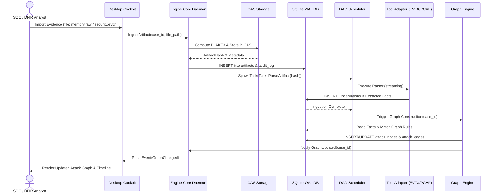
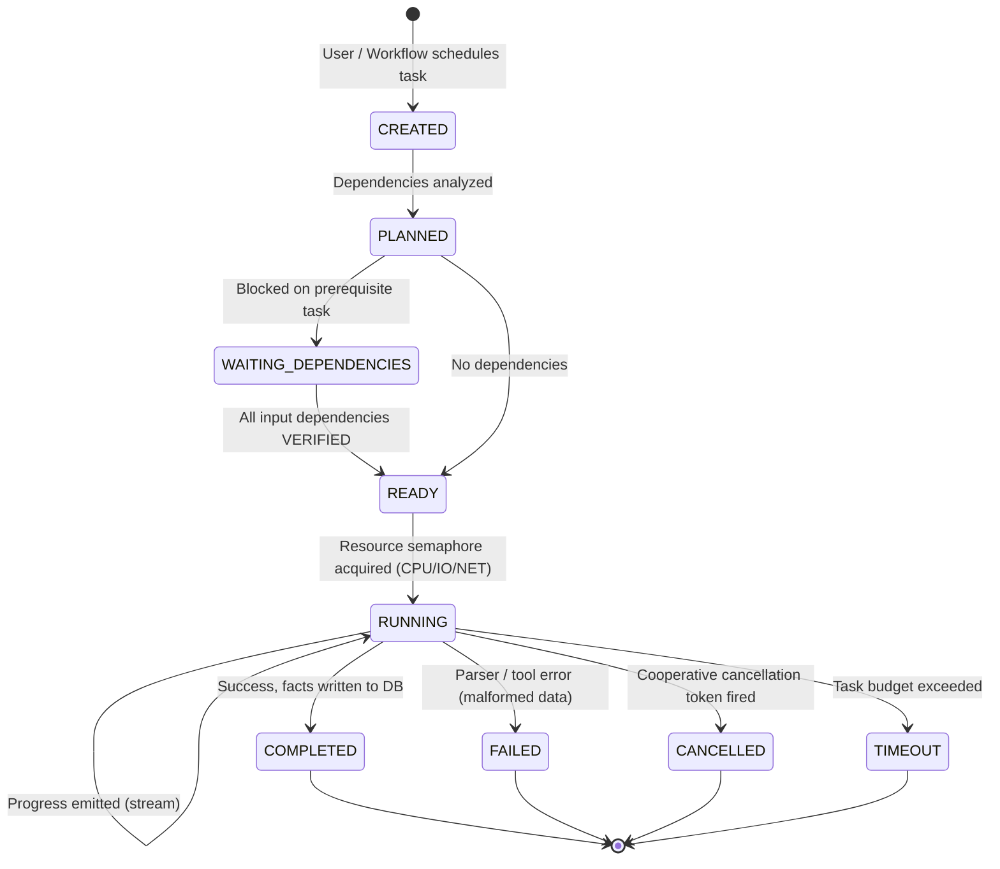
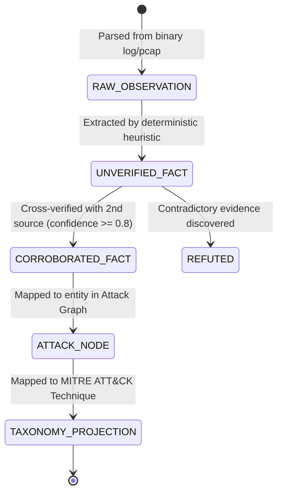

# 06. System Analysis Document: Blue Team Cyber Range & SOC/DFIR Platform

**Profile ID**: `PRF-06-SYSAN`  
**Status**: `COMPLETED`  
**Input**: `docs/it-company/04-solution-architect.md` & `docs/it-company/02-business-analyst.md`

---

## 1. End-to-End Ingestion & Investigation Sequence

---

## 2. Task Execution State Machine

---

## 3. Fact & Evidence Confidence State Machine

