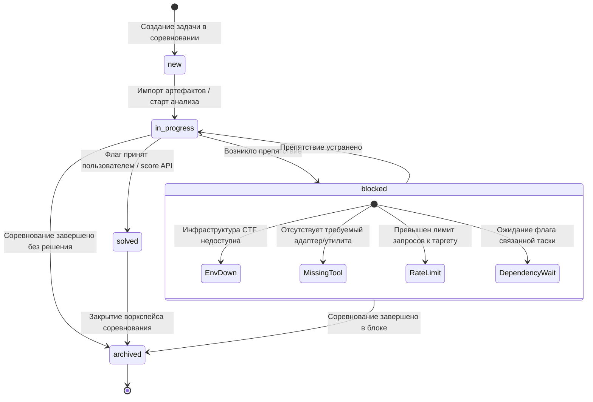
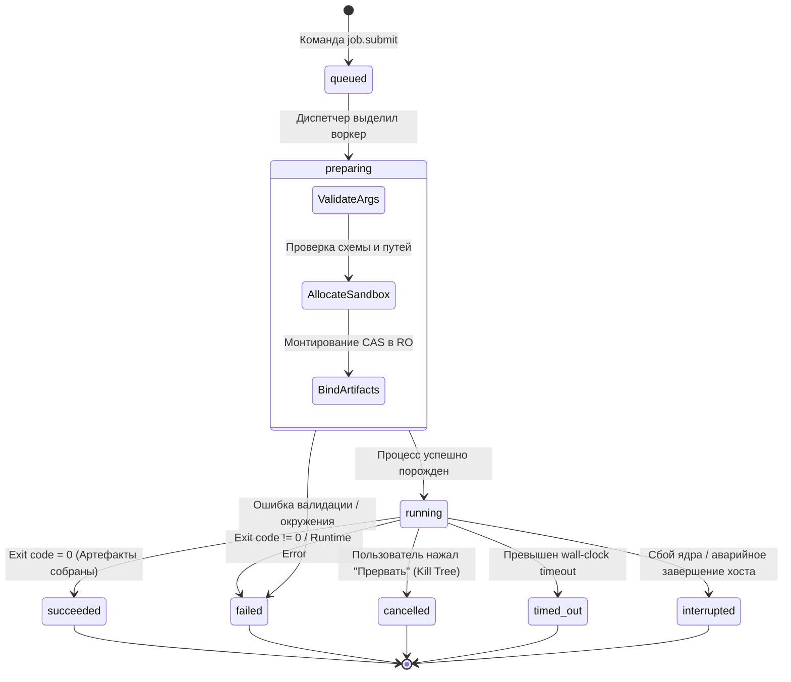
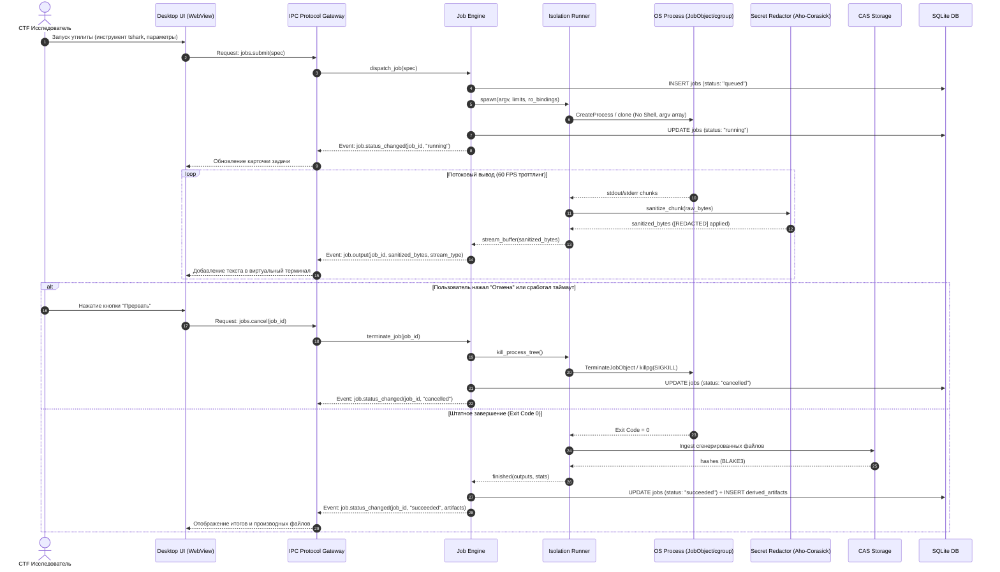

# 06. Системный анализ и спецификация взаимодействий: CTF Unified Workspace Platform

**Документ**: Системная спецификация взаимодействия компонентов, жизненных циклов и IPC контрактов  
**Версия**: 1.0.0-final  
**Автор**: Роль 06 (System Analyst)  
**Статус**: APPROVED  
**Связанные документы**: [`02-business-analyst.md`](file:///C:/Users/Siroj/Projects/soc-dfir-platform/docs/it-company/02-business-analyst.md), [`04-solution-architect.md`](file:///C:/Users/Siroj/Projects/soc-dfir-platform/docs/it-company/04-solution-architect.md), [`05-security-architect.md`](file:///C:/Users/Siroj/Projects/soc-dfir-platform/docs/it-company/05-security-architect.md), [`project_state.json`](file:///C:/Users/Siroj/Projects/soc-dfir-platform/docs/it-company/project_state.json)

---

## 1. Введение и системный контекст

Настоящий документ детализирует операционные сценарии модульного монолита CTF Unified Workspace Platform, формализует жизненные циклы сущностей, протоколы межпроцессного взаимодействия (IPC JSON-RPC 2.0), потоковую передачу данных, а также механизмы консистентности хранилищ (SQLite WAL + CAS WORM).

### Архитектурные границы взаимодействия
```mermaid
flowchart LR
    subgraph Frontend["Презентационный слой (Frontend / WebView)"]
        UI_VIEW["UI State & Viewport"]
        IPC_CLIENT["IPC Client (JSON-RPC / Event Dispatcher)"]
    end

    subgraph Backend["Ядро платформы (Modular Monolith in Rust)"]
        IPC_SERVER["IPC Gateway (Router & Validator)"]
        WS_MGR["Workspace Manager"]
        JOB_ENG["Job Engine & Tool Registry"]
        REC_ENG["Analysis Core & Recipe Engine"]
        SEC_FILTER["Secret Sanitizer (Aho-Corasick)"]
    end

    subgraph Storage["Хранилище данных"]
        CAS_STORE[("CAS Storage (.cas/data/ WORM)")]
        SQLITE_DB[("SQLite WAL (Metadata DB)")]
    end

    subgraph Execution["Изолированные раннеры"]
        RUNNER["Host (JobObject) / WSL2 / MicroVM"]
    end

    UI_VIEW <--> IPC_CLIENT
    IPC_CLIENT <==>|JSON-RPC 2.0 (Stdio / WebSocket)| IPC_SERVER
    IPC_SERVER <--> WS_MGR & JOB_ENG & REC_ENG
    JOB_ENG --> RUNNER
    RUNNER --> SEC_FILTER
    SEC_FILTER --> IPC_SERVER
    WS_MGR & JOB_ENG & REC_ENG <--> SQLITE_DB
    REC_ENG & JOB_ENG <--> CAS_STORE
```

---

## 2. Жизненные циклы сущностей (State Diagrams)

### 2.1. Жизненный цикл задачи (Challenge Entity Lifecycle)
Сущность `Challenge` отражает статус выполнения соревновательного задания. Переход в статус `blocked` требует фиксации конкретной системной или внешней причины (`BlockedReason`).



### 2.2. Жизненный цикл задания на исполнение (Job Entity Lifecycle)
Сущность `Job` управляет изолированным запуском CLI-инструментов, фаззеров и скриптов через типизированный манифест без шелл-интерполяции.



---

## 3. Сквозные системные процессы (Activity & Sequence Diagrams)

### 3.1. Безопасный прием и сохранение файлов в CAS (Safe Ingest Activity)
Процесс гарантирует устойчивость к поврежденным файлам, защиту от Zip-Slip / Zip-Bomb и сохранение неизменяемости WORM.

```mermaid
flowchart TD
    START([Входной файл / Поток]) --> STREAM_HASH[Потоковое вычисление BLAKE3 и SHA-256]
    STREAM_HASH --> CHK_CAS{Хэш уже есть в CAS?}
    
    CHK_CAS -->|Да (Дедупликация)| DEDUP[Создать связь challenge_artifacts]
    DEDUP --> RET_REF[Вернуть дескриптор артефакта]

    CHK_CAS -->|Нет| CHK_ARCH{Файл является архивом?}
    
    CHK_ARCH -->|Да| SCAN_ARCH[Проверка структуры архива: Zip-Slip / Zip-Bomb]
    SCAN_ARCH --> VALID_ARCH{Нарушение безопасности?}
    VALID_ARCH -->|Да| SEC_QUARANTINE[Заблокировать: EVT_INGEST_VIOLATION]
    SEC_QUARANTINE --> ERR_OUT([Ошибка безопасности])

    VALID_ARCH -->|Нет| WRITE_CAS
    CHK_ARCH -->|Нет| WRITE_CAS[Запись блоками в .cas/data/xx/yy/zzzz...]
    
    WRITE_CAS --> SET_RO[Установка прав Read-Only: chmod 0444]
    SET_RO --> DETECT_MIME{Распознан MIME-тип?}
    DETECT_MIME -->|Да| ASSIGN_TYPE[Назначить MIME и парсер]
    DETECT_MIME -->|Нет| FALLBACK_TYPE[Присвоить статус: stored/unclassified]
    
    ASSIGN_TYPE & FALLBACK_TYPE --> SQL_REG[Регистрация в таблице artifacts SQLite]
    SQL_REG --> RET_REF
    RET_REF --> END_NODE([Артефакт готов к анализу])
```

### 3.2. Сквозное выполнение утилиты со стримингом вывода (Sequence Diagram)
Показывает поток выполнения команды, маскирование секретов и гарантированное завершение процесса.



### 3.3. Конвейер рецептов и граф происхождения данных (Data Lineage DAG)
Каждое преобразование над артефактом создает звено в графе происхождения (Lineage DAG) с автоматическим поиском флагов.

```mermaid
flowchart LR
    A1["Исходный артефакт A-01<br/>(hash: 9f8a... / PCAP)"] -->|Extract Payload| S1["Шаг 1: tshark extract<br/>(tool: tshark, args)"]
    S1 --> A2["Производный артефакт A-02<br/>(hash: c4b1... / hex-dump)"]
    
    A2 -->|Recipe Step 1| R1["From Hex Decode"]
    R1 --> A3["Промежуточный чанк C-01<br/>(in-memory / cache)"]
    
    A3 -->|Recipe Step 2| R2["XOR (key: 0x5A)"]
    R2 --> A4["Промежуточный чанк C-02<br/>(in-memory / cache)"]
    
    A4 -->|Recipe Step 3| R3["Zlib Decompress"]
    R3 --> A5["Итоговый артефакт A-03<br/>(hash: 1e4d... / plain.txt)"]
    
    A5 -.-> SCAN{"Regex Flag Scan<br/>(^flag\{.*\}$)"}
    SCAN -->|Совпадение| FC["Кандидат флага FC-101<br/>(status: candidate)"]
    SCAN -->|Нет совпадения| NOTE["Сохранение в Scratchpad"]
```



---

## 4. Спецификация контрактов IPC (JSON-RPC 2.0 API)

Взаимодействие UI и бэкенда организовано по стандарту **JSON-RPC 2.0** поверх стандартных потоков (Stdio) или локального защищенного WebSocket со строгой валидацией через Serde.

### 4.1. Формат базового конверта (RPC Envelope)
```json
// Request
{
  "jsonrpc": "2.0",
  "id": "018f4a12-8791-7643-a812-d81a94b59e30",
  "method": "<namespace>.<command>",
  "params": {}
}

// Success Response
{
  "jsonrpc": "2.0",
  "id": "018f4a12-8791-7643-a812-d81a94b59e30",
  "result": {}
}

// Error Response
{
  "jsonrpc": "2.0",
  "id": "018f4a12-8791-7643-a812-d81a94b59e30",
  "error": {
    "code": -32001,
    "message": "SecurityViolation: Path traversal detected",
    "data": { "details": "Path contains relative traversal elements" }
  }
}
```

### 4.2. Спецификация команд по пространствам имен (RPC Commands)

| Пространство имен | Метод | Параметры (Params) | Результат (Result) | Описание |
|---|---|---|---|---|
| `competitions` | `create` | `{ "name": str, "description": str?, "flag_format": str? }` | `{ "competition_id": str }` | Создание соревнования с дефолтным regex флага |
| `competitions` | `list` | `{ "status_filter": str? }` | `{ "items": [CompetitionItem] }` | Список соревнований и сводная статистика |
| `competitions` | `get` | `{ "competition_id": str }` | `{ "competition": CompetitionDetails }` | Полная карточка соревнования |
| `competitions` | `update` | `{ "competition_id": str, "patch": Object }` | `{ "updated": bool }` | Обновление метаданных |
| `competitions` | `delete` | `{ "competition_id": str, "purge_cas": bool }` | `{ "deleted": bool }` | Удаление воркспейса |
| `challenges` | `create` | `{ "competition_id": str, "name": str, "category": str, "points": int?, "target": TargetSpec? }` | `{ "challenge_id": str }` | Создание карточки задачи |
| `challenges` | `list` | `{ "competition_id": str, "category": str? }` | `{ "items": [ChallengeItem] }` | Задачи соревнования по категориям |
| `challenges` | `get` | `{ "challenge_id": str }` | `{ "challenge": ChallengeDetails }` | Полный контекст задачи с таргетами и артефактами |
| `challenges` | `update_status` | `{ "challenge_id": str, "status": str, "blocked_reason": str? }` | `{ "status": str }` | Перевод состояния (new, in_progress, blocked, solved, archived) |
| `challenges` | `update_target` | `{ "challenge_id": str, "target": TargetSpec }` | `{ "target": TargetSpec }` | Конфигурация скоупа сети (`host`, `port`, `proto`) |
| `challenges` | `delete` | `{ "challenge_id": str }` | `{ "deleted": bool }` | Удаление задачи |
| `artifacts` | `import` | `{ "challenge_id": str, "source_path": str, "original_name": str }` | `{ "artifact_id": str, "blake3": str, "size": int }` | Ingest файла в CAS с расчетом хэшей |
| `artifacts` | `list` | `{ "challenge_id": str }` | `{ "artifacts": [ArtifactMeta] }` | Список файлов, привязанных к таске |
| `artifacts` | `get_slice` | `{ "artifact_id": str, "offset": int, "length": int }` | `{ "data_base64": str, "bytes_read": int, "total_size": int }` | Виртуализированное чтение чанка 64 КБ |
| `artifacts` | `inspect` | `{ "artifact_id": str, "entropy_blocks": int? }` | `{ "mime": str, "entropy": [float], "magic": str }` | Мета-инспекция (энтропия, сигнатуры) |
| `artifacts` | `derive` | `{ "parent_id": str, "step_id": str, "content_base64": str }` | `{ "derived_artifact_id": str, "blake3": str }` | Регистрация артефакта трансформации с Lineage |
| `artifacts` | `unpack_archive` | `{ "artifact_id": str, "destination_dir": str? }` | `{ "extracted_artifacts": [ArtifactMeta] }` | Безопасная распаковка архива (Anti-Zip-Slip) |
| `tools` | `list` | `{ "os_filter": str?, "category": str? }` | `{ "tools": [ToolManifest] }` | Каталог зарегистрированных адаптеров утилит |
| `tools` | `get_manifest` | `{ "tool_id": str }` | `{ "manifest": ToolManifest }` | Схема аргументов, лимиты, профиль изоляции |
| `tools` | `validate_args` | `{ "tool_id": str, "args": [str] }` | `{ "valid": bool, "sanitized_argv": [str], "errors": [str]? }` | Проверка аргументов на инъекции |
| `jobs` | `submit` | `{ "challenge_id": str, "tool_id": str, "args": [str], "limits": ResourceLimits? }` | `{ "job_id": str, "status": "queued" }` | Постановка задачи на выполнение |
| `jobs` | `cancel` | `{ "job_id": str, "reason": str? }` | `{ "cancelled": bool }` | Принудительное уничтожение дерева процессов |
| `jobs` | `get_status` | `{ "job_id": str }` | `{ "job": JobRuntimeState }` | Текущий статус, PID, использование ресурсов |
| `jobs` | `get_output` | `{ "job_id": str, "tail_bytes": int? }` | `{ "stdout_tail": str, "stderr_tail": str }` | Получение сохраненного буфера вывода |
| `recipes` | `preview` | `{ "input_data_base64": str, "operations": [RecipeOp] }` | `{ "preview_text": str, "flag_matches": [str] }` | Расчет конвейера в памяти без записи на диск |
| `recipes` | `save` | `{ "challenge_id": str, "name": str, "operations": [RecipeOp] }` | `{ "recipe_id": str }` | Сохранение рецепта в историю задачи |
| `recipes` | `execute_pipeline` | `{ "artifact_id": str, "operations": [RecipeOp] }` | `{ "resulting_artifact_id": str, "flags": [str] }` | Применение рецепта к файлу с сохранением в CAS |
| `recipes` | `list` | `{ "challenge_id": str }` | `{ "recipes": [RecipeMeta] }` | Список сохраненных рецептов задачи |
| `findings` | `create` | `{ "challenge_id": str, "title": str, "description": str, "evidence_ref": str? }` | `{ "finding_id": str }` | Регистрация ключевой улики/находки |
| `findings` | `list` | `{ "challenge_id": str }` | `{ "findings": [FindingItem] }` | Список улик задачи |
| `findings` | `update` | `{ "finding_id": str, "patch": Object }` | `{ "updated": bool }` | Редактирование заметки/улики |
| `findings` | `delete` | `{ "finding_id": str }` | `{ "deleted": bool }` | Удаление улики |
| `flags` | `submit_candidate` | `{ "challenge_id": str, "flag_string": str, "source_ref": str }` | `{ "candidate_id": str, "status": "candidate" }` | Регистрация кандидата регулярным выражением |
| `flags` | `accept` | `{ "candidate_id": str }` | `{ "status": "accepted", "solved_challenge": bool }` | Подтверждение флага пользователем |
| `flags` | `reject` | `{ "candidate_id": str, "reason": str? }` | `{ "status": "rejected" }` | Отклонение кандидата как false-positive |
| `flags` | `list` | `{ "challenge_id": str }` | `{ "flags": [FlagItem] }` | Список кандидатов и валидированных флагов |
| `writeups` | `generate_draft` | `{ "challenge_id": str, "include_timeline": bool }` | `{ "markdown_draft": str }` | Сборка черновика решения по Lineage DAG |
| `writeups` | `export_markdown` | `{ "challenge_id": str, "target_file_path": str }` | `{ "bytes_written": int }` | Экспорт итогового верифицированного отчета |
| `writeups` | `update_section` | `{ "challenge_id": str, "section": str, "content": str }` | `{ "updated": bool }` | Ручная правка разделов отчета |

### 4.3. Спецификация асинхронных потоковых событий (Streaming Events)
События отправляются ядром однонаправленно в UI без ожидания ответа (`id: null`).

#### 1. `job.output` (Троттлинг 60 FPS, размер чанка до 16 КБ)
```json
{
  "jsonrpc": "2.0",
  "method": "job.output",
  "params": {
    "job_id": "018f4a20-3b1a-7b32-9012-e1c2b3a4d5e6",
    "stream": "stdout",
    "chunk_seq": 142,
    "data": "Found potential key offset: 0x00041280\n[REDACTED:CTFD_TOKEN]\n",
    "timestamp_utc": "2026-09-24T09:21:04.120Z"
  }
}
```

#### 2. `job.status_changed`
```json
{
  "jsonrpc": "2.0",
  "method": "job.status_changed",
  "params": {
    "job_id": "018f4a20-3b1a-7b32-9012-e1c2b3a4d5e6",
    "challenge_id": "018f4a12-8791-7643-a812-d81a94b59e30",
    "previous_status": "running",
    "new_status": "succeeded",
    "exit_code": 0,
    "duration_ms": 3410,
    "derived_artifacts": ["018f4a25-99bc-7a11-8899-001122334455"]
  }
}
```

#### 3. `job.progress`
```json
{
  "jsonrpc": "2.0",
  "method": "job.progress",
  "params": {
    "job_id": "018f4a20-3b1a-7b32-9012-e1c2b3a4d5e6",
    "stage": "hashing_cas",
    "percentage": 85.5,
    "processed_bytes": 448576000,
    "total_bytes": 524288000
  }
}
```

---

## 5. Модели взаимодействия подсистем

### 5.1. Модель Frontend $\leftrightarrow$ Backend (IPC Transport & Protocols)
1. **Транспорт**: Локальный двунаправленный Stdio-пайп (в production десктопного сборщика) или защищенный Loopback WebSocket `127.0.0.1:<ephemeral-port>` с обязательным IPC-токеном авторизации в заголовке `X-CTF-IPC-Token`.
2. **Фрейминг сообщений**: Каждое JSON-RPC сообщение передается в виде одной строки UTF-8 с терминатором `\n` (NDJSON) либо с заголовком длины `Content-Length: <n>\r\n\r\n`.
3. **Управление нагрузкой (Backpressure & 60 FPS Throttle)**:
   - В ядре поток `stdout`/`stderr` от дочерних утилит буферизируется таймером `16 ms` (интервал 1 кадра при 60 FPS).
   - Если генерация логов превышает 50 МБ/с, диспетчер объединяет чанки, отсекает среднюю часть лога (`dropped_bytes_count`) и сохраняет полный сырой дамп непосредственно в CAS, предотвращая зависание WebView DOM.

### 5.2. Модель Backend $\leftrightarrow$ SQLite / CAS (Storage Interaction)
1. **SQLite (Метаданные, графы, история)**:
   - Подключение: `sqlite3` в режиме `PRAGMA journal_mode = WAL; PRAGMA synchronous = NORMAL;`.
   - Конкурентность: пул соединений `r2d2` или `sqlx` (1 писатель `Immediate Transaction`, до 8 параллельных фоновых читателей).
   - Транзакционность: все изменения сущностей (`JobEntity`, `ArtifactEntity`, `FlagCandidate`) фиксируются атомарно в транзакциях.
2. **CAS (Content-Addressed Storage)**:
   - Каталог: `.cas/data/{hash[0..2]}/{hash[2..4]}/{hash}`.
   - Имена файлов = строгий hex BLAKE3 (32 байта, 64 символа).
   - Запись (WORM): Файл пишется во временную директорию `.cas/tmp/`, хэшируется, затем атомарно перемещается (`rename`) по вычисленному пути с установкой атрибута Read-Only (`chmod 0444` / `FILE_ATTRIBUTE_READONLY`).
   - Чтение чанков: Прямой блочный доступ (`seek(offset)` + `read(64KB)`) без загрузки всего файла в RAM.
