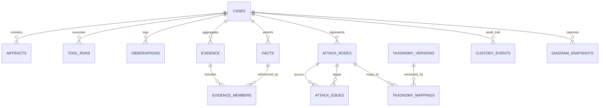

# 07. Database Architecture: Blue Team Cyber Range & SOC/DFIR Platform

**Profile ID**: `PRF-07-DBARCH`  
**Status**: `FROZEN (Approved at Human Gate 2 on 2026-09-17)`  
**Baseline**: Human Gate 2 Architecture & Contract Gate

---

## 1. Domain Identifier & Timestamp Policies

1. **Identifier Policy**:
   - **Domain Entities** (cases, observations, facts, evidence, nodes, edges, tasks, tool_runs): **`UUIDv7`** (128-bit time-ordered UUIDs, represented as 36-char canonical strings).
   - **Artifacts & Files**: Content Hash addressing (BLAKE3 64-char hex string as internal CAS locator; SHA-256 64-char hex string for forensic/IOC export).
2. **Timestamp Policy**:
   - Every temporal entity strictly records UTC timestamps in ISO-8601 format (`YYYY-MM-DDTHH:MM:SS.ffffffZ`).
   - Two distinct timestamps are preserved:
     - `source_timestamp`: Original event generation timestamp parsed from artifact.
     - `ingest_timestamp`: System clock timestamp when the observation was ingested.

---

## 2. Relational Schema Architecture (SQLite WAL)

The relational schema is structured into modular layers. The baseline domain schema contains the core investigation models, plus provenance, versioned taxonomy, and evidence aggregates:

---

## 3. High-Throughput Ingestion & Storage Invariants
- **WAL Journaling**: `PRAGMA journal_mode = WAL;` and `PRAGMA synchronous = NORMAL;`.
- **Foreign Keys**: `PRAGMA foreign_keys = ON;`.
- **Derived Attack Graph**: Nodes and edges are derived projections; if correlation or evidence rules are updated, graph reconstruction can be performed without loss of ground-truth observations and facts.
- **Append-Only Invariant**: Tables `observations`, `facts`, `tool_runs`, and `custody_events` are strictly append-only. Mutation or deletion of recorded forensic facts is forbidden.
