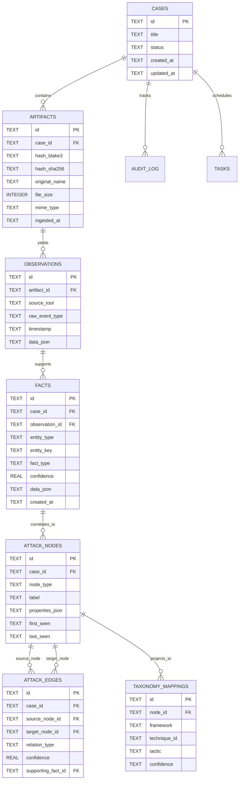

# 07. Database Architecture: Blue Team Cyber Range & SOC/DFIR Platform

**Profile ID**: `PRF-07-DBARCH`  
**Status**: `COMPLETED`  
**Input**: `docs/it-company/04-solution-architect.md` & `docs/it-company/06-system-analyst.md`

---

## 1. Storage Strategy: SQLite WAL + Content-Addressed Storage (CAS)

The system leverages a hybrid storage model:
- **SQLite (WAL mode)**: Structured relational metadata, cases, facts, graph topology, and audit trails with immediate consistency and ACID safety.
- **CAS (Local File Repository)**: Append-only, content-addressed storage for heavy immutable binaries (PCAP files, disk images, EVTX dumps) addressed by `cas/<hash[0..2]>/<hash[2..4]>/<hash>`.

---

## 2. Entity-Relationship (ER) Diagram

---

## 3. Performance & Indexing Strategy
- `PRAGMA journal_mode = WAL;` — High concurrency, parallel readers while writer commits.
- `PRAGMA synchronous = NORMAL;` — Durability with high throughput for bulk event ingestion.
- `PRAGMA foreign_keys = ON;` — Referential integrity.
- **Covering Indexes**:
  - `idx_artifacts_case_hash` on `artifacts(case_id, hash_blake3)`
  - `idx_observations_artifact` on `observations(artifact_id, timestamp)`
  - `idx_facts_case_entity` on `facts(case_id, entity_type, entity_key)`
  - `idx_edges_source_target` on `attack_edges(case_id, source_node_id, target_node_id)`
  - `idx_taxonomy_node` on `taxonomy_mappings(node_id, framework)`
