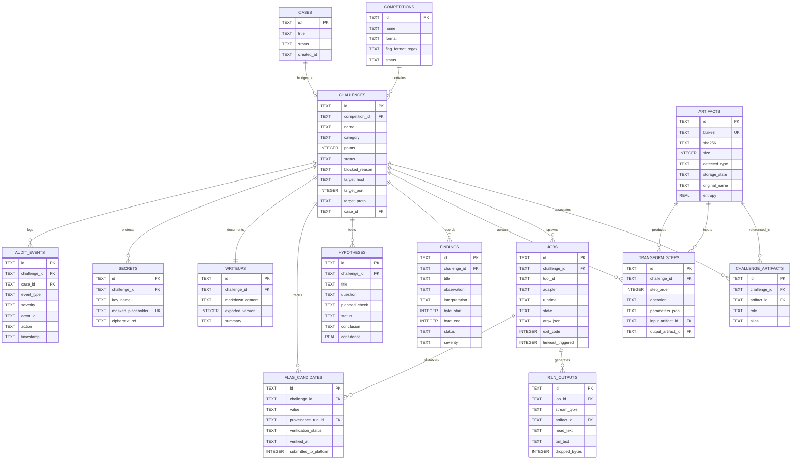

# 07. Спецификация логической схемы БД и миграций: CTF Unified Workspace Platform

**Документ**: Архитектурная спецификация модели данных и DDL-миграций (Database Architecture Document / DAD)  
**Версия**: 1.0.0-final  
**Архитектор**: Роль 07 (Database Architect)  
**Статус**: APPROVED  
**Связанные документы**: [`04-solution-architect.md`](file:///C:/Users/Siroj/Projects/soc-dfir-platform/docs/it-company/04-solution-architect.md), [`05-security-architect.md`](file:///C:/Users/Siroj/Projects/soc-dfir-platform/docs/it-company/05-security-architect.md), [`06-system-analyst.md`](file:///C:/Users/Siroj/Projects/soc-dfir-platform/docs/it-company/06-system-analyst.md), [`project_state.json`](file:///C:/Users/Siroj/Projects/soc-dfir-platform/docs/it-company/project_state.json)

---

## 1. Архитектурные принципы и стратегия хранения данных

1. **Двухуровневое хранилище (Dual-Tier Storage Engine)**:
   - **Метаданные и граф связей (SQLite 3)**: ACID-транзакции в режиме `PRAGMA journal_mode = WAL; PRAGMA synchronous = NORMAL;`. Обеспечивает параллельное чтение несколькими потоками без блокировки единственного потока-писателя.
   - **Контентно-адресуемое хранилище (CAS WORM)**: Все исходные файлы, дампы трафика, выгрузки памяти и промежуточные артефакты хранятся в неизменяемой файловой структуре `.cas/data/{hash[0..2]}/{hash[2..4]}/{hash}` с ключом BLAKE3 (64 hex-символа). SQLite хранит только дескрипторы и хэш-адреса.
2. **Аддитивная совместимость (Additive Non-Breaking Evolution)**:
   - Полное сохранение существующих структур DFIR-платформы: таблицы `cases`, `evidence`, `evidence_members`, `custody_events`, `attack_nodes`, `attack_edges` остаются нетронутыми.
   - Сущности CTF связываются с DFIR через внешние ключи-мосты (`challenges.case_id REFERENCES cases(id)`) и ретроспективные представления (SQL Views), позволяя расследовать инциденты и решать CTF в единой экосистеме.
3. **Строгая типизация и целостность**:
   - Первичные ключи — UUIDv7 (детерминированная сортировка по времени создания).
   - Ограничения `CHECK` на всех перечислениях статусов, категорий и протоколов.
   - Защита журнала аудита `audit_events` от модификации и удаления через SQLite-триггеры (Append-Only).

---

## 2. Логическая ER-диаграмма (Mermaid)



---

## 3. Словарь данных и спецификация сущностей

| Сущность | Первичный ключ | Внешние ключи / Ограничения | Назначение и семантика |
|---|---|---|---|
| `competitions` | `id` (UUIDv7) | `status IN ('draft', 'active', 'paused', 'completed', 'archived')` | Соревнование/платформа (CTFd, HTB, локальный воркспейс). |
| `challenges` | `id` (UUIDv7) | `FK -> competitions`, `FK -> cases (NULL)`, `status IN ('new', 'in_progress', 'blocked', 'solved', 'archived')` | Задание соревнования со скоупом сети и статусом. При `blocked` обязателен `blocked_reason`. |
| `artifacts` | `id` (UUIDv7) | `blake3 UNIQUE`, `size >= 0`, `storage_state IN ('stored', 'quarantined', 'evicted', 'missing')` | Метаданные файлов CAS. Ключ доступа — криптографический хэш BLAKE3. |
| `challenge_artifacts` | `id` (UUIDv7) | `FK -> challenges`, `FK -> artifacts`, `role IN ('input', 'extracted', 'transformed', 'memory_dump', 'pcaps', 'evidence', 'scratch')` | Junction-таблица (M:N) связки файлов с задачами с локальными алиасами. |
| `jobs` | `id` (UUIDv7) | `FK -> challenges`, `runtime IN ('native', 'wsl2', 'container', 'microvm')`, `state IN ('queued', 'preparing', 'running', 'succeeded', 'failed', 'cancelled', 'timed_out', 'interrupted')` | Изолированный запуск CLI-утилиты через безопасный массив `argv_json`. |
| `run_outputs` | `id` (UUIDv7) | `FK -> jobs`, `FK -> artifacts (NULL)`, `stream_type IN ('stdout', 'stderr', 'file', 'diagnostics')` | Буферизированный вывод процессов: кольцевые `head_text` / `tail_text` и CAS-дамп. |
| `transform_steps` | `id` (UUIDv7) | `FK -> challenges`, `FK -> artifacts (in/out)`, `operation IN ('hex_decode', 'hex_encode', 'base64_decode', 'base64_encode', 'xor', 'rot13', 'zlib_decompress', 'gzip_decompress', 'url_decode', 'custom_script')` | Узел в графе происхождения данных (Lineage DAG) и цепочках рецептов. |
| `findings` | `id` (UUIDv7) | `FK -> challenges`, `byte_end >= byte_start`, `status IN ('draft', 'confirmed', 'refuted', 'investigating')` | Ключевые наблюдения, фрагменты бинарных смещений и дедукции. |
| `hypotheses` | `id` (UUIDv7) | `FK -> challenges`, `confidence BETWEEN 0.0 AND 1.0`, `status IN ('proposed', 'in_progress', 'confirmed', 'rejected', 'abandoned')` | Проверяемые аналитические предположения с планом проверки. |
| `flag_candidates` | `id` (UUIDv7) | `FK -> challenges`, `FK -> jobs`, `verification_status IN ('candidate', 'accepted', 'rejected')`, `UNIQUE(challenge_id, value)` | Найденные по regex или вручную токены флагов с проверкой и аудитом. |
| `writeups` | `id` (UUIDv7) | `FK -> challenges UNIQUE`, `exported_version >= 1` | Итоговый Markdown-отчет с версионированием и timeline решения. |
| `secrets` | `id` (UUIDv7) | `FK -> challenges (NULL)`, `masked_placeholder UNIQUE`, `UNIQUE(challenge_id, key_name)` | Реестр конфиденциальных токенов/ключей для real-time санитизации вывода. |
| `audit_events` | `id` (UUIDv7) | `FK -> challenges (NULL)`, `FK -> cases (NULL)`, `severity IN ('info', 'warn', 'error', 'critical')` | Неизменяемый системный лог безопасности (Append-Only via Triggers). |

---

## 4. Архитектура обратной совместимости с SOC/DFIR

Платформа сохраняет 100% совместимость со старыми расследованиями `cases` и уликами `evidence`:
1. **Foreign Key Bridge**: Таблица `challenges` содержит столбец `case_id TEXT REFERENCES cases(id) ON DELETE SET NULL`. При необходимости углубленного расследования CTF-задача связывается с инцидентом DFIR.
2. **SQL View `v_legacy_cases`**: Предоставляет существующему коду SOC-платформы объединенное представление расследований и CTF-задач.
3. **SQL View `v_unified_artifacts`**: Объединяет файловые объекты расследований и контентно-адресуемые артефакты CTF.
4. **SQL View `v_tool_runs_legacy`**: Транслирует выполнения `jobs` в формат существующей таблицы `tool_runs`.

---

## 5. Черновой DDL-скрипт миграции (`V002_ctf_core_schema.sql`)

```sql
PRAGMA foreign_keys = ON;

-- 1. Competitions
CREATE TABLE IF NOT EXISTS competitions (
    id TEXT PRIMARY KEY,
    name TEXT NOT NULL,
    description TEXT,
    format TEXT NOT NULL DEFAULT 'jeopardy' CHECK (format IN ('jeopardy', 'attack_defense', 'mixed', 'ad_hoc')),
    flag_format_regex TEXT,
    start_at TEXT,
    end_at TEXT,
    status TEXT NOT NULL DEFAULT 'active' CHECK (status IN ('draft', 'active', 'paused', 'completed', 'archived')),
    created_at TEXT NOT NULL,
    updated_at TEXT NOT NULL
);
CREATE INDEX IF NOT EXISTS idx_competitions_status ON competitions(status);

-- 2. Challenges
CREATE TABLE IF NOT EXISTS challenges (
    id TEXT PRIMARY KEY,
    competition_id TEXT NOT NULL REFERENCES competitions(id) ON DELETE CASCADE,
    name TEXT NOT NULL,
    category TEXT NOT NULL CHECK (category IN ('web', 'pwn', 'reverse', 'crypto', 'forensics', 'misc', 'osint', 'stego', 'network')),
    points INTEGER DEFAULT 0 CHECK (points >= 0),
    status TEXT NOT NULL DEFAULT 'new' CHECK (status IN ('new', 'in_progress', 'blocked', 'solved', 'archived')),
    blocked_reason TEXT CHECK (status != 'blocked' OR blocked_reason IS NOT NULL),
    target_host TEXT,
    target_port INTEGER CHECK (target_port IS NULL OR (target_port >= 1 AND target_port <= 65535)),
    target_proto TEXT DEFAULT 'tcp' CHECK (target_proto IN ('tcp', 'udp', 'http', 'https', 'nc')),
    case_id TEXT REFERENCES cases(id) ON DELETE SET NULL,
    created_at TEXT NOT NULL,
    updated_at TEXT NOT NULL
);
CREATE INDEX IF NOT EXISTS idx_challenges_competition ON challenges(competition_id, category);
CREATE INDEX IF NOT EXISTS idx_challenges_status ON challenges(status);
CREATE INDEX IF NOT EXISTS idx_challenges_case ON challenges(case_id);

-- 3. Artifacts (CAS Metadata)
CREATE TABLE IF NOT EXISTS artifacts (
    id TEXT PRIMARY KEY,
    blake3 TEXT NOT NULL UNIQUE,
    sha256 TEXT NOT NULL,
    size INTEGER NOT NULL CHECK (size >= 0),
    detected_type TEXT NOT NULL DEFAULT 'application/octet-stream',
    storage_state TEXT NOT NULL DEFAULT 'stored' CHECK (storage_state IN ('stored', 'quarantined', 'evicted', 'missing')),
    original_name TEXT NOT NULL,
    entropy REAL CHECK (entropy IS NULL OR (entropy >= 0.0 AND entropy <= 8.0)),
    case_id TEXT REFERENCES cases(id) ON DELETE SET NULL,
    created_at TEXT NOT NULL
);
CREATE INDEX IF NOT EXISTS idx_artifacts_blake3 ON artifacts(blake3);
CREATE INDEX IF NOT EXISTS idx_artifacts_sha256 ON artifacts(sha256);
CREATE INDEX IF NOT EXISTS idx_artifacts_storage ON artifacts(storage_state);

-- 4. Challenge Artifacts Junction (M:N)
CREATE TABLE IF NOT EXISTS challenge_artifacts (
    id TEXT PRIMARY KEY,
    challenge_id TEXT NOT NULL REFERENCES challenges(id) ON DELETE CASCADE,
    artifact_id TEXT NOT NULL REFERENCES artifacts(id) ON DELETE RESTRICT,
    role TEXT NOT NULL DEFAULT 'input' CHECK (role IN ('input', 'extracted', 'transformed', 'memory_dump', 'pcaps', 'evidence', 'scratch')),
    alias TEXT,
    added_at TEXT NOT NULL,
    UNIQUE(challenge_id, artifact_id, role)
);
CREATE INDEX IF NOT EXISTS idx_chal_art_lookup ON challenge_artifacts(challenge_id, role);
CREATE INDEX IF NOT EXISTS idx_chal_art_rev ON challenge_artifacts(artifact_id);

-- 5. Jobs (Tool Runs Subsystem)
CREATE TABLE IF NOT EXISTS jobs (
    id TEXT PRIMARY KEY,
    challenge_id TEXT NOT NULL REFERENCES challenges(id) ON DELETE CASCADE,
    tool_id TEXT NOT NULL,
    adapter TEXT NOT NULL,
    runtime TEXT NOT NULL DEFAULT 'native' CHECK (runtime IN ('native', 'wsl2', 'container', 'microvm')),
    state TEXT NOT NULL DEFAULT 'queued' CHECK (state IN ('queued', 'preparing', 'running', 'succeeded', 'failed', 'cancelled', 'timed_out', 'interrupted')),
    argv_json TEXT NOT NULL,
    input_refs_json TEXT NOT NULL DEFAULT '[]',
    exit_code INTEGER,
    timeout_ms INTEGER NOT NULL DEFAULT 60000 CHECK (timeout_ms > 0),
    timeout_triggered INTEGER NOT NULL DEFAULT 0 CHECK (timeout_triggered IN (0, 1)),
    started_at TEXT,
    completed_at TEXT,
    created_at TEXT NOT NULL
);
CREATE INDEX IF NOT EXISTS idx_jobs_challenge_state ON jobs(challenge_id, state);
CREATE INDEX IF NOT EXISTS idx_jobs_created ON jobs(created_at);

-- 6. Run Outputs (Bounded Buffers + Spills)
CREATE TABLE IF NOT EXISTS run_outputs (
    id TEXT PRIMARY KEY,
    job_id TEXT NOT NULL REFERENCES jobs(id) ON DELETE CASCADE,
    stream_type TEXT NOT NULL CHECK (stream_type IN ('stdout', 'stderr', 'file', 'diagnostics')),
    artifact_id TEXT REFERENCES artifacts(id) ON DELETE SET NULL,
    head_text TEXT,
    tail_text TEXT,
    dropped_bytes INTEGER NOT NULL DEFAULT 0 CHECK (dropped_bytes >= 0),
    diagnostics_json TEXT NOT NULL DEFAULT '{}',
    created_at TEXT NOT NULL
);
CREATE INDEX IF NOT EXISTS idx_run_outputs_job ON run_outputs(job_id, stream_type);

-- 7. Transform Steps (Recipe Lineage DAG)
CREATE TABLE IF NOT EXISTS transform_steps (
    id TEXT PRIMARY KEY,
    challenge_id TEXT NOT NULL REFERENCES challenges(id) ON DELETE CASCADE,
    recipe_id TEXT,
    step_order INTEGER NOT NULL CHECK (step_order >= 0),
    operation TEXT NOT NULL CHECK (operation IN ('hex_decode', 'hex_encode', 'base64_decode', 'base64_encode', 'xor', 'rot13', 'zlib_decompress', 'gzip_decompress', 'url_decode', 'custom_script')),
    parameters_json TEXT NOT NULL DEFAULT '{}',
    input_artifact_id TEXT REFERENCES artifacts(id) ON DELETE RESTRICT,
    output_artifact_id TEXT REFERENCES artifacts(id) ON DELETE RESTRICT,
    input_hash TEXT,
    output_hash TEXT,
    created_at TEXT NOT NULL
);
CREATE INDEX IF NOT EXISTS idx_steps_chal_recipe ON transform_steps(challenge_id, recipe_id, step_order);
CREATE INDEX IF NOT EXISTS idx_steps_in_art ON transform_steps(input_artifact_id);
CREATE INDEX IF NOT EXISTS idx_steps_out_art ON transform_steps(output_artifact_id);

-- 8. Findings (Observations & Interpretations)
CREATE TABLE IF NOT EXISTS findings (
    id TEXT PRIMARY KEY,
    challenge_id TEXT NOT NULL REFERENCES challenges(id) ON DELETE CASCADE,
    title TEXT NOT NULL,
    observation TEXT NOT NULL,
    interpretation TEXT,
    byte_start INTEGER CHECK (byte_start IS NULL OR byte_start >= 0),
    byte_end INTEGER CHECK (byte_end IS NULL OR (byte_start IS NOT NULL AND byte_end >= byte_start)),
    evidence_refs TEXT NOT NULL DEFAULT '[]',
    status TEXT NOT NULL DEFAULT 'confirmed' CHECK (status IN ('draft', 'confirmed', 'refuted', 'investigating')),
    severity TEXT NOT NULL DEFAULT 'info' CHECK (severity IN ('info', 'low', 'medium', 'high', 'critical')),
    created_at TEXT NOT NULL,
    updated_at TEXT NOT NULL
);
CREATE INDEX IF NOT EXISTS idx_findings_chal_status ON findings(challenge_id, status);

-- 9. Hypotheses (Deductive Investigation)
CREATE TABLE IF NOT EXISTS hypotheses (
    id TEXT PRIMARY KEY,
    challenge_id TEXT NOT NULL REFERENCES challenges(id) ON DELETE CASCADE,
    title TEXT NOT NULL,
    question TEXT NOT NULL,
    statement TEXT,
    planned_check TEXT NOT NULL,
    evidence_refs TEXT NOT NULL DEFAULT '[]',
    status TEXT NOT NULL DEFAULT 'proposed' CHECK (status IN ('proposed', 'in_progress', 'confirmed', 'rejected', 'abandoned')),
    conclusion TEXT,
    confidence REAL NOT NULL DEFAULT 0.5 CHECK (confidence >= 0.0 AND confidence <= 1.0),
    created_at TEXT NOT NULL,
    evaluated_at TEXT
);
CREATE INDEX IF NOT EXISTS idx_hypotheses_chal_status ON hypotheses(challenge_id, status);

-- 10. Flag Candidates (Verification Pipeline)
CREATE TABLE IF NOT EXISTS flag_candidates (
    id TEXT PRIMARY KEY,
    challenge_id TEXT NOT NULL REFERENCES challenges(id) ON DELETE CASCADE,
    value TEXT NOT NULL,
    provenance_run_id TEXT REFERENCES jobs(id) ON DELETE SET NULL,
    provenance_artifact_id TEXT REFERENCES artifacts(id) ON DELETE SET NULL,
    provenance_step_id TEXT REFERENCES transform_steps(id) ON DELETE SET NULL,
    pattern_match TEXT,
    verification_status TEXT NOT NULL DEFAULT 'candidate' CHECK (verification_status IN ('candidate', 'accepted', 'rejected')),
    rejection_reason TEXT,
    verified_at TEXT,
    submitted_to_platform INTEGER NOT NULL DEFAULT 0 CHECK (submitted_to_platform IN (0, 1)),
    created_at TEXT NOT NULL,
    UNIQUE(challenge_id, value)
);
CREATE INDEX IF NOT EXISTS idx_flags_chal_status ON flag_candidates(challenge_id, verification_status);

-- 11. Writeups
CREATE TABLE IF NOT EXISTS writeups (
    id TEXT PRIMARY KEY,
    challenge_id TEXT NOT NULL UNIQUE REFERENCES challenges(id) ON DELETE CASCADE,
    markdown_content TEXT NOT NULL DEFAULT '',
    exported_version INTEGER NOT NULL DEFAULT 1 CHECK (exported_version >= 1),
    summary TEXT,
    created_at TEXT NOT NULL,
    updated_at TEXT NOT NULL
);

-- 12. Secrets Registry
CREATE TABLE IF NOT EXISTS secrets (
    id TEXT PRIMARY KEY,
    challenge_id TEXT REFERENCES challenges(id) ON DELETE CASCADE,
    key_name TEXT NOT NULL,
    masked_placeholder TEXT NOT NULL UNIQUE,
    ciphertext_ref TEXT NOT NULL,
    created_at TEXT NOT NULL,
    updated_at TEXT NOT NULL,
    UNIQUE(challenge_id, key_name)
);
CREATE INDEX IF NOT EXISTS idx_secrets_mask ON secrets(masked_placeholder);

-- 13. Audit Events (Append-Only Trail)
CREATE TABLE IF NOT EXISTS audit_events (
    id TEXT PRIMARY KEY,
    challenge_id TEXT REFERENCES challenges(id) ON DELETE SET NULL,
    case_id TEXT REFERENCES cases(id) ON DELETE SET NULL,
    event_type TEXT NOT NULL,
    severity TEXT NOT NULL DEFAULT 'info' CHECK (severity IN ('info', 'warn', 'error', 'critical')),
    actor_id TEXT NOT NULL DEFAULT 'system',
    action TEXT NOT NULL,
    resource_type TEXT NOT NULL,
    resource_id TEXT,
    process_argv TEXT,
    details_json TEXT NOT NULL DEFAULT '{}',
    timestamp TEXT NOT NULL
);
CREATE INDEX IF NOT EXISTS idx_audit_chal_ts ON audit_events(challenge_id, timestamp);
CREATE INDEX IF NOT EXISTS idx_audit_type ON audit_events(event_type);

-- Triggers Enforcing Append-Only Audit Integrity
CREATE TRIGGER IF NOT EXISTS trg_audit_no_update
BEFORE UPDATE ON audit_events
BEGIN
    SELECT RAISE(ABORT, 'SecurityViolation: audit_events log is strictly append-only (UPDATE rejected)');
END;
CREATE TRIGGER IF NOT EXISTS trg_audit_no_delete
BEFORE DELETE ON audit_events
BEGIN
    SELECT RAISE(ABORT, 'SecurityViolation: audit_events log is strictly append-only (DELETE rejected)');
END;

-- Compatibility SQL Views: Bridging CTF and DFIR Models
CREATE VIEW IF NOT EXISTS v_legacy_cases AS
SELECT
    c.id AS case_id, c.title, c.description, c.status AS case_status,
    ch.id AS challenge_id, ch.competition_id, ch.category AS challenge_category,
    ch.points AS challenge_points, ch.status AS challenge_status, c.created_at, c.updated_at
FROM cases c LEFT JOIN challenges ch ON ch.case_id = c.id;

CREATE VIEW IF NOT EXISTS v_unified_artifacts AS
SELECT
    a.id AS artifact_id, a.blake3, a.sha256, a.original_name, a.size, a.detected_type,
    a.storage_state, ca.challenge_id, ca.role AS challenge_role, ca.alias AS challenge_alias,
    a.case_id, a.created_at
FROM artifacts a LEFT JOIN challenge_artifacts ca ON ca.artifact_id = a.id;

CREATE VIEW IF NOT EXISTS v_tool_runs_legacy AS
SELECT
    j.id AS run_id, j.challenge_id, ch.case_id, j.adapter AS adapter_name, j.runtime,
    j.state, j.argv_json, j.exit_code AS exit_status, j.timeout_triggered, j.started_at, j.completed_at
FROM jobs j LEFT JOIN challenges ch ON ch.id = j.challenge_id;
```

---

## 6. Матрица передачи артефактов (Handover Matrix)

| Приемник (Роль) | Целевой документ / Зона ответственности | Передаваемые данные и контракты |
|---|---|---|
| **16-frontend-architect** | `16-frontend-architect.md` | Схема сущностей (`challenges`, `artifacts`, `jobs`, `flag_candidates`), статусы, контракты виртуализации (смещения 64 КБ). |
| **08-database-developer** | Релизация в `crates/storage-sqlite` | DDL-скрипт `V002_ctf_core_schema.sql`, индексы, триггеры целостности, пулы соединений `r2d2`/`sqlx`. |
| **09-backend-architect** | `09-backend-architect.md` | Реляционная нормализация `jobs`/`run_outputs`, CAS-хэширование BLAKE3, правила маскирования `secrets`. |

> [!IMPORTANT]
> Спроектированная схема полностью аддитивна: существующие таблицы SOC-платформы не модифицируются деструктивно, обеспечивая одновременную работу модулей расследования инцидентов и CTF-воркспейса.
