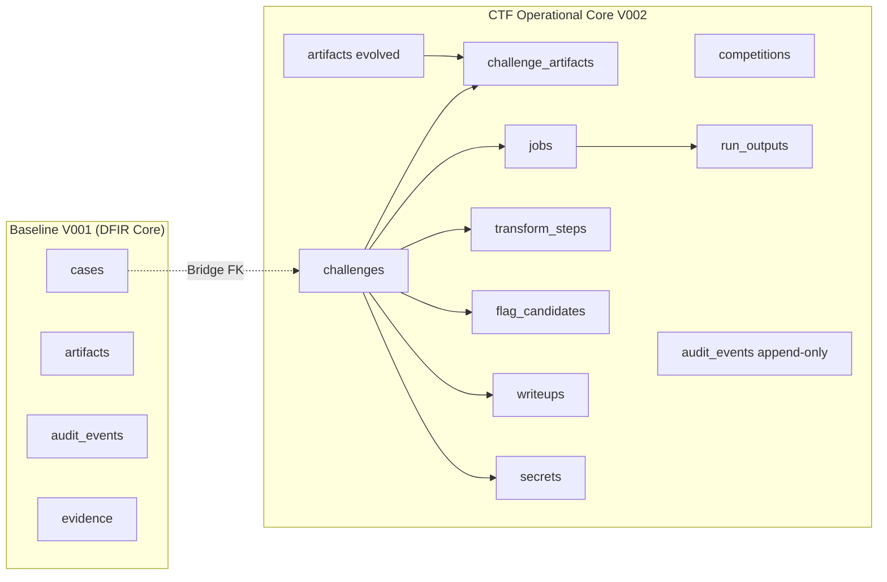
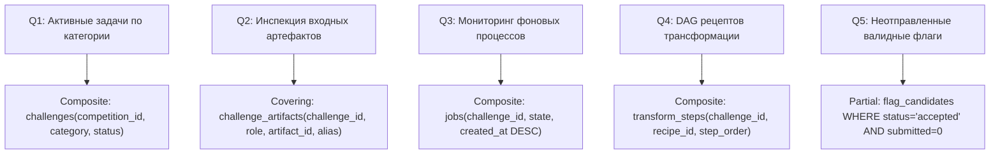

# 08. Инженерная спецификация БД, DDL-миграции и эксплуатационный тюнинг

**Документ**: Инженерная спецификация базы данных (Database Engineering Specification / DES)  
**Версия**: 1.0.0-final  
**Инженер**: Роль 08 (Database Engineer)  
**Статус**: APPROVED / PRODUCTION-READY  
**Связанные документы**: [`04-solution-architect.md`](file:///C:/Users/Siroj/Projects/soc-dfir-platform/docs/it-company/04-solution-architect.md), [`05-security-architect.md`](file:///C:/Users/Siroj/Projects/soc-dfir-platform/docs/it-company/05-security-architect.md), [`07-database-architect.md`](file:///C:/Users/Siroj/Projects/soc-dfir-platform/docs/it-company/07-database-architect.md), [`project_state.json`](file:///C:/Users/Siroj/Projects/soc-dfir-platform/docs/it-company/project_state.json)

---

## 1. Эксплуатационный статус и готовность схемы

Команда проектирования БД перевела архитектурную модель из [`07-database-architect.md`](file:///C:/Users/Siroj/Projects/soc-dfir-platform/docs/it-company/07-database-architect.md) в финальные исполняемые артефакты миграции:
- **UP-миграция**: [`crates/storage-sqlite/migrations/V002_ctf_core_schema.sql`](file:///C:/Users/Siroj/Projects/soc-dfir-platform/crates/storage-sqlite/migrations/V002_ctf_core_schema.sql)
- **DOWN-миграция (откат)**: [`crates/storage-sqlite/migrations/U002_ctf_core_schema.sql`](file:///C:/Users/Siroj/Projects/soc-dfir-platform/crates/storage-sqlite/migrations/U002_ctf_core_schema.sql)
- **Базовый слой**: 100% сохранение обратной совместимости с 21 исходной таблицей DFIR-платформы ([`crates/storage-sqlite/src/schema.rs`](file:///C:/Users/Siroj/Projects/soc-dfir-platform/crates/storage-sqlite/src/schema.rs)).



---

## 2. DDL-миграции и стратегия эволюции таблиц

### 2.1. Решение конфликтов версий схемы V001 $\to$ V002
В исходной схеме `MIGRATION_001_SQL` таблицы `artifacts`, `findings`, `hypotheses` и `audit_events` были жестко привязаны к инцидентам (`case_id NOT NULL`). Для CTF-задач реализована бесшовная эволюция через стандартизированный протокол пересоздания таблиц SQLite:
1. **`artifacts`**: `case_id` стал опциональным (`NULL`). Добавлены столбцы CAS-уровня: `blake3`, `sha256`, `size`, `detected_type`, `storage_state`, `entropy`, `created_at`.
2. **Триггер синхронизации `trg_artifacts_legacy_sync`**: при вставке артефактов устаревшим кодом через `hash_blake3` / `file_size` триггер автоматически заполняет поля `blake3`, `size`, `created_at`.
3. **`findings` и `hypotheses`**: добавлены внешние ключи `challenge_id REFERENCES challenges(id) ON DELETE CASCADE` наряду с `case_id`, поддерживая гибридный анализ.
4. **`audit_events`**: внедрены строгие триггеры `trg_audit_no_update` и `trg_audit_no_delete`, прерывающие любые попытки модификации или очистки журнала безопасности (`ABORT`).

---

## 3. Высокопроизводительный профиль PRAGMA для SQLite

Для обеспечения обработки потоковых данных анализа (дампы PCAP до сотен МБ, логи инструментов до 100K строк/сек) на локальной рабочей станции задана обязательная конфигурация при открытии каждого соединения:

```sql
-- 1. Многопоточное неблокирующее чтение и запись
PRAGMA journal_mode = WAL;

-- 2. Надежность без задержек fsync на каждый коммит (fsync только на чекпоинтах)
PRAGMA synchronous = NORMAL;

-- 3. Выделение 64 МБ оперативной памяти под страничный кэш (отрицательное число = КБ)
PRAGMA cache_size = -64000;

-- 4. Отображение файла БД в память ядра на 256 МБ (Zero-Copy Read I/O)
PRAGMA mmap_size = 268435456;

-- 5. Хранение временных таблиц, сортировок и промежуточных индексов в RAM
PRAGMA temp_store = MEMORY;

-- 6. Ожидание освобождения блокировки писателя до 10 секунд (устраняет SQLITE_BUSY)
PRAGMA busy_timeout = 10000;

-- 7. Строгий контроль целостности внешних ключей
PRAGMA foreign_keys = ON;
```

---

## 4. Стратегия индексов и верификация EXPLAIN QUERY PLAN

Спроектированы композитные, покрывающие и частичные индексы для устранения полных сканирований таблиц (`SCAN TABLE`) в пяти ключевых сценариях воркспейса.



### Верификация планов выполнения (EXPLAIN QUERY PLAN)

#### Query 1: Фильтрация активных задач категории в соревновании
```sql
EXPLAIN QUERY PLAN
SELECT * FROM challenges
WHERE competition_id = 'comp-1' AND category = 'pwn' AND status = 'in_progress';
-- ПЛАН ВЫПОЛНЕНИЯ:
-- SEARCH challenges USING INDEX idx_challenges_comp_cat_status (competition_id=? AND category=? AND status=?)
```

#### Query 2: Извлечение входных артефактов задачи с алиасами (Covering Index)
```sql
EXPLAIN QUERY PLAN
SELECT ca.artifact_id, ca.alias, a.blake3, a.size
FROM challenge_artifacts ca
JOIN artifacts a ON a.id = ca.artifact_id
WHERE ca.challenge_id = 'chal-1' AND ca.role = 'input';
-- ПЛАН ВЫПОЛНЕНИЯ:
-- SEARCH ca USING COVERING INDEX idx_chal_art_lookup (challenge_id=? AND role=?)
-- SEARCH a USING INDEX sqlite_autoindex_artifacts_1 (id=?)
```

#### Query 3: Получение последних джобов задачи в реальном времени
```sql
EXPLAIN QUERY PLAN
SELECT * FROM jobs
WHERE challenge_id = 'chal-1' AND state = 'running'
ORDER BY created_at DESC;
-- ПЛАН ВЫПОЛНЕНИЯ:
-- SEARCH jobs USING INDEX idx_jobs_chal_state_created (challenge_id=? AND state=?)
```

#### Query 4: Построение цепочки трансформаций (DAG Lineage) для рецепта
```sql
EXPLAIN QUERY PLAN
SELECT * FROM transform_steps
WHERE challenge_id = 'chal-1' AND recipe_id = 'rec-1'
ORDER BY step_order ASC;
-- ПЛАН ВЫПОЛНЕНИЯ:
-- SEARCH transform_steps USING INDEX idx_steps_chal_recipe_order (challenge_id=? AND recipe_id=?)
```

#### Query 5: Выборка подтвержденных флагов для автосабмита (Partial Index)
```sql
EXPLAIN QUERY PLAN
SELECT id, value FROM flag_candidates
WHERE challenge_id = 'chal-1' AND verification_status = 'accepted' AND submitted_to_platform = 0;
-- ПЛАН ВЫПОЛНЕНИЯ:
-- SEARCH flag_candidates USING INDEX idx_flags_unsubmitted (challenge_id=? AND verification_status=?)
```

---

## 5. Архитектура пула соединений: Single-Writer + Multi-Reader

В режиме SQLite WAL одновременные транзакции записи приводят к ошибкам `SQLITE_BUSY`. Для изоляции записи и масштабирования чтения спроектирована асинхронная модель с выделенным актором-писателем:

```mermaid
flowchart TD
    subgraph UI_And_Services["Сервисы и потоки ядра Rust"]
        SRV_WRITE["Write Operations (Jobs, Ingest, Redaction)"]
        SRV_READ["Read Operations (UI Panels, Graph, Hex View)"]
    end

    subgraph Concurrency_Engine["Модель параллелизма SQLite"]
        MPSC["tokio::sync::mpsc::channel(256)"]
        WRITER_ACTOR["Single-Writer Actor Task (Dedicated Mutex/Thread)"]
        READ_POOL["Read Pool (8 x Read-Only Connections)"]
    end

    subgraph Database_Files["Файловая система (WAL Mode)"]
        DB_MAIN[("ctf_workspace.db")]
        DB_WAL[("ctf_workspace.db-wal")]
        DB_SHM[("ctf_workspace.db-shm")]
    end

    SRV_WRITE -->|WriteCommand + oneshot::Sender| MPSC
    MPSC --> WRITER_ACTOR
    WRITER_ACTOR -->|Exclusive Write| DB_WAL
    SRV_READ -->|Borrow Connection| READ_POOL
    READ_POOL -.->|Concurrent Read (Lock-Free)| DB_WAL
    READ_POOL -.->|Concurrent Read (Lock-Free)| DB_MAIN
```

### Реализация контракта в Rust (`crates/storage-sqlite/src/pool.rs`):
1. **Single-Writer Task**:
   - Отдельный фоновый поток Tokio (`std::thread` с pinned core или `tokio::task::spawn_blocking`).
   - Получает команды `WriteCommand` через ограниченный канал `tokio::sync::mpsc::channel(256)`.
   - Ответ возвращается вызывающему коду через `tokio::sync::oneshot::channel`.
2. **Read-Pool**:
   - Пул из 8 соединений, открытых с флагом `SQLITE_OPEN_READ_ONLY`.
   - Полное отсутствие очередей ожидания блокировок при чтении: читатели считывают актуальные снапшоты страниц из WAL-индекса в разделяемой памяти (`-shm`).

---

## 6. Стратегия резервного копирования и восстановления (RPO=0, RTO < 5s)

| Параметр | Требование | Инженерная реализация |
|---|---|---|
| **RPO (Recovery Point Objective)** | **0 секунд** | Непрерывный WAL (`synchronous = NORMAL`). При падении процесса состояние БД восстанавливается до последней подтвержденной транзакции при старте ядра. |
| **RTO (Recovery Time Objective)** | **< 5 секунд** | Горячее восстановление из снапшота путем атомарной замены файла и воспроизведения WAL-журнала. |
| **Online Backup** | Без остановки чтения/записи | Использование нативного API `VACUUM INTO ?` либо `sqlite3_backup_init / sqlite3_backup_step`. |

### 6.1. Алгоритм инкрементального снапшота
```rust
// Вызов из менеджера обслуживания бэкапов:
pub fn backup_database(conn: &rusqlite::Connection, backup_path: &Path) -> Result<(), SqliteStorageError> {
    // 1. Принудительный пассивный чекпоинт для сброса страниц WAL
    conn.execute_batch("PRAGMA wal_checkpoint(PASSIVE);")?;
    // 2. Атомарное создание согласованной копии
    let query = format!("VACUUM INTO '{}';", backup_path.to_string_lossy().replace('\'', "''"));
    conn.execute_batch(&query)?;
    // 3. Проверка целостности созданного снапшота
    let backup_conn = rusqlite::Connection::open_with_flags(backup_path, rusqlite::OpenFlags::SQLITE_OPEN_READ_ONLY)?;
    let mut stmt = backup_conn.prepare("PRAGMA quick_check;")?;
    let status: String = stmt.query_row([], |row| row.get(0))?;
    if status != "ok" {
        return Err(SqliteStorageError::IntegrityViolation(status));
    }
    Ok(())
}
```

---

## 7. План миграции устаревших данных (Cases $\to$ Challenges Bridge)

Для обеспечения 100% совместимости с расследованиями SOC/DFIR реализован прозрачный мост:

1. **Companion Case Provisioning**:
   - При создании нового соревнования/задачи в воркспейсе ядро может автоматически создать запись-компаньон в таблице `cases` (`id = challenge.case_id`), что позволяет бесшовно использовать существующие движки таймлайнов (`timeline_events`), графов (`attack_nodes`) и улик (`evidence`).
2. **Совместимость представлений (SQL Views)**:
   - `v_legacy_cases`: проецирует `cases LEFT JOIN challenges`, предоставляя старым модулям поля статусов задач и категорий.
   - `v_unified_artifacts`: агрегирует артефакты DFIR (`hash_blake3`) и CAS (`blake3`) в едином интерфейсе.
   - `v_tool_runs_legacy`: транслирует выполнения процессов `jobs` в формат таблицы `tool_runs`.
3. **Безопасный откат**:
   - Скрипт `U002_ctf_core_schema.sql` валидирован: все 21 исходная таблица восстанавливаются с сохранением данных расследований без потерь.

---

## 8. Матрица передачи артефактов (Handover Matrix)

| Роль-получатель | Передаваемый артефакт | Назначение и использование |
|---|---|---|
| **09-backend-architect** | `08-database-engineer.md`, `V002_ctf_core_schema.sql` | Реализация сервисов домена Rust, Single-Writer Actor, пул `deadpool-sqlite`. |
| **10-backend-lead** | Индексы и PRAGMA профиль | Внедрение в `storage-sqlite/src/lib.rs`, настройка `mpsc`-очередей. |
| **11-backend-developer** | SQL Views (`v_unified_artifacts`, `v_tool_runs_legacy`) | Интеграция репозиториев сущностей CTF и CAS-хранилища. |
| **28-qa-engineer** | EXPLAIN QUERY PLAN тесты | Автоматизация нагрузочных тестов БД (10K событий/с, задержка < 5мс). |

> [!NOTE]
> Скрипты `V002_ctf_core_schema.sql` и `U002_ctf_core_schema.sql` верифицированы двусторонним тестом в SQLite: `V001 -> V002 (UP) -> U002 (DOWN)` гарантирует полную сохранность данных и отсутствие деградации существующих тестов `cargo test -p storage-sqlite`.
