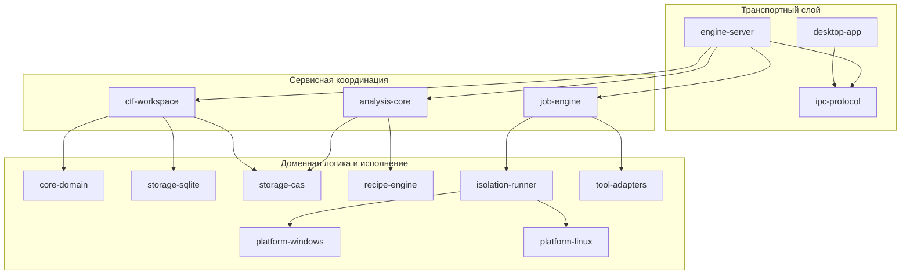
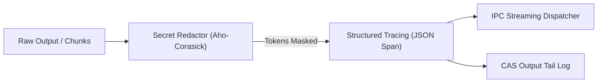

# 09. Архитектура бэкенда: CTF Unified Workspace Platform

**Документ**: Архитектурная спецификация бэкенда (Backend Architecture Specification / BAS)  
**Версия**: 1.0.0-final | **Архитектор**: Роль 09 (Backend Architect) | **Статус**: APPROVED  
**Связанные документы**: [`04-solution-architect.md`](file:///C:/Users/Siroj/Projects/soc-dfir-platform/docs/it-company/04-solution-architect.md), [`05-security-architect.md`](file:///C:/Users/Siroj/Projects/soc-dfir-platform/docs/it-company/05-security-architect.md), [`06-system-analyst.md`](file:///C:/Users/Siroj/Projects/soc-dfir-platform/docs/it-company/06-system-analyst.md), [`08-database-engineer.md`](file:///C:/Users/Siroj/Projects/soc-dfir-platform/docs/it-company/08-database-engineer.md), [`project_state.json`](file:///C:/Users/Siroj/Projects/soc-dfir-platform/docs/it-company/project_state.json)

---

## 1. Декомпозиция крейтов Cargo Workspace

Бэкенд спроектирован как модульный монолит в Cargo Workspace с компиляционной изоляцией слоев. Новые CTF-крейты интегрируются с базовыми модулями платформы без циклических зависимостей:



### Модульная матрица крейтов

| Крейт | Ответственность | Зависимости в Workspace |
|---|---|---|
| `core-domain` | Базовые сущности, UUIDv7, Value Objects, Domain Events | Нет внутренних зависимостей |
| `storage-cas` | WORM хранилище, блочный ввод-вывод (64 KB), BLAKE3/SHA-256 | `core-domain` |
| `storage-sqlite` | Single-Writer Actor, пул 8x Read, миграции V002, транзакции | `core-domain` |
| `recipe-engine` | Конвейер операций (Hex, Base64, XOR, zlib, ROT13), Regex сканер | `core-domain` |
| `analysis-core` | Ingestion, Anti-Zip-Slip, энтропия, виртуализация срезов | `core-domain`, `storage-cas`, `recipe-engine` |
| `isolation-runner` | Трейт `Runner`, Job Objects (Win), cgroups/namespaces (Linux) | `core-domain`, `platform-windows`, `platform-linux` |
| `tool-adapters` | Манифесты CLI-инструментов, парсеры вывода, типизированный argv | `core-domain` |
| `job-engine` | Очередь, лимиты, кольцевой буфер вывода (2MB/8MB), Redactor | `core-domain`, `storage-cas`, `isolation-runner`, `tool-adapters` |
| `ctf-workspace` | Сервисы соревнований, задач, скоринга, улик, черновиков Write-up | `core-domain`, `storage-sqlite`, `storage-cas` |
| `ipc-protocol` | JSON-RPC 2.0 DTO, конверты, валидация, стриминговые события | `core-domain` |
| `engine-server` | Инициализация SQLite/CAS, IPC роутер, диспетчеризация вызовов | Все крейты workspace |

---

## 2. Contract A: Domain & Service Layer (для Роли 10)

Контракт задает чистые асинхронные Rust-интерфейсы бизнес-логики без привязки к JSON-RPC, сериализации или сетевым протоколам.

### 2.1. Доменные ошибки (`DomainError`)
```rust
#[derive(thiserror::Error, Debug)]
pub enum DomainError {
    #[error("Entity not found: {entity} with id {id}")]
    NotFound { entity: &'static str, id: String },
    #[error("Validation failed: {0}")]
    Validation(String),
    #[error("Security violation: {0}")]
    SecurityViolation(String),
    #[error("Resource limit exceeded: {0}")]
    ResourceLimit(String),
    #[error("Storage failure: {0}")]
    Storage(String),
    #[error("Execution failed: {0}")]
    Execution(String),
    #[error("Conflict: {0}")]
    Conflict(String),
}
```

### 2.2. Сервисные трейты (`async_trait`)

```rust
#[async_trait::async_trait]
pub trait WorkspaceService: Send + Sync {
    async fn create_competition(&self, cmd: CreateCompetitionCmd) -> Result<CompetitionId, DomainError>;
    async fn get_competition(&self, id: &CompetitionId) -> Result<Competition, DomainError>;
    async fn list_competitions(&self, filter: Option<CompetitionStatus>) -> Result<Vec<CompetitionSummary>, DomainError>;
    async fn create_challenge(&self, cmd: CreateChallengeCmd) -> Result<ChallengeId, DomainError>;
    async fn get_challenge(&self, id: &ChallengeId) -> Result<ChallengeDetails, DomainError>;
    async fn list_challenges(&self, comp_id: &CompetitionId, cat: Option<String>) -> Result<Vec<ChallengeSummary>, DomainError>;
    async fn update_challenge_status(&self, id: &ChallengeId, status: ChallengeStatus, reason: Option<BlockedReason>) -> Result<(), DomainError>;
    async fn update_challenge_target(&self, id: &ChallengeId, target: TargetScope) -> Result<(), DomainError>;
}

#[async_trait::async_trait]
pub trait CasStorageService: Send + Sync {
    async fn store_stream<R: tokio::io::AsyncRead + Unpin + Send>(&self, reader: R, meta: IngestMetadata) -> Result<ArtifactId, DomainError>;
    async fn read_slice(&self, hash: &Blake3Hash, offset: u64, length: usize) -> Result<Vec<u8>, DomainError>;
    async fn verify_integrity(&self, hash: &Blake3Hash) -> Result<bool, DomainError>;
    async fn unpack_archive_safe(&self, artifact_id: &ArtifactId, target_dir: &std::path::Path) -> Result<Vec<ArtifactId>, DomainError>;
}

#[async_trait::async_trait]
pub trait JobEngineService: Send + Sync {
    async fn submit_job(&self, spec: JobSpec) -> Result<JobId, DomainError>;
    async fn cancel_job(&self, id: &JobId, reason: Option<String>) -> Result<(), DomainError>;
    async fn get_job_state(&self, id: &JobId) -> Result<JobRuntimeState, DomainError>;
    async fn get_output_tail(&self, id: &JobId, max_bytes: usize) -> Result<OutputTail, DomainError>;
}

#[async_trait::async_trait]
pub trait RecipeService: Send + Sync {
    fn preview(&self, input: &[u8], ops: &[RecipeOp]) -> Result<RecipePreview, DomainError>;
    async fn execute_pipeline(&self, artifact_id: &ArtifactId, ops: &[RecipeOp]) -> Result<ArtifactId, DomainError>;
    async fn save_recipe(&self, chal_id: &ChallengeId, name: String, ops: Vec<RecipeOp>) -> Result<RecipeId, DomainError>;
    async fn list_recipes(&self, chal_id: &ChallengeId) -> Result<Vec<RecipeMeta>, DomainError>;
}

#[async_trait::async_trait]
pub trait FlagService: Send + Sync {
    async fn register_candidate(&self, chal_id: &ChallengeId, value: String, source_ref: String) -> Result<CandidateId, DomainError>;
    async fn accept_flag(&self, candidate_id: &CandidateId) -> Result<bool, DomainError>;
    async fn reject_flag(&self, candidate_id: &CandidateId, reason: Option<String>) -> Result<(), DomainError>;
    async fn list_flags(&self, chal_id: &ChallengeId) -> Result<Vec<FlagCandidate>, DomainError>;
}

#[async_trait::async_trait]
pub trait WriteupService: Send + Sync {
    async fn generate_draft(&self, chal_id: &ChallengeId, include_timeline: bool) -> Result<String, DomainError>;
    async fn export_markdown(&self, chal_id: &ChallengeId, dest_path: &std::path::Path) -> Result<u64, DomainError>;
    async fn update_section(&self, chal_id: &ChallengeId, section: String, content: String) -> Result<(), DomainError>;
}
```

---

## 3. Contract B: IPC JSON-RPC 2.0 & Streaming API (для Роли 11)

### 3.1. Базовые конверты и коды ошибок

```rust
#[derive(Serialize, Deserialize)]
pub struct JsonRpcRequest<T> {
    pub jsonrpc: String, // "2.0"
    pub id: serde_json::Value,
    pub method: String,  // "<namespace>.<command>"
    pub params: T,
}

#[derive(Serialize, Deserialize)]
pub struct JsonRpcResponse<T> {
    pub jsonrpc: String,
    pub id: serde_json::Value,
    #[serde(skip_serializing_if = "Option::is_none")]
    pub result: Option<T>,
    #[serde(skip_serializing_if = "Option::is_none")]
    pub error: Option<JsonRpcError>,
}
```

| Код ошибки | Константа | Описание |
|---|---|---|
| `-32700` | `PARSE_ERROR` | Некорректный JSON синтаксис |
| `-32600` | `INVALID_REQUEST` | Нарушена структура JSON-RPC конверта |
| `-32601` | `METHOD_NOT_FOUND` | Неизвестное пространство имен или метод |
| `-32602` | `INVALID_PARAMS` | Ошибка валидации DTO параметров |
| `-32001` | `SECURITY_VIOLATION` | Path traversal, Shell injection, SSRF blocked |
| `-32002` | `RESOURCE_EXHAUSTED` | Превышение квот RAM/CPU, Zip-Bomb limit |
| `-32004` | `ENTITY_NOT_FOUND` | Сущность не найдена в хранилище |
| `-32005` | `CONFLICT_STATE` | Недопустимый переход в жизненном цикле |

### 3.2. Ключевые DTO структур и правила валидации

```rust
// 1. competitions.create
#[derive(Deserialize, Validate)]
pub struct CompetitionCreateReq {
    #[validate(length(min = 1, max = 120))]
    pub name: String,
    pub description: Option<String>,
    #[validate(regex(path = "*FLAG_REGEX_VALIDATOR"))]
    pub flag_format: Option<String>,
}

// 2. challenges.create
#[derive(Deserialize, Validate)]
pub struct ChallengeCreateReq {
    pub competition_id: String, // UUIDv7
    #[validate(length(min = 1, max = 120))]
    pub name: String,
    pub category: String, // "crypto"|"pwn"|"web"|"rev"|"forensics"|"misc"
    pub points: Option<u32>,
    pub target: Option<TargetScopeDto>,
}

// 3. jobs.submit (SEC-ARCH-01 zero shell validation)
#[derive(Deserialize, Validate)]
pub struct JobSubmitReq {
    pub challenge_id: String,
    pub tool_id: String,
    #[validate(custom(function = "validate_zero_shell_argv"))]
    pub argv: Vec<String>,
    pub limits: Option<ResourceLimitsDto>,
}

// 4. artifacts.get_slice (до 64 KB за вызов)
#[derive(Deserialize, Validate)]
pub struct ArtifactSliceReq {
    pub artifact_id: String,
    pub offset: u64,
    #[validate(range(min = 1, max = 65536))]
    pub length: usize,
}
```

### 3.3. Спецификация Streaming Events (One-way IPC)

События отправляются ядром клиенту без подтверждения (`id = null`):
1. **`job.output`**: консольный чанк stdout/stderr (до 16 KB), троттлинг 16 мс (60 FPS).
2. **`job.status_changed`**: переход состояния (`queued` $\to$ `running` $\to$ `succeeded`/`failed`/`cancelled`).
3. **`job.progress`**: этап и процент выполнения (`stage`, `percentage`, `bytes_processed`).

---

## 4. Сквозные механизмы: Ошибки, Tracing и Redaction



### 4.1. Логирование и Observability (`tracing`)
- Формат: структурированный JSON с полями `timestamp`, `level`, `target`, `span_id`, `challenge_id`, `job_id`.
- Уровни: `ERROR` (сбои среды, перехват безопасности), `WARN` (redaction secrets, retry), `INFO` (статусы задач, ingest), `DEBUG`/`TRACE` (IPC framing, slice offsets).
- Контекстные спаны: каждый запуск оборачивается в `tracing::info_span!("job_run", job_id = %id, tool = %tool)`.

### 4.2. Потоковая санитизация секретов (Secret Redactor)
- **Алгоритм**: Двухфазный сканер: `aho-corasick::AhoCorasick` для точных совпадений ключей из БД + предкомпилированные регулярные выражения для шаблонов токенов (Bearer, Private Keys, CTFd Session).
- **Маскирование**: Замена совпадения на маркер `[REDACTED:SECRET_<ID>]` до записи в SQLite, CAS или отправки в IPC-пайп.

---

## 5. Декомпозиция задач для инженеров

### 5.1. Роль 10: Backend Logic Developer
- [ ] **TASK-BE-10-01**: Реализовать доменные сущности и ошибки в `crates/core-domain` (`Competition`, `Challenge`, `Artifact`, `Job`, `Finding`, `FlagCandidate`, `DomainError`).
- [ ] **TASK-BE-10-02**: Реализовать `CasStorageService` в `crates/storage-cas` (потоковый ingest, блочный read_slice 64KB, BLAKE3 WORM, Safe Ingest с защитой от Zip-Slip/Bomb по SEC-ARCH-02).
- [ ] **TASK-BE-10-03**: Реализовать `WorkspaceService` в `crates/ctf-workspace` (CRUD соревнований/задач, Single-Writer SQLite интеграция, изоляция контекстов).
- [ ] **TASK-BE-10-04**: Реализовать `JobEngineService` в `crates/job-engine` (диспетчер воркеров, принудительный таймаут, ring buffer 2MB head / 8MB tail).
- [ ] **TASK-BE-10-05**: Реализовать `RecipeService` в `crates/recipe-engine` (in-memory трансформации Hex/Base64/XOR/zlib, Regex scanner кандидатов флагов).
- [ ] **TASK-BE-10-06**: Реализовать `FlagService` и `WriteupService` в `crates/ctf-workspace` (валидация флагов, сборка Markdown Writeup из Lineage DAG).

### 5.2. Роль 11: Backend API Developer
- [ ] **TASK-BE-11-01**: Реализовать базовый JSON-RPC 2.0 фрейминг, сериализаторы и маршрутизатор в `crates/ipc-protocol` и `crates/engine-server`.
- [ ] **TASK-BE-11-02**: Разработать Request/Response DTO с валидаторами (`validator` crate) для пространств `competitions`, `challenges`, `artifacts`.
- [ ] **TASK-BE-11-03**: Разработать RPC-обработчики пространств `tools`, `jobs`, `recipes`, `findings`, `flags`, `writeups`.
- [ ] **TASK-BE-11-04**: Реализовать маппер доменных ошибок `DomainError` $\to$ `JsonRpcError` со строгой типизацией кодов (-32001..-32005).
- [ ] **TASK-BE-11-05**: Реализовать потоковый Event Dispatcher с троттлингом 16 мс (60 FPS) для `job.output`, `job.status_changed`, `job.progress`.

### 5.3. Роль 12: Backend Integration Engineer
- [ ] **TASK-BE-12-01**: Интегрировать трейт `Runner` в `crates/isolation-runner` с платформенными бекендами (`platform-windows` JobObject, `platform-linux` cgroups/namespaces).
- [ ] **TASK-BE-12-02**: Реализовать потоковый `SecretRedactor` на базе `aho-corasick` в конвейере вывода `job-engine`.
- [ ] **TASK-BE-12-03**: Сконфигурировать `tracing-subscriber` с JSON выводом, корреляционными спанами и интеграцией в аудит `audit_events`.
- [ ] **TASK-BE-12-04**: Написать сквозные интеграционные тесты жизненного цикла (Ingest $\to$ Job dispatch $\to$ Stream Output $\to$ Recipe transform $\to$ Flag accept $\to$ Writeup export).

---

## 6. Критерии приемки и правила валидации

| ID | Критерий приемки | Метод верификации |
|---|---|---|
| **AC-BE-01** | Компиляция всех крейтов workspace `cargo check --workspace --all-targets` проходит без warnings. | CI / Cargo lint |
| **AC-BE-02** | Ни один сервис не использует `sh -c` / `cmd.exe /c`. Все системные команды получают `argv: Vec<String>`. | Unit тесты `tool-adapters` |
| **AC-BE-03** | Чтение среза артефакта 500 МБ через `read_slice` занимает $<2$ мс и не аллоцирует более 128 КБ RAM. | Бенчмарк `storage-cas` |
| **AC-BE-04** | Отмена запущенного джоба полностью уничтожает дерево процессов (Job Object / killpg). | Тест с дочерними процессами |
| **AC-BE-05** | Все зарегистрированные секреты заменяются маркером `[REDACTED]` в потоке вывода. | Тест `SecretRedactor` |

> [!IMPORTANT]
> Настоящий документ фиксирует строгие контракты типов и задач. Разработка логики сервисов возложена на Роль 10, а шлюза IPC — на Роль 11.
