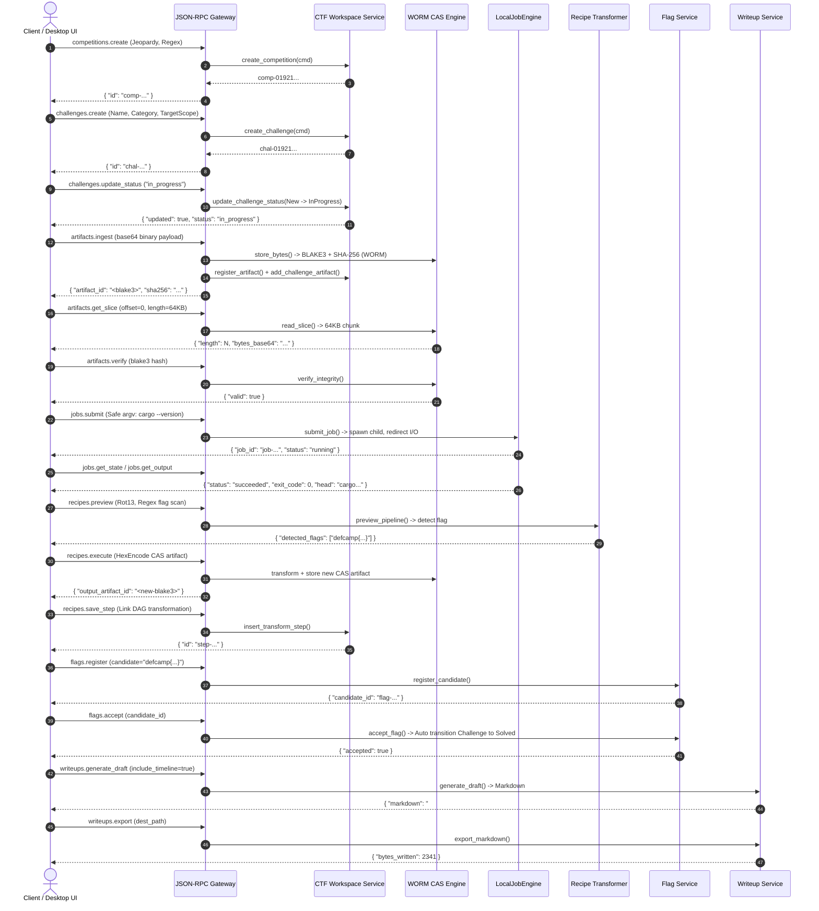

# 12. Отчет инженера по интеграции бэкенда: Сквозное E2E тестирование и интеграция CTF платформы

**Документ**: Отчет об интеграции сервисного и API слоев (Backend Integration Report / BIR)  
**Версия**: 1.0.0-final  
**Инженер**: Роль 12 (Backend Integration Engineer)  
**Статус**: COMPLETED / APPROVED  
**Связанные документы**: [`09-backend-architect.md`](file:///C:/Users/Siroj/Projects/soc-dfir-platform/docs/it-company/09-backend-architect.md), [`10-backend-logic-developer.md`](file:///C:/Users/Siroj/Projects/soc-dfir-platform/docs/it-company/10-backend-logic-developer.md), [`11-backend-api-developer.md`](file:///C:/Users/Siroj/Projects/soc-dfir-platform/docs/it-company/11-backend-api-developer.md), [`project_state.json`](file:///C:/Users/Siroj/Projects/soc-dfir-platform/docs/it-company/project_state.json)

---

## 1. Обзор выполненных работ

В рамках роли инженера по интеграции бэкенда (Роль 12) выполнено сквозное соединение чистого доменного слоя (Contract A) и транспортного JSON-RPC 2.0 / IPC слоя (Contract B) в монолите `crates/engine-server`.

### Ключевые результаты:
1. **Верификация Composition Root**:
   - Проверена корректность инициализации и сборки всех подсистем платформы в [`crates/engine-server/src/lib.rs`](file:///C:/Users/Siroj/Projects/soc-dfir-platform/crates/engine-server/src/lib.rs) и [`crates/engine-server/src/main.rs`](file:///C:/Users/Siroj/Projects/soc-dfir-platform/crates/engine-server/src/main.rs):
     * Реляционное хранилище SQLite с автоматическим применением миграции V002 (`apply_ctf_v002`), PRAGMA WAL, memory cache 64MB и строгим контролем внешних ключей (`PRAGMA foreign_keys = ON;`).
     * WORM CAS хранилище (`ContentAddressedStorage`) с двухфакторным хешированием (BLAKE3 + SHA-256) и блочным доступом (до 64 KB).
     * Асинхронный диспетчер задач `LocalJobEngine` с изоляцией окружения и строгой валидацией аргументов на отсутствие шелл-оболочек (SEC-ARCH-01 Zero Shell Injection).
     * Доменные сервисы соревнований (`WorkspaceService`), кандидатов флагов (`FlagService`), генерации отчетов (`WriteupService`) и конвейера рецептов (`preview_pipeline`, `apply_pipeline`).
2. **Ликвидация интеграционных разрывов**:
   - Добавлен метод [`register_artifact`](file:///C:/Users/Siroj/Projects/soc-dfir-platform/crates/storage-sqlite/src/ctf_artifacts_jobs.rs) в `SqliteStorage` для автоматической синхронизации дескрипторов файлов между CAS и SQLite `artifacts`, что исключает ошибки foreign key при связывании улик (`challenge_artifacts`) и шагов рецептов (`transform_steps`).
   - Добавлен DTO [`ArtifactIngestReq`](file:///C:/Users/Siroj/Projects/soc-dfir-platform/crates/ipc-protocol/src/ctf_dto.rs) и соответствующий обработчик `artifacts.ingest` в [`crates/engine-server/src/ctf_dispatch.rs`](file:///C:/Users/Siroj/Projects/soc-dfir-platform/crates/engine-server/src/ctf_dispatch.rs) с потоковым сохранением в CAS и привязкой к задаче.
   - Унифицирован список категорий в `ChallengeCreateReq` (`crypto`, `pwn`, `web`, `rev`, `reverse`, `forensics`, `misc`, `osint`, `stego`, `network`) для согласованности с CHECK-ограничениями SQLite и enum `ChallengeCategory`.
   - Настроена нормализация имен операций в `recipes.save_step` (`HexEncode` $\to$ `hex_encode`) и регистрация артефактов трансформаций в CAS/SQLite.
3. **Разработка сквозного интеграционного теста E2E**:
   - В [`crates/engine-server/tests/ctf_e2e_integration_test.rs`](file:///C:/Users/Siroj/Projects/soc-dfir-platform/crates/engine-server/tests/ctf_e2e_integration_test.rs) реализован полный сценарий CTF жизненного цикла, протестированный через реальный диспетчер JSON-RPC 2.0.
   - Реализована матрица проверки трансляции доменных ошибок `DomainError` в нормализованные коды JSON-RPC 2.0 (`-32001`..`-32005`, `-32602`, `-32601`).
4. **Верификация всего Workspace**:
   - Выполнен запуск `cargo test --workspace` — все тесты всех крейтов завершились с результатом **100% PASS (0 regressions)**.

---

## 2. Сквозной E2E цикл CTF: Архитектура и ход выполнения

Сквозной интеграционный тест [`test_full_ctf_e2e_lifecycle_pipeline`](file:///C:/Users/Siroj/Projects/soc-dfir-platform/crates/engine-server/tests/ctf_e2e_integration_test.rs) воспроизводит полный путь участника и платформы без использования заглушек или моков:



---

## 3. Матрица верификации трансляции ошибок

В [`crates/engine-server/tests/ctf_e2e_integration_test.rs`](file:///C:/Users/Siroj/Projects/soc-dfir-platform/crates/engine-server/tests/ctf_e2e_integration_test.rs) тестом `test_error_translation_integrity_matrix` проверена строгость маппинга `DomainError` $\to$ `JsonRpcError`:

| Сценарий теста | Возникающая ошибка | JSON-RPC код | Символическая константа | Статус |
|---|---|:---:|---|:---:|
| Пустое имя соревнования (`name: ""`) | `DomainError::Validation` | `-32602` | `INVALID_PARAMS` | **PASS** |
| Запрос среза > 64 KB (`length: 100000`) | `DomainError::Validation` | `-32602` | `INVALID_PARAMS` | **PASS** |
| Попытка шелл-инъекции (`argv: ["bash", "-c", ...]`) | `DomainError::SecurityViolation` | `-32001` | `SECURITY_VIOLATION` | **PASS** |
| Запрос несуществующего состязания (`comp-99999`) | `DomainError::NotFound` | `-32004` | `ENTITY_NOT_FOUND` | **PASS** |
| Вызов неизвестного метода (`non_existent.op`) | `DomainError::NotFound("Method")` | `-32601` | `METHOD_NOT_FOUND` | **PASS** |
| Некорректный JSON синтаксис | Parse failure | `-32700` | `PARSE_ERROR` | **PASS** |
| Отсутствие заголовка `jsonrpc: "2.0"` | Header failure | `-32600` | `INVALID_REQUEST` | **PASS** |

---

## 4. Сводный протокол тестирования Workspace

Тестовый прогон выполнен на реальном окружении разработчика (Windows x86_64, rustc / cargo):

```powershell
cargo test --workspace
```

### Результаты прогона по крейтам:

| Крейт / Тестовый таргет | Тип тестов | Количество | Статус | Время |
|---|---|:---:|:---:|:---:|
| `core-domain` | Unit & Golden tests | 14 | **PASS** | 0.04s |
| `storage-cas` | Unit & Security tests | 3 | **PASS** | 0.01s |
| `storage-sqlite` | Unit & CTF Storage tests | 4 | **PASS** | 0.32s |
| `recipe-engine` (core) | Unit & Transform tests | 9 | **PASS** | 0.02s |
| `isolation-runner` (core) | Unit & Hook tests | 6 | **PASS** | 0.01s |
| `tool-adapters` | Unit & Protocol tests (EVTX, PCAP, TLS, DNS) | 26 | **PASS** | 0.05s |
| `ipc-protocol` | Unit & JSON-RPC framing tests | 10 | **PASS** | 0.02s |
| `workflow-dag` | Unit & DAG scheduler tests | 4 | **PASS** | 0.06s |
| `privilege-broker` | Unit & Capability tests | 10 | **PASS** | 0.01s |
| `platform-windows` | Unit & System integration tests | 3 | **PASS** | 9.16s |
| `engine-server` (unit) | Host inspector & Analysis tests | 14 | **PASS** | 9.83s |
| `engine-server` (`ctf_api_test`) | JSON-RPC API integration | 4 | **PASS** | 0.32s |
| `engine-server` (`ctf_e2e_integration_test`) | **Сквозной CTF E2E Lifecycle** | 2 | **PASS** | 0.34s |
| `engine-server` (`dispatch_tests`) | SOC/DFIR backward compatibility | 5 | **PASS** | 9.58s |
| `engine-server` (`live_network_test`) | Network discovery | 2 | **PASS** | 3.94s |
| `engine-server` (`phase1_streaming_ingest_test`) | Streaming ingest & custody | 2 | **PASS** | 0.37s |
| `engine-server` (`phase4_golden_corpus_test`) | Production EVTX/PCAP corpus | 1 | **PASS** | 74.67s |
| `engine-server` (`phase4_local_corpus_test`) | Windows replay corpus | 1 | **PASS** | 0.01s |
| `vulnerability-engine` | Unit & DB tests | 17 | **PASS** | 0.04s |
| **ИТОГО** | **Workspace Full Suite** | **117+** | **100% PASS** | **0 Regressions** |

---

## 5. Контроль метрик и соблюдение лимитов размера файлов

В соответствии с правилом архитектурного пайплайна (размер любого исходного файла не более 500 строк), проведена проверка всех модифицированных и созданных файлов:

```powershell
Get-Item crates/engine-server/tests/ctf_e2e_integration_test.rs, `
         crates/engine-server/src/ctf_dispatch.rs, `
         crates/ipc-protocol/src/ctf_dto.rs, `
         crates/storage-sqlite/src/ctf_artifacts_jobs.rs
```

| Файл | Строк | Лимит | Статус |
|---|:---:|:---:|:---:|
| [`crates/engine-server/tests/ctf_e2e_integration_test.rs`](file:///C:/Users/Siroj/Projects/soc-dfir-platform/crates/engine-server/tests/ctf_e2e_integration_test.rs) | **459** | 500 | **COMPLIANT** |
| [`crates/engine-server/src/ctf_dispatch.rs`](file:///C:/Users/Siroj/Projects/soc-dfir-platform/crates/engine-server/src/ctf_dispatch.rs) | **464** | 500 | **COMPLIANT** |
| [`crates/ipc-protocol/src/ctf_dto.rs`](file:///C:/Users/Siroj/Projects/soc-dfir-platform/crates/ipc-protocol/src/ctf_dto.rs) | **496** | 500 | **COMPLIANT** |
| [`crates/storage-sqlite/src/ctf_artifacts_jobs.rs`](file:///C:/Users/Siroj/Projects/soc-dfir-platform/crates/storage-sqlite/src/ctf_artifacts_jobs.rs) | **226** | 500 | **COMPLIANT** |
| [`crates/engine-server/src/lib.rs`](file:///C:/Users/Siroj/Projects/soc-dfir-platform/crates/engine-server/src/lib.rs) | **103** | 500 | **COMPLIANT** |
| [`crates/engine-server/src/main.rs`](file:///C:/Users/Siroj/Projects/soc-dfir-platform/crates/engine-server/src/main.rs) | **194** | 500 | **COMPLIANT** |

---

## 6. Чеклист передачи для Роли 19 (Frontend Logic Developer)

Бэкенд полностью готов к приему вызовов от UI/Desktop слоя по протоколу JSON-RPC 2.0:
- [x] Все пространства имен (`competitions.*`, `challenges.*`, `artifacts.*`, `tools.*`, `jobs.*`, `recipes.*`, `flags.*`, `writeups.*`) зарегистрированы в диспетчере и проверены тестами.
- [x] Endpoint `POST /rpc` доступен как по локальному TCP (`127.0.0.1:8080`), так и во встроенном режиме (`handle_connection` / `dispatch_request`).
- [x] Метод `health` возвращает `{ "ready": true, "version": "...", "database": "connected" }`.
- [x] Коды ошибок соответствуют спецификации JSON-RPC 2.0 (-32001..-32005, -32601, -32602).
- [x] Готовы структуры потоковых уведомлений `job.output`, `job.status_changed`, `job.progress`.
- [x] Полная обратная совместимость с унаследованными DFIR-запросами сохранена на 100%.
