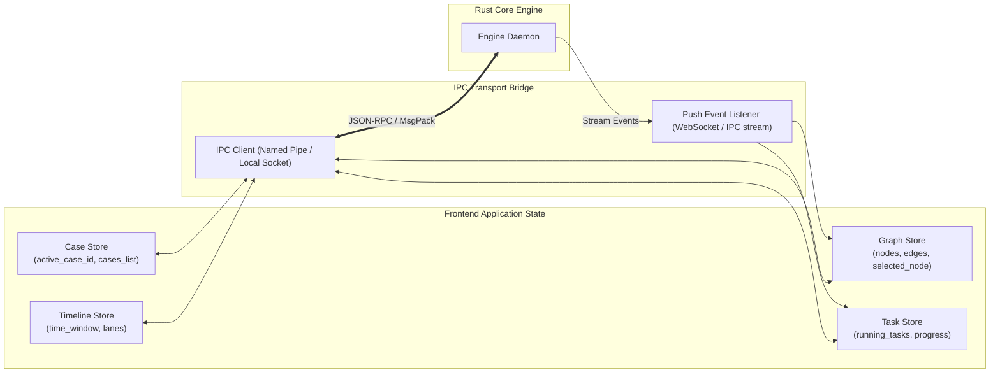

# 16. Frontend Architecture: Blue Team Cyber Range & SOC/DFIR Platform

**Profile ID**: `PRF-16-FEARCH`  
**Status**: `COMPLETED`  
**Input**: `docs/it-company/09-backend-architect.md`, `docs/it-company/17-ux-designer.md`, `docs/it-company/18-ui-designer.md`

---

## 1. Desktop UI Architecture & Technology Selection

To achieve the best combination of cross-platform native performance (Windows, Linux, macOS), modern UI responsiveness, and lightweight binary distribution:
- **Core Strategy**: Cross-platform Desktop Cockpit (Tauri v2 / Qt Quick) interfacing directly with the Rust Core Engine via fast local IPC / in-process FFI bridge.
- **Rendering Engines**:
  - **Graph Canvas**: High-performance WebGL / Canvas2D force-directed layout engine capable of rendering 10,000+ nodes at 60 FPS without DOM lag.
  - **Timeline Canvas**: Virtualized horizontal time-scrubber with multi-host tracks and sub-millisecond event zooming.
  - **Data Tables**: Virtual scrolling table supporting 1,000,000+ observation rows with constant memory footprint.

---

## 2. Frontend State Machine & Communication Bridge

---

## 3. High-Volume Data Rendering & Virtualization Strategy
1. **Attack Graph Level of Detail (LoD)**:
   - Aggregation of cluster nodes at high zoom-out levels (e.g. collapse 50 child processes of the same executable into a single summary node).
   - Expand on zoom-in or double-click.
2. **Infinite Virtualization for Observations**:
   - Only 50 visible rows rendered in DOM/viewport at any time; viewport scroll requests chunked slices (`offset`, `limit`) from the SQLite engine.
3. **Hardware Acceleration**:
   - Graph node geometry, shapes, and glow borders drawn on GPU canvas with zero garbage-collection stutter.
