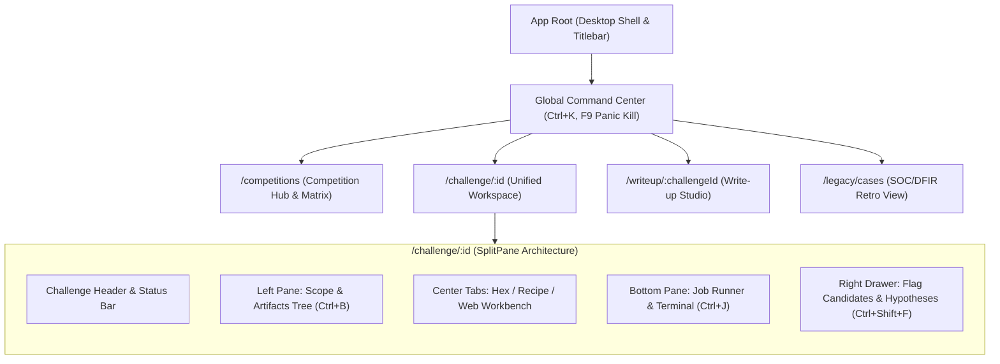
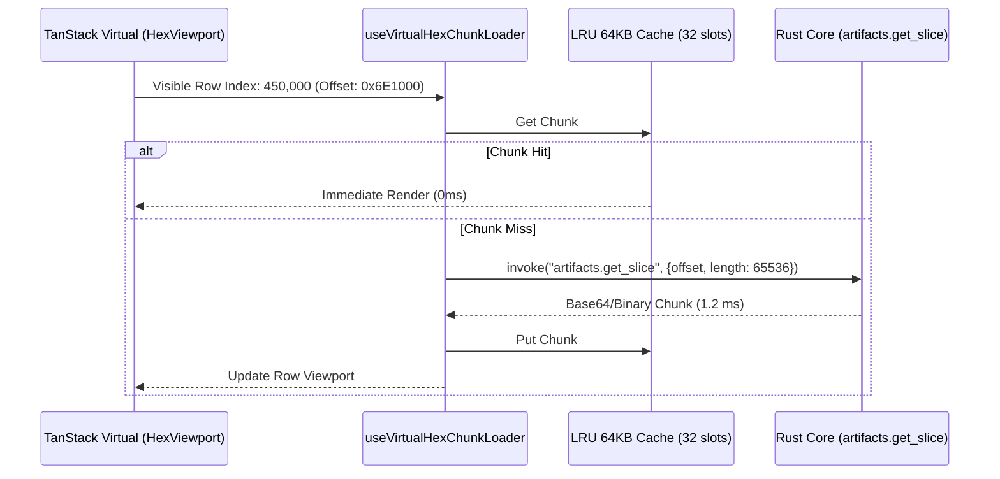
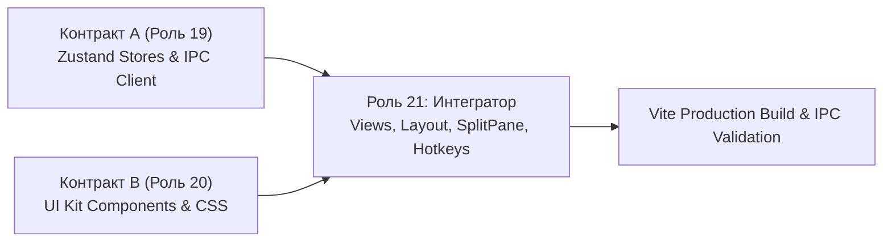

# 16. Фронтенд-архитектура: CTF Unified Workspace Platform

**Документ**: Архитектурная спецификация клиентского приложения и системные контракты  
**Версия**: 1.0.0-final  
**Роль**: 16 (Frontend Architect)  
**Статус**: APPROVED  
**Связанные документы**: [`04-solution-architect.md`](file:///C:/Users/Siroj/Projects/soc-dfir-platform/docs/it-company/04-solution-architect.md), [`05-security-architect.md`](file:///C:/Users/Siroj/Projects/soc-dfir-platform/docs/it-company/05-security-architect.md), [`06-system-analyst.md`](file:///C:/Users/Siroj/Projects/soc-dfir-platform/docs/it-company/06-system-analyst.md), [`17-ux-designer.md`](file:///C:/Users/Siroj/Projects/soc-dfir-platform/docs/it-company/17-ux-designer.md), [`18-ui-designer.md`](file:///C:/Users/Siroj/Projects/soc-dfir-platform/docs/it-company/18-ui-designer.md), [`project_state.json`](file:///C:/Users/Siroj/Projects/soc-dfir-platform/docs/it-company/project_state.json)

---

## 1. Архитектурный стек и структура клиентского приложения

Клиентский слой строится как высокопроизводительное SPA внутри десктопного WebView-контейнера (`desktop-app`). Архитектура полностью развязана на три изолированных слоя: **Транспорт/Состояние (Роль 19)**, **Визуальные компоненты UI Kit (Роль 20)** и **Сквозная интеграция/Сборка (Роль 21)**.

### 1.1. Технологический стек
- **Runtime & UI Library**: React 19 + TypeScript 5.5+ (strict mode, no implicit any).
- **Bundler & Tooling**: Vite 6 (HMR, ESM, chunk splitting).
- **Styling**: TailwindCSS (дизайн-токены `Deep Dark Terminal` из [`18-ui-designer.md`](file:///C:/Users/Siroj/Projects/soc-dfir-platform/docs/it-company/18-ui-designer.md)).
- **State Management**: Zustand v5 (атомарные сторы, селекторы с shallow-сравнением).
- **DOM Virtualization**: TanStack Virtual v3 (виртуализация строк Hex-дампов и ANSI-терминала).
- **Icons & Glyphs**: Lucide React + кастомные дуальные глифы соревнований (WCAG AAA).

### 1.2. Директории проекта (`frontend/src/`)
```
frontend/src/
├── app/                  # Корневые провайдеры, роутинг, глобальный Layout
├── contracts/            # Общие TypeScript интерфейсы, DTO, схемы JSON-RPC
├── core/                 # IPC клиент, кольцевые буферы, LZ4/Base64 декодеры
├── stores/               # Zustand хранилища состояния (Контракт А, Роль 19)
├── hooks/                # Кастомные хуки (IPC, виртуализация, горячие клавиши)
├── ui/                   # Презентационные компоненты UI Kit (Контракт B, Роль 20)
│   ├── atoms/            # Button, Badge, Input, Splitter, RedactionPill
│   ├── molecules/        # HexRow, LogLine, RecipeStepCard, FlagCandidatePill
│   └── organisms/        # HexViewer, TerminalView, RecipeBuilder, FlagDrawer
├── views/                # Страницы экранов (Роль 21: сборка views из UI + Stores)
└── styles/               # tokens.css, tailwind.css, fonts
```

---

## 2. Карта роутинга и иерархия Layout

Навигация приложения детерминирована и управляется клиентским роутером (React Router / Hash Router для десктопного WebView).



| Маршрут | Название экрана | Назначение и состав модулей |
|---|---|---|
| `/competitions` | **Competition Hub & Matrix** | Обзор активных соревнований, Jeopardy-матрица задач по категориям, скоринг. |
| `/challenge/:id` | **Unified Workspace** | 4-секторный SplitPane: дерево артефактов, Hex/Recipe вьюер, терминал, флаг-шторка. |
| `/writeup/:challengeId`| **Write-up Studio** | Генератор отчетов на базе Lineage DAG, сплит-редактор Markdown и живой превью. |
| `/legacy/cases` | **Legacy DFIR View** | Обратная совместимость с расследованиями инцидентов через SQL Views SQLite. |

---

## 3. Контракт А: Состояние и бизнес-логика (Для Роли 19)

Роль 19 реализует транспортный слой, Zustand-сторы, кольцевые буферы и хуки. Доступ к DOM и CSS-классам исключен.

### 3.1. Типизация IPC транспорта и протокола JSON-RPC 2.0
```typescript
export interface JsonRpcRequest<T = unknown> {
  jsonrpc: '2.0';
  id: string; // UUID v4
  method: string;
  params: T;
}

export interface JsonRpcResponse<T = unknown> {
  jsonrpc: '2.0';
  id: string;
  result?: T;
  error?: { code: number; message: string; data?: unknown };
}

export interface StreamingEvent<T = unknown> {
  jsonrpc: '2.0';
  method: 'job.output' | 'job.status_changed' | 'job.progress';
  params: T;
}

export interface IpcBridge {
  invoke<P, R>(method: string, params: P): Promise<R>;
  subscribe<T>(event: string, handler: (payload: T) => void): () => void;
}
```

### 3.2. Интерфейсы Zustand-хранилищ (Stores Contract)

#### 1. `useWorkspaceStore` (Контекст соревнований и задач)
```typescript
export interface WorkspaceState {
  activeCompetitionId: string | null;
  activeChallengeId: string | null;
  challenges: Record<string, ChallengeItem>;
  artifacts: Record<string, ArtifactMeta>;
  activePanels: { left: boolean; bottom: boolean; rightDrawer: boolean };
  // Actions
  loadCompetition: (compId: string) => Promise<void>;
  selectChallenge: (challengeId: string) => Promise<void>;
  togglePanel: (panel: 'left' | 'bottom' | 'rightDrawer') => void;
  importArtifact: (filePath: string) => Promise<string>;
  updateChallengeStatus: (status: ChallengeStatus, reason?: string) => Promise<void>;
}
```

#### 2. `useJobRunnerStore` (Управление процессами и логами)
```typescript
export interface JobRunnerState {
  activeJobs: Record<string, JobRuntimeState>;
  terminalBuffers: Record<string, TerminalRingBuffer>; // 10MB memory ring buffer
  isBackpressureActive: boolean;
  // Actions
  submitJob: (toolId: string, args: string[]) => Promise<string>;
  cancelJob: (jobId: string) => Promise<void>;
  panicKillAll: () => Promise<void>; // F9 Panic Kill Switch
  appendLogChunk: (jobId: string, chunk: OutputChunk) => void;
  clearTerminal: (jobId: string) => void;
}
```

#### 3. `useHexViewerStore` (Виртуализированный доступ к CAS-файлам)
```typescript
export interface HexViewerState {
  artifact: ArtifactMeta | null;
  totalSize: number;
  chunkCache: Map<number, Uint8Array>; // 64KB block index -> Data
  cursorOffset: number;
  selection: { start: number; end: number } | null;
  searchHits: number[];
  // Actions
  loadArtifact: (artifact: ArtifactMeta) => void;
  fetchChunk: (chunkIndex: number) => Promise<Uint8Array>;
  setSelection: (start: number, end: number) => void;
  setCursor: (offset: number) => void;
  sendSelectionToRecipe: () => void;
}
```

#### 4. `useRecipeStore` (Конвейер трансформаций)
```typescript
export interface RecipeState {
  operations: RecipeOperation[];
  inputData: Uint8Array | null;
  livePreviewText: string;
  detectedFlags: string[];
  isProcessing: boolean;
  // Actions
  addOperation: (op: RecipeOperation) => void;
  removeOperation: (index: number) => void;
  reorderOperations: (from: number, to: number) => void;
  toggleMute: (index: number) => void;
  updateParams: (index: number, params: Record<string, unknown>) => void;
  executeAndSaveArtifact: () => Promise<string>;
}
```

#### 5. `useFlagStore` (Учет и сабмит флагов)
```typescript
export interface FlagState {
  candidates: FlagCandidate[];
  filter: 'all' | 'candidates' | 'accepted' | 'rejected';
  // Actions
  registerCandidate: (flag: string, source: string) => Promise<void>;
  acceptFlag: (candidateId: string) => Promise<void>;
  rejectFlag: (candidateId: string, reason?: string) => Promise<void>;
}
```

### 3.3. Кольцевой буфер терминала с защитой от переполнения (`TerminalRingBuffer`)
- **Размер буфера**: Максимум 10 МБ в памяти на один процесс.
- **Алгоритм отсечения**: При превышении 10 МБ первые 2 МБ (заголовок команды) сохраняются, средняя секция сбрасывается с вставкой маркера `[... 3.4 MB DROPPED TO PREVENT OOM. FULL RAW LOG IN CAS ...]`, сохраняются последние 8 МБ.
- **Батчинг вывода**: Накопление чанков в буфере кадра с последующим сбросом в состояние терминала через `requestAnimationFrame` (60 FPS).

---

## 4. Контракт B: Презентационные UI-компоненты (Для Роли 20)

Роль 20 создает чисто презентационные компоненты без прямого импорта IPC или бэкенда. Стилизация строго соответствует UI Kit [`18-ui-designer.md`](file:///C:/Users/Siroj/Projects/soc-dfir-platform/docs/it-company/18-ui-designer.md).

### 4.1. `HexViewer` & `HexRow` Component Contract
```typescript
export interface HexRowProps {
  offset: number;
  bytes: Uint8Array; // Строго 16 байт
  isSelected: (byteIndex: number) => boolean;
  isCursor: (byteIndex: number) => boolean;
  onByteClick: (byteIndex: number, e: React.MouseEvent) => void;
  onByteHover: (byteIndex: number) => void;
}

export interface HexViewerProps {
  totalBytes: number;
  bytesPerRow: 16;
  rowHeight: 20; // 20px фиксированная высота строки
  renderRow: (rowOffset: number) => React.ReactNode;
  onGoToOffset: (offset: number) => void;
  onCopySelection: (format: 'hex' | 'c-array' | 'ascii' | 'base64') => void;
  isSearchActive?: boolean;
}
```

### 4.2. `TerminalView` Component Contract
```typescript
export interface TerminalViewProps {
  lines: string[];
  isBackpressureActive: boolean;
  isRunning: boolean;
  onClear: () => void;
  onKill: () => void; // Trigger Panic Kill
  onCommandSubmit: (cmd: string) => void;
}
```

### 4.3. `RecipeBuilder` & `RecipeStepCard` Contract
```typescript
export interface RecipeStepCardProps {
  stepIndex: number;
  operationId: string;
  name: string;
  isMuted: boolean;
  paramsSchema: Record<string, unknown>;
  currentParams: Record<string, unknown>;
  onMuteToggle: () => void;
  onRemove: () => void;
  onParamsChange: (newParams: Record<string, unknown>) => void;
  dragHandleProps?: Record<string, unknown>;
}
```

### 4.4. `FlagCandidatePill` & `FlagDrawer` Contract
```typescript
export interface FlagCandidatePillProps {
  candidateId: string;
  flagString: string;
  source: string;
  status: 'candidate' | 'accepted' | 'rejected';
  timestamp: string;
  onAccept: (id: string) => void;
  onReject: (id: string) => void;
  onCopy: (flag: string) => void;
}
```

### 4.5. `PanicKillButton` (`F9`) Contract
```typescript
export interface PanicKillButtonProps {
  isTerminating: boolean;
  activeProcessesCount: number;
  onPanicKill: () => void;
}
```

### 4.6. `SandboxedPreview` Contract (Untrusted HTML/SVG)
```typescript
export interface SandboxedPreviewProps {
  rawContent: string;
  mimeType: 'text/html' | 'image/svg+xml' | 'text/plain';
  width?: string | number;
  height?: string | number;
}
```

---

## 5. Производительность и безопасность презентационного слоя

### 5.1. Виртуализация 500 МБ Hex-дампов (64 КБ IPC Chunks)
1. **Сетка TanStack Virtual**:
   - При 500 МБ файл содержит $\approx 32\,768\,000$ строк по 16 байт.
   - TanStack Virtual динамически монтирует в DOM только $N \approx 50$ строк (вьюпорт + 10 overscan).
2. **Chunk Sliding Window (LRU)**:
   - Данные запрашиваются у бэкенда через IPC метод `artifacts.get_slice` блоками по **64 КБ** (4096 строк).
   - В памяти UI хранится LRU-кэш на 32 чанка (2 МБ RAM).
   - При скролле хук `useVirtualHexChunkLoader` предзагружает следующий и предыдущий чанки с приоритетом текущего видимого окна.



### 5.2. Троттлинг терминального потока (60 FPS / Memory Cap)
1. **Событийный Backpressure**: При взрывной генерации логов (> 50 МБ/с) Rust-ядро сжимает чанки и шлет событие `isBackpressureActive: true`.
2. **requestAnimationFrame Flush**:
   - Чанки из `job.output` пушатся во временный буфер кадра `pendingChunksRef`.
   - Вызов `flushLogs()` привязан к `requestAnimationFrame`. Если между вызовами прошло меньше 16.6 мс, ре-рендеринг React-компонента терминала блокируется.
3. **Защита памяти DOM**: Терминал хранит не более 10 000 строк во вьюпорте. Устаревшие строки вытесняются в виртуальный скроллер.

### 5.3. Изоляция рендеринга недоверенного HTML/SVG (`SEC-ARCH-05`)
Любой полученный от сетевого таргета или распакованный из артефакта HTML/SVG контент отображается исключительно через безопасный изолированный контейнер:
```tsx
// frontend/src/ui/atoms/SandboxedPreview.tsx
export const SandboxedPreview: React.FC<SandboxedPreviewProps> = ({ rawContent }) => {
  return (
    <iframe
      title="Sandboxed Artifact Preview"
      sandbox="" // Максимальная изоляция: запрет scripts, forms, same-origin, popups
      srcDoc={rawContent}
      className="w-full h-full border-0 bg-white"
    />
  );
};
```
*Запрещено передавать флаги `allow-scripts` или `allow-same-origin`, что исключает хищение токенов приложения через DOM XSS.*

---

## 6. Задачи для Интегратора фронтенда (Роль 21)

Роль 21 осуществляет связывание контрактов А и В в готовые экраны и сборку продакшн-бандла.



| ID задачи | Модуль / Экран | Инструкция для Роли 21 |
|---|---|---|
| **TASK-FE-01** | `app/App.tsx` & Router | Смонтировать корневой Layout с `Titlebar`, модальной панелью `Ctrl+K` и глобальной обработкой `F9` (Panic Kill Switch). |
| **TASK-FE-02** | `/challenge/:id` | Собрать 4-секторный `SplitPaneLayout`, связав `useWorkspaceStore` с деревом улик и карточкой задачи. |
| **TASK-FE-03** | `HexViewer` Viewport | Интегрировать `HexViewer` (Контракт B) с хуком `useVirtualHex` и `useHexViewerStore` (Контракт A). Проверить скроллинг на тестовом файле 500 МБ. |
| **TASK-FE-04** | `JobTerminal` Integration| Связать компонент `TerminalView` с кольцевым буфером `useJobRunnerStore`, индикатором Backpressure и кнопкой принудительного прерывания. |
| **TASK-FE-05** | `RecipeBuilder` Pipe | Подключить DnD (Drag-and-Drop) сортировку шагов конвейера, вывод живого превью и автоматическую передачу найденных флагов в `useFlagStore`. |
| **TASK-FE-06** | `FlagDrawer` Assembly | Реализовать выезжающую панель (`Ctrl+Shift+F`) со списком кандидатов, счетчиком непроверенных флагов и хоткеями `Ctrl+Shift+A` / `Ctrl+Shift+R`. |
| **TASK-FE-07** | `/writeup/:challengeId` | Реализовать экран экспорта отчета: привязка Lineage DAG к Markdown-редактору и валидация маскирования секретов (`[REDACTED]`). |
