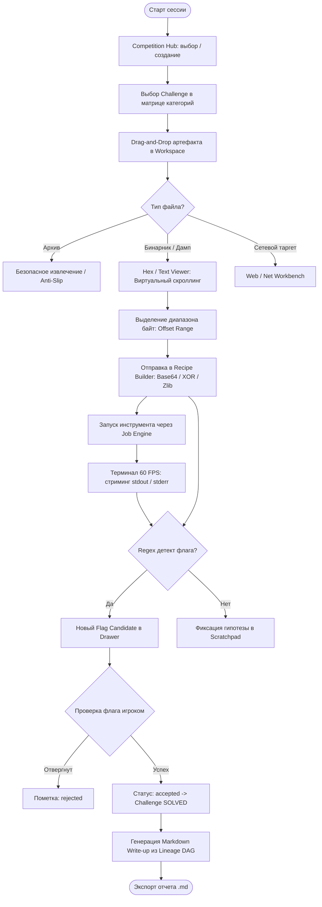
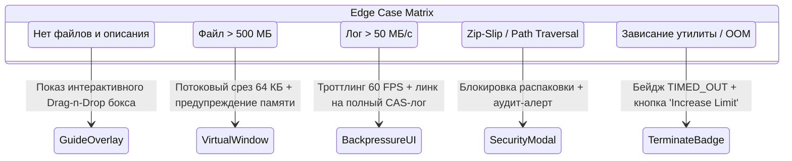

# 17. UX Дизайн и спецификация интерфейса: CTF Unified Workspace Platform

**Документ**: UX Спецификация пользовательских путей, эргономики и каркасов интерфейса  
**Версия**: 1.0.0-final  
**Роль**: 17 (UX Designer)  
**Статус**: APPROVED  
**Связанные документы**: [`01-product-discovery-manager.md`](file:///C:/Users/Siroj/Projects/soc-dfir-platform/docs/it-company/01-product-discovery-manager.md), [`02-business-analyst.md`](file:///C:/Users/Siroj/Projects/soc-dfir-platform/docs/it-company/02-business-analyst.md), [`06-system-analyst.md`](file:///C:/Users/Siroj/Projects/soc-dfir-platform/docs/it-company/06-system-analyst.md), [`project_state.json`](file:///C:/Users/Siroj/Projects/soc-dfir-platform/docs/it-company/project_state.json)

---

## 1. Customer Journey Map (CJM) и пользовательские сценарии

### 1.1. Карта пути пользователя (CJM)

| Этап пути | Цель игрока | Действия в интерфейсе | Болевые точки (UX Pains) | Проектные решения (UX Solutions) |
|---|---|---|---|---|
| **1. Setup & Scope** | Создать турнир и структурировать таски | Нажатие `+ Competition`, ввод regex флага, создание тасок в матрице | Ручной ввод однотипных данных, потеря ссылок и портов | Быстрый парсер таргетов (`host:port`), шаблоны флагов, единый импорт |
| **2. Triage & Ingest** | Загрузить файлы и определить тип | Перетаскивание файлов Drag-n-Drop, безопасная распаковка | Зависание UI на больших файлах, zip-бомбы, отказ парсеров | CAS-хранилище со статусом `unclassified`, Anti-Zip-Slip превью, streaming |
| **3. Deep Analysis** | Исследовать артефакт, декодировать | Hex/Text инспекция, сборка цепочки рецептов, запуск CLI-утилит | Переключение между браузером и 5 консолями, потеря истории | Встроенный виртуализированный Hex Viewer, CyberChef-подобный Recipe Builder, Job Runner |
| **4. Flag Verification** | Зафиксировать и проверить флаг | Просмотр найденных кандидатов по regex, сабмит флага | Ложные срабатывания regex, случайная отправка мусора | Выдвижной флаг-ящик (Drawer), разделение `candidate` $\to$ `accepted`, hotkey сабмита |
| **5. Write-up Export** | Сохранить отчет о решении для команды | Нажатие `Generate Write-up`, правка черновика, экспорт в `.md` | Забытые шаги эксплоита, ручное выписывание хэшей и команд | Авто-сборка Markdown по графу шагов (Lineage DAG) с маскированием токенов |

### 1.2. Сквозной пользовательский сценарий (End-to-End User Flow)



---

## 2. Архитектура экранов и эргономичные Wireframes

### 2.1. Экран 1: Competition Hub & Challenge Matrix

Центральный экран обзора соревнований с Jeopardy-матрицей категорий, фильтрацией и быстрой статистикой.

```text
+----------------------------------------------------------------------------------------------------+
| [=] CTF WORKSPACE   [Competitions v]  [Active: VolgaCTF 2026 (7/24 Solved)]         [Ctrl+K Search] |
+----------------------------------------------------------------------------------------------------+
| [+ New Comp] [Import CTFd JSON] | Filter: [All Categories v] [Status: Active v]    Score: 1450 pts |
+----------------------------------------------------------------------------------------------------+
|  WEB (3/6)         |  CRYPTO (2/4)      |  REV / PWN (1/5)   |  FORENSICS (1/4)   |  MISC (0/5)    |
| +----------------+ | +----------------+ | +----------------+ | +----------------+ | +------------+ |
| | CookieMonster  | | | LinearRSA      | | | EasyPatch      | | | MemoryDump     | | | QR_Mania   | |
| | 100 pts [SOLVED| | | 150 pts [SOLVED| | | 200 pts [SOLVED| | | 300 pts [BLOCKED| | | 50 pts [NEW| |
| +----------------+ | +----------------+ | +----------------+ | +----------------+ | +------------+ |
| | JWT_Bypass     | | | FaultyXOR      | | | HeapAlloc      | | | UsbTraffic     | | | SandboxPy  | |
| | 250 pts [ACTIVE| | | 200 pts [ACTIVE| | | 400 pts [ACTIVE| | | 150 pts [SOLVED | | | 200 pts [NEW| |
| | target: 8080   | | | 2 candidates   | | | PID: 4092      | | | pcap, 84 MB    | | |            | |
| +----------------+ | +----------------+ | +----------------+ | +----------------+ | +------------+ |
| | GraphQLLeak    | | | EllipticCurve  | | | Shellcoder     | | | DiskRecovery   | | | ...        | |
| | 300 pts [NEW]  | | | 350 pts [NEW]  | | | 500 pts [NEW]  | | | 450 pts [NEW]  | | |            | |
+----------------------------------------------------------------------------------------------------+
| [Status Bar] Total: 24 Challenges | 7 Solved | 3 In Progress | 1 Blocked | SQLite: WAL (OK)        |
+----------------------------------------------------------------------------------------------------+
```

### 2.2. Экран 2: Unified Challenge Workspace (Основное рабочее место)

Эргономичная 4-секторная модульная раскладка с возможностью сворачивания панелей по `Ctrl+B` / `Ctrl+J` / `Ctrl+Shift+F`.

```text
+----------------------------------------------------------------------------------------------------+
| [< Hub] VolgaCTF / Crypto / FaultyXOR (200 pts)  [Status: IN_PROGRESS]       [Flag Matcher: ^flag\{|
+----------------------------------+------------------------------------------------+----------------+
| LEFT PANEL (Scope & Artifacts)   | CENTRAL WORK AREA (Tabs: Hex/Text/Recipes)     | RIGHT DRAWER   |
| [Info / Statement] [Files (3)]   | [x cipher.bin (Hex)] [x Recipe Pipeline] [+]   | [Hypotheses (2)|
|----------------------------------+------------------------------------------------| [Flags (1)  *] |
| Statement:                       | 00000000: 43 54 46 7b 31 33 33 37  CTF{1337... |----------------|
| "Decrypt the intercepted packet" | 00000008: 5f 78 6f 72 5f 6b 65 79  _xor_key... | FLAG CANDIDATE |
| Target: nc 10.10.2.14 9999       | 00000010: 65 61 73 79 5f 70 65 61  easy_pea... | [ candidate  ] |
| Creds:  guest:guest              | [Selection: 0x0008 - 0x0017 (16 bytes)]        | flag{x0r_k3y_  |
|                                  | Action: [Pipe to Recipe] [Send to Runner]      | easy_peasy}    |
| Artifacts Tree:                  |------------------------------------------------| Source: recipe |
| v [Root Files]                   | Data Inspector (Selected Range):               | [Accept] [Rej] |
|   - cipher.bin (128 KB, CAS:8f12)| - UTF-8: "_xor_keyeasy_pea"                    |----------------|
|   - enc_traffic.pcap (4.2 MB)    | - Hex:   5f786f725f6b6579656173795f706561      | Hypotheses:    |
|   - key_stream.txt (Derived)     | - UInt32 (LE): 0x726f785f | Entropy: 3.42 bits | [x] Key is 8B  |
| [+ Import File] [Dropzone Area]  |                                                | [ ] Double XOR |
+----------------------------------+------------------------------------------------+----------------+
| BOTTOM PANEL (Tool Execution Runner & Virtual Terminal)                     [^ Maximize] [x Close] |
| [Terminal: strings (PID: 8124)] [Runner: tshark] [+]      Status: RUNNING (12s)  [■ Kill Tree (F9)]|
|----------------------------------------------------------------------------------------------------|
| [14:22:01] strings -a -n 8 cipher.bin                                                             |
| [14:22:02] Found potential signature: 0x00001020 "V1_XOR_SECRET_CONTAINER"                         |
| [14:22:03] Stream buffer: [REDACTED:CTFD_TOKEN] masked in output chunk #4                          |
| > [Type command or select registered tool adapter...                             ] [Submit Enter]  |
+----------------------------------------------------------------------------------------------------+
```

### 2.3. Экран 3: Virtualized Hex/Text Viewer

Оптимизирован для файлов до 500 МБ. Рендерится только видимый вьюпорт (64 КБ чанки), исключая зависание DOM.

```text
+----------------------------------------------------------------------------------------------------+
| File: memory_dump.raw (CAS: 9f8a... / 248 MB)   Search: [ 0x4D 0x5A        ] [Prev] [Next] (14 hit)|
| Offset Format: [Hex v] | Width: [16 Bytes] | Endian: [Little v] | View: [Hex + ASCII v]  [Entropy] |
+----------------------------------------------------------------------------------------------------+
| OFFSET    | 00 01 02 03 04 05 06 07  08 09 0A 0B 0C 0D 0E 0F | ASCII DECODE     | ENTROPY HEATMAP  |
|-----------+--------------------------------------------------+------------------+------------------|
| 00004100  | 4d 5a 90 00 03 00 00 00  04 00 00 00 ff ff 00 00 | MZ.............. | [#####.....] 3.8 |
| 00004110  | b8 00 00 00 00 00 00 00  40 00 00 00 00 00 00 00 | ........@....... | [##........] 1.2 |
| 00004120* | 54 68 69 73 20 70 72 6f  67 72 61 6d 20 63 61 6e | This program can | [######....] 4.5 |
| 00004130* | 6e 6f 74 20 62 65 20 72  75 6e 20 69 6e 20 44 4f | not be run in DO | [######....] 4.6 |
| 00004140* | 53 20 6d 6f 64 65 2e 0d  0d 0a 24 00 00 00 00 00 | S mode....$..... | [####......] 2.9 |
| 00004150  | 00 00 00 00 00 00 00 00  00 00 00 00 00 00 00 00 | ................ | [..........] 0.0 |
|-----------+--------------------------------------------------+------------------+------------------|
| Selection | Offset: 0x00004120 - 0x00004149 (42 bytes)       | Actions:                            |
| Inspector | Magic: "This program cannot be run in DOS mode." | [Pipe to Recipe] [Copy Raw] [Save]  |
+----------------------------------------------------------------------------------------------------+
| Status: Chunk 65/3968 loaded (1.2 ms) | RAM UI: 64 MB | Virtual Scroll: 60 FPS | Target: x86_64 PE |
+----------------------------------------------------------------------------------------------------+
```

### 2.4. Экран 4: Recipe Pipeline Builder (Интерактивный конвейер трансформаций)

Позволяет на лету собирать цепочки преобразований с мгновенным in-memory превью и поиском флагов.

```text
+----------------------------------------------------------------------------------------------------+
| RECIPE BUILDER: "XOR-Decompress Flow"               [Input: cipher.bin (128 KB)] [Target: Memory]  |
+----------------------------------------------------------------------------------------------------+
| OPERATIONS PALETTE             | PIPELINE STAGES (Drag to reorder)      | LIVE PREVIEW & AUTO-FLAG |
| [Search op: xor...        ]    | 1. [::] From Hex                       | Preview Output (Step 3): |
| v Encoding                     |    Delimiter: [None       v]  [x] [Mute] | ------------------------ |
|   - From Hex / To Hex          |----------------------------------------| ... payload header ...   |
|   - From Base64 / To Base64    | 2. [::] XOR                            | Found target key string! |
|   - URL / HTML Entity Decode   |    Key: [0x5A              ]  [Hex v]  |                          |
| v Compression                  |    Mode: [Standard Repeating ]  [x]    | >> MATCH:                |
|   - Zlib Inflate / Deflate     |----------------------------------------| flag{s1mple_x0r_dec0de}  |
|   - Gunzip / Raw Inflate       | 3. [::] Zlib Inflate                   | ------------------------ |
| v Crypto & Hashing             |    Window Bits: [15 (Default)]  [x]    | [!] 1 Flag Candidate     |
|   - XOR / ROT13 / AES Decrypt  |----------------------------------------| [Push to Flags Drawer]   |
|   - MD5 / SHA256 / BLAKE3      | [+ Add Operation from Palette        ] |                          |
+--------------------------------+----------------------------------------+--------------------------+
| [▶ Execute & Save as Artifact]   [Save Recipe to Challenge]   [Reset Pipeline]  [Copy Output to Clip] |
+----------------------------------------------------------------------------------------------------+
```

### 2.5. Экран 5: Write-up Generator & Live Markdown Preview

Автоматически строит отчет на основе цепочки улик (Lineage DAG) с контролем маскирования секретов.

```text
+----------------------------------------------------------------------------------------------------+
| WRITE-UP EXPORTER: VolgaCTF 2026 / FaultyXOR                               [Export: challenge.md v]|
+-------------------------------------------------+--------------------------------------------------+
| LINEAGE & PROVENANCE GRAPH                      | MARKDOWN LIVE EDITOR & PREVIEW (Split View)      |
|                                                 | [Source Editor]         | [Rendered Preview]     |
| (A-01: cipher.bin [CAS:8f12])                   |-------------------------+------------------------|
|      |                                          | # FaultyXOR (200 pts)   | # FaultyXOR (200 pts)  |
|      v                                          | **Category**: Crypto    | **Category**: Crypto   |
| [Step 1: strings -a] -> Found container sig     | **Flag**: `flag{...}`   | **Flag**: `flag{...}`  |
|      |                                          |                         |                        |
|      v                                          | ## 1. Initial Analysis  | ## 1. Initial Analysis |
| (A-02: key_stream.txt [CAS:3c91])               | File `cipher.bin` has   | File `cipher.bin` has  |
|      |                                          | SHA256: `9f8a...`       | SHA256: `9f8a...`      |
|      v                                          |                         |                        |
| [Step 2: Recipe (Hex -> XOR 0x5A -> Inflate)]   | ## 2. Exploitation      | ## 2. Exploitation     |
|      |                                          | Applied recipe pipeline | Applied recipe pipeline|
|      v                                          | with XOR key `0x5A`.    | with XOR key `0x5A`.   |
| [FLAG ACCEPTED: flag{s1mple_x0r_dec0de}]        | Output reveals flag.    | Output reveals flag.   |
+-------------------------------------------------+--------------------------------------------------+
| Privacy Filter: [x] Mask Secrets ([REDACTED])   [x] Embed Hashes   [x] Include Timestamps          |
| [Save Draft] [Copy Markdown] [Export Standalone HTML] [Upload to Team Repository]                 |
+----------------------------------------------------------------------------------------------------+
```

---

## 3. Клавиатурная эргономика и горячие клавиши (Hotkeys)

Для достижения максимальной скорости решения (Speed CTF) минимизируются перемещения руки к мыши.

### 3.1. Глобальная навигация (Global Shortcuts)

| Комбинация клавиш | Контекст | Назначение / Действие |
|---|---|---|
| `Ctrl + K` / `Cmd + K` | Глобально | Открыть **Command Palette** (поиск тасок, инструментов, файлов) |
| `Ctrl + P` / `Cmd + P` | Глобально | Быстрый переход между задачами текущего соревнования |
| `Ctrl + B` | Глобально | Свернуть / Развернуть левую панель (Scope & Artifacts Tree) |
| `Ctrl + J` | Глобально | Свернуть / Развернуть нижнюю панель (Job Terminal & Runner) |
| `Ctrl + Shift + F` | Глобально | Выдвинуть / Скрыть правую шторку флагов и гипотез (Drawer) |
| `Ctrl + 1` .. `Ctrl + 4` | Workspace | Фокус на панелях: 1-Спека, 2-Центральный вьюер, 3-Терминал, 4-Флаги |
| `F9` / `Ctrl + Shift + X`| Глобально | **Panic Kill Switch**: Немедленное уничтожение дерева процессов |
| `Esc` | Модальные окна | Закрыть модальное окно / drawer / снять выделение |

### 3.2. Контекстные горячие клавиши (Contextual Hotkeys)

| Раздел интерфейса | Комбинация | Действие |
|---|---|---|
| **Hex / Text Viewer** | `Ctrl + F` | Фокус в строку поиска байт / текста |
| | `Ctrl + G` | Переход к смещению (Go to Offset: `0x00401000`) |
| | `Ctrl + R` | Отправить выделенный диапазон байт в **Recipe Builder** |
| | `Ctrl + Shift + C` | Копировать как C-Array / Hex-String / Python bytes |
| **Recipe Builder** | `Ctrl + Enter` | Применить конвейер и обновить превью |
| | `Alt + Up / Down` | Переместить активную операцию выше/ниже по конвейеру |
| | `Ctrl + D` | Отключить (Mute) текущий шаг рецепта без удаления |
| **Terminal / Runner** | `Ctrl + Enter` | Запустить команду / выбранную утилиту |
| | `Ctrl + L` | Очистить экран терминала (Clear buffer) |
| | `Ctrl + Shift + V` | Безопасная вставка аргументов (с санитизацией спецсимволов)|
| **Flag Drawer** | `Ctrl + Shift + A` | Принять верхний кандидат флага (`Accept -> Solved`) |
| | `Ctrl + Shift + R` | Отклонить кандидат как false-positive (`Reject`) |

---

## 4. Обработка граничных состояний, ошибок и производительность UX

### 4.1. Спецификация граничных состояний (Edge States)



### 4.2. Детальное поведение интерфейса при аномалиях

1. **Пустое состояние (Empty Challenge State)**:
   - Если в задаче нет описания и файлов, центральная панель не пустует: выводится визуальный dropzone с подсказками: `[Перетащите файлы сюда или вставьте ссылку на таргет]`. Доступны быстрые кнопки: `[Paste cURL]`, `[Enter netcat target]`.
2. **Сверхбольшие файлы (> 500 МБ)**:
   - Вьюер блокирует полную загрузку в память браузера/WebView.
   - Выводится информационная плашка: `[Файл 1.4 ГБ: Активирован режим виртуального окна (Windowing: 64 КБ)]`.
   - На таймлайне скролла отображаются дискретные блоки; при быстром перемещении бегунка рендерится легкий skeleton loader до получения чанка из CAS.
3. **Высокоскоростной поток логов (Runaway Streaming Terminal)**:
   - При превышении скорости вывода $50\text{ МБ/с}$ активируется backpressure-защита: авто-скролл терминала замирает, если пользователь прокрутил историю вверх.
   - Если буфер превышает $100\,000$ строк, интерфейс отображает предупреждение: `[Терминал оптимизирован: часть вывода сохранена напрямую в CAS-лог] [Открыть полный сырой лог]`.
4. **Попытка Path Traversal / Zip-Bomb в архивах**:
   - При обнаружении небезопасного пути (например, `../../etc/shadow`) извлечение немедленно останавливается.
   - Поверх интерфейса выводится модальное окно безопасности красного цвета с точным списком заблокированных файлов и кнопкой `[Извлечь только безопасные файлы в изолированную папку]`.
5. **Аварийное прерывание процессов (Process Cancellation & Timeouts)**:
   - Кнопка «Прервать» (`Kill Tree`) имеет мгновенный тактильный отклик: иконка переходит в статус «Завершение...», предотвращая повторные клики.
   - При срабатывании таймаута терминал не очищается: последняя строка подсвечивается желтым маркером с сообщением: `[TIMEOUT]: Инструмент работал более 120 секунд и был корректно остановлен. Вывод сохранен.`

---

## 5. Контрольный лист проверки UX (Usability Checklist)

- [x] Полная изоляция контекстов: переход между тасками не смешивает открытые файлы, логи и переменные окружения.
- [x] Zero Data Loss: любые текстовые заметки и рецепты автосохраняются каждые 5 секунд и при потере фокуса.
- [x] Предсказуемость сабмита: кандидат во флаг никогда не отправляется на платформу автоматически без явного действия пользователя.
- [x] Контрастность и читаемость: поддержка высокой читаемости шестнадцатеричных смещений и моноширинных терминалов в темных темах.
- [x] Доступность горячих клавиш: 100% ключевых действий доступны без мыши.
