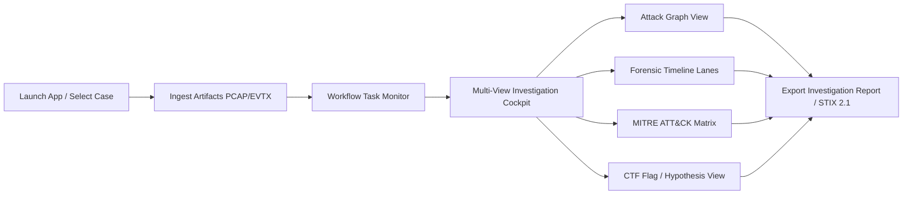

# 17. UX Design Document: Blue Team Cyber Range & SOC/DFIR Platform

**Profile ID**: `PRF-17-UX`  
**Status**: `COMPLETED`  
**Input**: `docs/it-company/02-business-analyst.md` & `docs/it-company/04-solution-architect.md`

---

## 1. Primary User Journeys & Workflows

---

## 2. Information Architecture & Screen Layouts

### View 1: Main Investigation Cockpit (3-Pane Layout)
- **Left Pane (Sidebar)**: Case Selector, Ingested Artifacts list, Workflow Task progress, Filter Bar (Time, Host, Severity).
- **Center Pane (Main Canvas)**: Multi-Tab Switcher:
  - Tab 1: **Attack Graph** (interactive nodes, force-directed/hierarchical layout, lateral movement highlights).
  - Tab 2: **Forensic Timeline** (horizontal lanes by host/process with zoom and brushing).
  - Tab 3: **MITRE ATT&CK Navigator** (heat-mapped tactics and techniques with node counts).
  - Tab 4: **Raw Observations & Hex/Packet Inspector**.
- **Right Pane (Inspector)**: Detailed attributes of selected Node/Edge/Fact, Provenance Hash, Supporting Observations, and MITRE mapping.

### View 2: Cyber Range / CTF Challenge Mode
- Challenge brief, scenario objectives, active indicators of compromise, automated flag verification input, and instant deterministic verdict.
