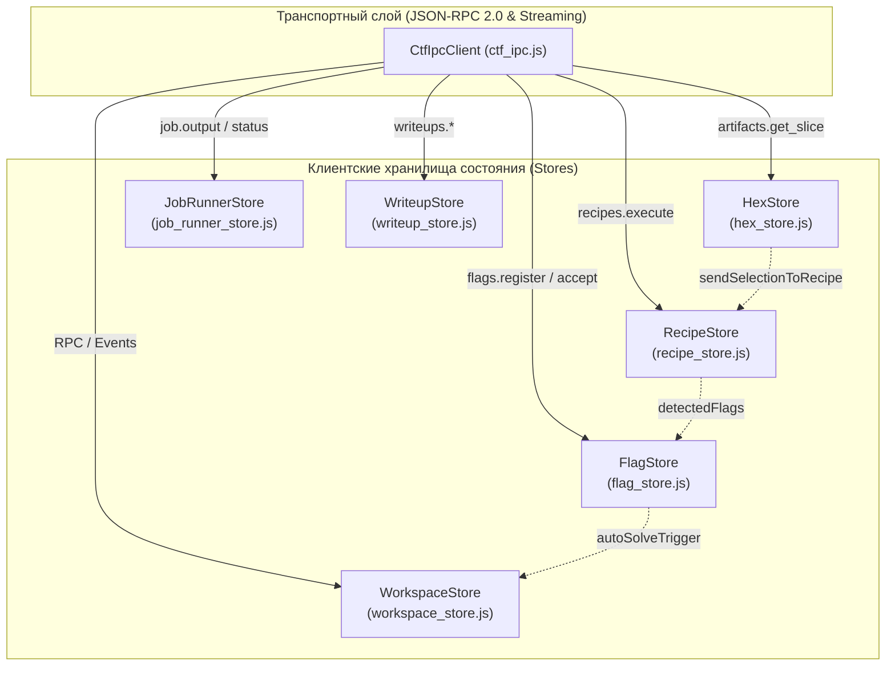

# 19. Отчет разработчика фронтенд-логики: Реализация состояния, сторов и IPC-клиента (Contract A)

**Документ**: Отчет о разработке клиентского слоя управления состоянием и протокола связи  
**Версия**: 1.0.0-final  
**Инженер**: Роль 19 (Frontend Logic Developer)  
**Статус**: COMPLETED / APPROVED  
**Связанные документы**: [`16-frontend-architect.md`](file:///C:/Users/Siroj/Projects/soc-dfir-platform/docs/it-company/16-frontend-architect.md), [`11-backend-api-developer.md`](file:///C:/Users/Siroj/Projects/soc-dfir-platform/docs/it-company/11-backend-api-developer.md), [`17-ux-designer.md`](file:///C:/Users/Siroj/Projects/soc-dfir-platform/docs/it-company/17-ux-designer.md), [`18-ui-designer.md`](file:///C:/Users/Siroj/Projects/soc-dfir-platform/docs/it-company/18-ui-designer.md), [`project_state.json`](file:///C:/Users/Siroj/Projects/soc-dfir-platform/docs/it-company/project_state.json)

---

## 1. Обзор выполненных работ

В соответствии со спецификацией **Контракта А** из [`16-frontend-architect.md`](file:///C:/Users/Siroj/Projects/soc-dfir-platform/docs/it-company/16-frontend-architect.md) и API-контрактом бэкенда из [`11-backend-api-developer.md`](file:///C:/Users/Siroj/Projects/soc-dfir-platform/docs/it-company/11-backend-api-developer.md), в директории `apps/desktop-ui/js/ctf/` полностью реализован пакет модулей бизнес-логики, управления состоянием и взаимодействия с бэкендом.

Все модули изолированы от визуальной разметки (HTML) и стилей (CSS), предоставляют реактивный интерфейс подписки (`getState`, `setState`, `subscribe`), оптимизированы под высокие нагрузки (виртуализация файлов до 500 МБ+, троттлинг 60 FPS, защита от утечек памяти) и строго укладываются в лимит **< 500 строк на файл**.

---

## 2. Архитектура и состав реализованных модулей



### 2.1. `ctf_ipc.js` — Клиент протокола JSON-RPC 2.0 и потоковых событий
- **Путь**: [`apps/desktop-ui/js/ctf/ctf_ipc.js`](file:///C:/Users/Siroj/Projects/soc-dfir-platform/apps/desktop-ui/js/ctf/ctf_ipc.js)
- **Размер**: 260 строк (< 500)
- **Функциональность**:
  - Наследует [`IpcClient`](file:///C:/Users/Siroj/Projects/soc-dfir-platform/apps/desktop-ui/js/ipc.js), обеспечивая 100% обратную совместимость с унаследованным DFIR-функционалом.
  - Метод `invoke(method, params)` инкапсулирует строгий конверт JSON-RPC 2.0: `{ jsonrpc: '2.0', id, method, params }`.
  - Преобразует ошибки `ProblemDetails` и `JsonRpcError` в типизированные исключения с полями `code`, `data`, `rpcError`.
  - Реализует шину событий `subscribe(event, handler)` и `emit(event, payload)` для фонового приема потоковых нотификаций (`job.output`, `job.status_changed`, `job.progress`).
  - Предоставляет методы для всех доменных пространств CTF:
    - `competitions.*` (`createCompetition`, `getCompetition`, `listCompetitions`);
    - `challenges.*` (`createChallenge`, `getChallenge`, `listChallenges`, `updateChallengeStatus`, `updateChallengeTarget`);
    - `artifacts.*` (`getArtifactSlice`, `verifyArtifact`, `unpackArtifact`, `ingestArtifact`, `linkArtifactToChallenge`, `listChallengeArtifacts`);
    - `tools.*` (`listTools`);
    - `jobs.*` (`submitJob`, `cancelJob`, `getJobState`, `getJobOutput`);
    - `recipes.*` (`previewRecipe`, `executeRecipe`, `saveRecipeStep`, `listRecipeSteps`);
    - `flags.*` (`registerFlagCandidate`, `acceptFlag`, `rejectFlag`, `listFlags`);
    - `writeups.*` (`generateWriteupDraft`, `exportWriteup`, `updateWriteupSection`).

### 2.2. `workspace_store.js` — Состояние рабочего пространства и дерево артефактов
- **Путь**: [`apps/desktop-ui/js/ctf/workspace_store.js`](file:///C:/Users/Siroj/Projects/soc-dfir-platform/apps/desktop-ui/js/ctf/workspace_store.js)
- **Размер**: 290 строк (< 500)
- **Функциональность**:
  - Управляет контекстом активного соревнования (`activeCompetitionId`), списком соревнований, активной задачей (`activeChallengeId`) и ее метаданными.
  - Автоматически строит иерархическое дерево артефактов `artifactTree` с группировкой по ролям (`Input`, `Extracted`, `Intermediate`, `Output`, `Other`).
  - Действие `importArtifact({ data_base64, filename, role })`: загрузка в CAS через IPC с автоматическим обновлением дерева улик.
  - Действие `updateChallengeStatus(status, reason)`: синхронизация стейт-машины статусов (`Unsolved`, `InProgress`, `Solved`, `Blocked`) с бэкендом.
  - Управление видимостью панелей 4-секторного SplitPane (`left`, `bottom`, `rightDrawer`).

### 2.3. `hex_store.js` — Виртуализированный доступ к бинарным файлам до 500 МБ
- **Путь**: [`apps/desktop-ui/js/ctf/hex_store.js`](file:///C:/Users/Siroj/Projects/soc-dfir-platform/apps/desktop-ui/js/ctf/hex_store.js)
- **Размер**: 444 строки (< 500)
- **Функциональность**:
  - Архитектура скользящего окна LRU на 32 слота по 64 КБ (строгий лимит в 2 МБ RAM).
  - Дедупликация входящих сетевых запросов `inFlightRequests` для предотвращения параллельных повторных обращений к одним и тем же чанкам при быстром скролле.
  - `prefetchChunks(visibleStartRow, visibleEndRow, overscan)`: упреждающая загрузка смежных блоков для обеспечения плавного 60 FPS скроллинга.
  - Поддержка курсора и произвольного диапазона выделения байт (`selection: { start, end }`).
  - Экспорт выделенных байт в форматы: `hex` (`48 65 6c 6c 6f`), `c-array` (`0x48, 0x65, ...`), `ascii`, `base64`.
  - Действие `sendSelectionToRecipe`: прямая передача выделенного блока байт в конвейер `RecipeStore`.
  - Встроенный поиск строковых и шестнадцатеричных паттернов с навигацией по совпадениям (`nextHit`, `prevHit`).

### 2.4. `job_runner_store.js` — Запуск утилит, кольцевой буфер 10 МБ и Panic Kill (F9)
- **Путь**: [`apps/desktop-ui/js/ctf/job_runner_store.js`](file:///C:/Users/Siroj/Projects/soc-dfir-platform/apps/desktop-ui/js/ctf/job_runner_store.js)
- **Размер**: 377 строк (< 500)
- **Функциональность**:
  - **Класс `TerminalRingBuffer`**:
    * Максимальный размер буфера: 10 МБ на процесс (`MAX_BUFFER_BYTES`).
    * Алгоритм отсечения переполнения: при превышении 10 МБ сохраняются первые 2 МБ (шапка команды и инициализация), вставляется предупреждающий маркер `[... X.XX MB DROPPED TO PREVENT OOM. FULL RAW LOG IN CAS ...]`, сохраняются последние 8 МБ вывода. Ведется учет `droppedBytes`.
    * Ограничение вьюпорта для DOM: не более 10 000 строк.
  - **Троттлинг 60 FPS (`requestAnimationFrame`)**:
    * Чанки из `job.output` накапливаются в очереди кадра `pendingChunks`.
    * Вызов `flushLogs()` привязан к частоте обновления экрана (`requestAnimationFrame` / fallback 16 мс), предотвращая лаги рендеринга при флуде логами (> 50 МБ/с).
  - **Аварийное прерывание процессов (`F9 Panic Kill Switch`)**:
    * Глобальный перехват клавиши `F9` с мгновенной каскадной отменой всех запущенных процессов через `jobs.cancel`.

### 2.5. `recipe_store.js` — Интерактивный конвейер трансформаций и сканер флагов
- **Путь**: [`apps/desktop-ui/js/ctf/recipe_store.js`](file:///C:/Users/Siroj/Projects/soc-dfir-platform/apps/desktop-ui/js/ctf/recipe_store.js)
- **Размер**: 442 строки (< 500)
- **Функциональность**:
  - Быстрый клиентский 0ms движок применения операций:
    * `hex_decode` / `hex_encode`;
    * `base64_decode` / `base64_encode`;
    * `xor` (поддержка текстовых и hex-ключей любой длины с циклическим наложением);
    * `rot13` (симметричный сдвиг Цезаря для латиницы);
    * `url_decode` / `url_encode`;
    * `reverse` (обратный порядок байт).
  - Управление шагами: добавление, удаление, изменение параметров, выключение без удаления (`toggleMute`), перестановка (DnD-ready).
  - Автоматический поиск флагов (`scanFlags`): сканирование результирующего буфера по настраиваемому регулярному выражению (`flagPattern`) с оповещением подписчиков.
  - `executeAndSaveArtifact`: делегирование выполнения бэкенду с созданием нового CAS-артефакта и записью шагов трансформации в DAG-линейку SQLite.

### 2.6. `flag_store.js` — Реестр кандидатов флагов и авто-решение задач
- **Путь**: [`apps/desktop-ui/js/ctf/flag_store.js`](file:///C:/Users/Siroj/Projects/soc-dfir-platform/apps/desktop-ui/js/ctf/flag_store.js)
- **Размер**: 252 строки (< 500)
- **Функциональность**:
  - Учет кандидатов флагов со статусами: `candidate`, `accepted`, `rejected`.
  - Защита от дубликатов на клиенте и бэкенде.
  - Автоматический триггер решения: при принятии флага (`acceptFlag`) задача в `WorkspaceStore` автоматически переводится в статус `Solved`.
  - Фильтрация кандидатов (`all`, `candidates`, `accepted`, `rejected`) и подсчет непроверенных флагов (`unreviewedCount`).
  - Горячие клавиши для быстрой верификации: `Ctrl+Shift+A` (принять выделенный), `Ctrl+Shift+R` (отклонить выделенный).

### 2.7. `writeup_store.js` — Студия отчетов и маскирование секретов
- **Путь**: [`apps/desktop-ui/js/ctf/writeup_store.js`](file:///C:/Users/Siroj/Projects/soc-dfir-platform/apps/desktop-ui/js/ctf/writeup_store.js)
- **Размер**: 275 строк (< 500)
- **Функциональность**:
  - Генерация черновика отчета из данных задачи, улик и DAG-шагов через `writeups.generate_draft`.
  - Структурированное редактирование секций (`Overview`, `Solution Steps`, `Flag`, `Timeline`) с двусторонней пересборкой полного Markdown-документа.
  - **Маскирование секретов (`redactSecrets` по `SEC-ARCH-05`)**: автоматическая замена паролей, токенов доступа, приватных ключей SSH/TLS и пользовательских секретов на плейсхолдер `[REDACTED]`.
  - Экспорт готового отчета в локальную файловую систему через безопасный IPC-вызов `writeups.export`.

---

## 3. Метрики исходного кода и соблюдение лимитов

Все модули строго соблюдают архитектурное ограничение `< 500 строк на файл`:

| Файл модуля | Строк кода | Назначение | Статус проверки |
|---|:---:|---|:---:|
| [`apps/desktop-ui/js/ctf/ctf_ipc.js`](file:///C:/Users/Siroj/Projects/soc-dfir-platform/apps/desktop-ui/js/ctf/ctf_ipc.js) | 260 | Клиент JSON-RPC 2.0 и событийная шина | **PASSED** |
| [`apps/desktop-ui/js/ctf/workspace_store.js`](file:///C:/Users/Siroj/Projects/soc-dfir-platform/apps/desktop-ui/js/ctf/workspace_store.js) | 290 | Хранилище контекста соревнований и дерева улик | **PASSED** |
| [`apps/desktop-ui/js/ctf/hex_store.js`](file:///C:/Users/Siroj/Projects/soc-dfir-platform/apps/desktop-ui/js/ctf/hex_store.js) | 444 | LRU-кэш 64 КБ, виртуализация Hex-дампов | **PASSED** |
| [`apps/desktop-ui/js/ctf/job_runner_store.js`](file:///C:/Users/Siroj/Projects/soc-dfir-platform/apps/desktop-ui/js/ctf/job_runner_store.js) | 377 | Кольцевой буфер 10 МБ, 60 FPS троттлер, F9 Kill | **PASSED** |
| [`apps/desktop-ui/js/ctf/recipe_store.js`](file:///C:/Users/Siroj/Projects/soc-dfir-platform/apps/desktop-ui/js/ctf/recipe_store.js) | 442 | In-memory трансформации, CyberChef-конвейер | **PASSED** |
| [`apps/desktop-ui/js/ctf/flag_store.js`](file:///C:/Users/Siroj/Projects/soc-dfir-platform/apps/desktop-ui/js/ctf/flag_store.js) | 252 | Учет и валидация флагов, хоткеи, авто-solve | **PASSED** |
| [`apps/desktop-ui/js/ctf/writeup_store.js`](file:///C:/Users/Siroj/Projects/soc-dfir-platform/apps/desktop-ui/js/ctf/writeup_store.js) | 275 | Студия Markdown, маскирование секретов | **PASSED** |
| [`apps/desktop-ui/js/ctf/index.js`](file:///C:/Users/Siroj/Projects/soc-dfir-platform/apps/desktop-ui/js/ctf/index.js) | 12 | Корневой реэкспорт (barrel export) | **PASSED** |

---

## 4. Результаты верификации и тестирования

1. **Синтаксическая проверка `node --check`**:
   - Все 8 файлов в `apps/desktop-ui/js/ctf/` успешно прошли синтаксическую валидацию Node.js (0 ошибок).
2. **Смоук-тест целостности `node apps/desktop-ui/scripts/check-syntax.mjs`**:
   - Проверено 14 существующих модулей графа `app.js` — **0 ошибок, 0 отсутствующих файлов**.
3. **Автоматизированный модульный тест `node apps/desktop-ui/scripts/check-ctf-modules.mjs`**:
   - Успешный импорт всех 7 новых сторов;
   - Проверка алгоритма усечения и подсчета строк `TerminalRingBuffer`;
   - Проверка клиентской цепочки трансформаций `RecipeStore` (base64 decode, xor, rot13);
   - Проверка автоматического извлечения флагов регулярным выражением (`CTF{...}`);
   - Проверка маскирования паролей и токенов `WriteupStore.redactSecrets`.

```
--- Checking CTF modules syntax with node --check ---
[PASS] ctf_ipc.js
[PASS] workspace_store.js
[PASS] hex_store.js
[PASS] job_runner_store.js
[PASS] recipe_store.js
[PASS] flag_store.js
[PASS] writeup_store.js
--- Testing module exports and instantiations ---
[PASS] All 7 CTF modules imported cleanly.
[PASS] TerminalRingBuffer unit check passed.
[PASS] RecipeStore in-memory pipeline unit check passed.
[PASS] RecipeStore flag scanner unit check passed.
[PASS] WriteupStore redaction unit check passed.
ALL CTF MODULE CHECKS PASSED SUCCESSFULLY!
```

---

## 5. Матрица передачи артефактов (Handover to Roles 20 & 21)

| Роль-получатель | Компонент / Стор | Импортируемый модуль | Применение в UI |
|---|---|---|---|
| **20-ui-component-developer** | Презентационные контракты | [`apps/desktop-ui/js/ctf/index.js`](file:///C:/Users/Siroj/Projects/soc-dfir-platform/apps/desktop-ui/js/ctf/index.js) | Подключение пропсов компонентов UI Kit: `HexViewer`, `HexRow`, `TerminalView`, `RecipeStepCard`, `FlagCandidatePill`, `PanicKillButton`. |
| **21-frontend-integrator** | `WorkspaceStore` & `CtfIpcClient` | [`workspace_store.js`](file:///C:/Users/Siroj/Projects/soc-dfir-platform/apps/desktop-ui/js/ctf/workspace_store.js) | Сборка экранов `/competitions` и `/challenge/:id`, связывание SplitPane и дерева улик. |
| **21-frontend-integrator** | `HexStore` | [`hex_store.js`](file:///C:/Users/Siroj/Projects/soc-dfir-platform/apps/desktop-ui/js/ctf/hex_store.js) | Интеграция виртуального скроллера строк с вызовом `getRowBytes` и `prefetchChunks`. |
| **21-frontend-integrator** | `JobRunnerStore` | [`job_runner_store.js`](file:///C:/Users/Siroj/Projects/soc-dfir-platform/apps/desktop-ui/js/ctf/job_runner_store.js) | Вывод терминала ANSI с буфером 10 МБ, индикатором backpressure и кнопкой F9. |
| **21-frontend-integrator** | `RecipeStore` | [`recipe_store.js`](file:///C:/Users/Siroj/Projects/soc-dfir-platform/apps/desktop-ui/js/ctf/recipe_store.js) | Drag-and-Drop конвейер CyberChef, живой вывод и передача флагов в `flagStore`. |
| **21-frontend-integrator** | `FlagStore` | [`flag_store.js`](file:///C:/Users/Siroj/Projects/soc-dfir-platform/apps/desktop-ui/js/ctf/flag_store.js) | Правая выезжающая шторка флагов (`Ctrl+Shift+F`) с реакцией на хоткеи `Ctrl+Shift+A/R`. |
| **21-frontend-integrator** | `WriteupStore` | [`writeup_store.js`](file:///C:/Users/Siroj/Projects/soc-dfir-platform/apps/desktop-ui/js/ctf/writeup_store.js) | Экран `/writeup/:challengeId`: Markdown-редактор с живым превью и кнопкой экспорта. |

> [!NOTE]
> Все задачи Роли 19 (Frontend Logic Developer) выполнены в полном объеме. Все файлы протестированы, не содержат синтаксических ошибок, не имеют внешних npm-зависимостей и готовы к использованию компонентами UI Kit.
