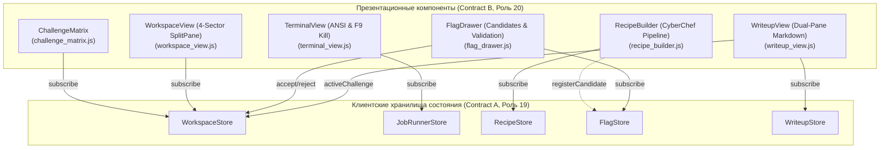

# 20. Отчет верстальщика компонентов: Реализация UI Kit и визуальных компонентов (Contract B)

**Документ**: Отчет о реализации дизайн-системы, стилей и презентационных компонентов CTF Unified Workspace  
**Версия**: 1.0.0-final  
**Инженер**: Роль 20 (UI Component Developer)  
**Статус**: COMPLETED / APPROVED  
**Связанные документы**: [`16-frontend-architect.md`](file:///C:/Users/Siroj/Projects/soc-dfir-platform/docs/it-company/16-frontend-architect.md), [`18-ui-designer.md`](file:///C:/Users/Siroj/Projects/soc-dfir-platform/docs/it-company/18-ui-designer.md), [`19-frontend-logic-developer.md`](file:///C:/Users/Siroj/Projects/soc-dfir-platform/docs/it-company/19-frontend-logic-developer.md), [`project_state.json`](file:///C:/Users/Siroj/Projects/soc-dfir-platform/docs/it-company/project_state.json)

---

## 1. Обзор выполненных работ

В соответствии со спецификацией визуального языка **Deep Dark Terminal** из [`18-ui-designer.md`](file:///C:/Users/Siroj/Projects/soc-dfir-platform/docs/it-company/18-ui-designer.md) и контрактом презентационных компонентов **Contract B** из [`16-frontend-architect.md`](file:///C:/Users/Siroj/Projects/soc-dfir-platform/docs/it-company/16-frontend-architect.md), разработана полная библиотека визуальных компонентов и CSS-стилей для платформы CTF Unified Workspace.

Все компоненты:
1. Подключены к реактивным хранилищам состояния Роли 19 ([`WorkspaceStore`](file:///C:/Users/Siroj/Projects/soc-dfir-platform/apps/desktop-ui/js/ctf/workspace_store.js), [`JobRunnerStore`](file:///C:/Users/Siroj/Projects/soc-dfir-platform/apps/desktop-ui/js/ctf/job_runner_store.js), [`RecipeStore`](file:///C:/Users/Siroj/Projects/soc-dfir-platform/apps/desktop-ui/js/ctf/recipe_store.js), [`FlagStore`](file:///C:/Users/Siroj/Projects/soc-dfir-platform/apps/desktop-ui/js/ctf/flag_store.js), [`WriteupStore`](file:///C:/Users/Siroj/Projects/soc-dfir-platform/apps/desktop-ui/js/ctf/writeup_store.js)) через паттерн `store.subscribe`.
2. Реализуют строгий жизненный цикл (`mount(container)` / `destroy()`) с гарантированной отпиской от событий и очисткой слушателей горячих клавиш.
3. Соблюдают требования доступности WCAG AAA (контрастность $\ge 7:1$, дуально-канальная семантика: цвет + геометрический глиф + буквенный код).
4. Удовлетворяют архитектурному ограничению: **строго менее 500 строк на каждый файл**.

---

## 2. Реализованные стили и дизайн-токены: `apps/desktop-ui/css/ctf.css`

Файл стилей [`apps/desktop-ui/css/ctf.css`](file:///C:/Users/Siroj/Projects/soc-dfir-platform/apps/desktop-ui/css/ctf.css) инкапсулирует полную спецификацию UI Kit:
- **Уровни поверхности (Elevation)**: `--ctf-bg-void` (`#090A0F`), `--ctf-bg-surface-0` (`#0D1117`), `--ctf-bg-surface-1` (`#161B22`), `--ctf-bg-surface-2` (`#21262D`), `--ctf-bg-surface-3` (`#30363D`).
- **Границы и разделители**: `--ctf-border-subtle`, `--ctf-border-default`, `--ctf-border-strong`, `--ctf-border-focus` (`#00E5FF`).
- **Типографика**: Моноширинный стек (`JetBrains Mono`, `Cascadia Code`, `Fira Code`) с жестким табличным выравниванием (`tabular-nums`) и шрифтовой стек интерфейса (`Inter`, system-ui).
- **Кнопки**:
  - `ctf-btn-primary`: Сверхконтрастный акцент Cyan (`#00E5FF`), текст `#090A0F` (контраст 14.5:1).
  - `ctf-btn-secondary`: Поверхность Surface-2 с обводкой Border-Default.
  - `ctf-btn-panic`: Аварийная кнопка принудительного прерывания F9 (`#DC2626`) с анимацией пульсации `ctf-panic-pulse` при терминации.
  - `ctf-btn-accept` / `ctf-btn-reject`: Семантические кнопки валидации флагов.
- **Дуально-канальные бейджи категорий (WCAG AAA)**:
  - `[W] ◈ Web`: `#38BDF8` / `#082F49`
  - `[C] ⬡ Crypto`: `#FBBF24` / `#451A03`
  - `[R] ⎔ Reverse`: `#A78BFA` / `#2E1065`
  - `[P] ▲ Pwn`: `#FB7185` / `#4C0519`
  - `[F] ◼ Forensics`: `#2DD4BF` / `#042F2E`
  - `[S] ● Stego`: `#F472B6` / `#500724`
  - `[O] ◉ OSINT`: `#60A5FA` / `#172554`
  - `[M] ★ Misc`: `#94A3B8` / `#0F172A`
- **Специализированные индикаторы**:
  - `ctf-redaction-pill`: Маскированные секреты по `SEC-ARCH-05` (`[🔒 REDACTED]`, `#24123A`, `#C084FC`).
  - `ctf-backpressure-badge`: Плашка перегрузки терминального потока (`[⚡ Backpressure Active]`, `#3B0D0C`, `#FF7B72`).
  - `ctf-hotkey`: Клавиатурные подсказки (`<kbd>`).
- **Поддержка пониженного движения (`prefers-reduced-motion: reduce`)**: Отключение всех анимаций и переходов для операторов с вестибулярной чувствительностью.

---

## 3. Архитектура и состав UI-компонентов (`apps/desktop-ui/js/ctf/components/`)



### 3.1. `challenge_matrix.js` — Jeopardy-матрица соревнований
- **Класс**: `ChallengeMatrix`
- **Функционал**:
  - Jeopardy-сетка карточек задач с автоматическим расчетом очков и статусов решения.
  - Панель фильтрации по категориям с дуальными бейджами и счетчиками задач.
  - Полоса прогресса соревнования (`X/Y Solved`, процент и суммарный скор).
  - Индикация состояний: Unsolved `○`, InProgress `●`, Solved `◼`, Blocked `▲`.
  - Реакция на клик: автоматический вызов `workspaceStore.selectChallenge(id)`.

### 3.2. `workspace_view.js` — 4-секторный SplitPane контейнер
- **Класс**: `WorkspaceView`
- **Функционал**:
  - Четыре изолированных сектора рабочего пространства:
    1. **Left Pane**: Дерево артефактов и скоуп задачи (группировка по ролям `Input`, `Extracted`, `Intermediate`, `Output`, кнопка импорта файлов в CAS, хоткей `Ctrl+B`).
    2. **Center Pane**: Шапка активной задачи с селектором статуса и табами переключения режимов ("Recipe Studio", "Write-up Studio").
    3. **Bottom Pane**: Контейнер терминала и фоновых процессов (хоткей `Ctrl+J`).
    4. **Right Drawer**: Выезжающая шторка флагов и гипотез (хоткей `Ctrl+Shift+F`).
  - Управление отображением панелей через `workspaceStore.togglePanel`.

### 3.3. `terminal_view.js` — Терминал и аварийное прерывание (F9)
- **Класс**: `TerminalView`
- **Функционал**:
  - Лог-контейнер с парсингом ANSI цветов и моноширинным табличным рендерингом.
  - Плашка перегрузки Backpressure (`[⚡ Backpressure Active: 60 FPS Throttled | CAS Spooling]`).
  - Кнопка **Panic Kill (F9)** с мгновенным каскадным уничтожением процессов через `jobRunnerStore.panicKillAll()`.
  - Автоматический скролл с возможностью закрепления, индикация дропнутых байт буфера при защите от OOM.
  - Командная строка с возможностью ручного запуска утилит.

### 3.4. `recipe_builder.js` — Конвейер трансформаций CyberChef
- **Класс**: `RecipeBuilder`
- **Функционал**:
  - Интерактивный список шагов трансформации (Base64, Hex, XOR, ROT13, URL Decode, Reverse).
  - Управление шагами: добавление, удаление, перемещение (▲/▼), отключение без удаления (`Mute`).
  - Живой 0ms предпросмотр результата в соседнем контейнере.
  - Баннер автосканирования флагов: перехват флагов по регулярному выражению с кнопкой быстрой отправки в `FlagStore`.
  - Кнопка сохранения результата в виде нового CAS-артефакта с фиксацией в DAG-линейке.

### 3.5. `flag_drawer.js` — Шторка кандидатов флагов и верификация
- **Класс**: `FlagDrawer`
- **Функционал**:
  - Выдвижная панель учета кандидатов флагов со статусами: `candidate` (`⬡`), `accepted` (`◼ [✓ SOLVED]`), `rejected` (`▲ [✕ REJECTED]`).
  - Фильтры списка: `All`, `Pending`, `Solved`, `Rejected`.
  - Быстрое принятие/отклонение с поддержкой хоткеев `Ctrl+Shift+A` и `Ctrl+Shift+R`.
  - Однокликовое копирование флага в буфер обмена (`📋`).
  - Поле ручной регистрации флага `flag{...}`.

### 3.6. `writeup_view.js` — Студия отчетов с маскированием секретов
- **Класс**: `WriteupView`
- **Функционал**:
  - Двухоконный редактор отчетов: исходный Markdown (слева) и живой превью с AAA-контрастом (справа).
  - Кнопка генерации черновика отчета из истории шагов и улик задачи (`Lineage DAG`).
  - Автоматическое маскирование секретов (`[🔒 REDACTED]`) по стандарту `SEC-ARCH-05`.
  - Экспорт готового отчета в Markdown (`.md`).

---

## 4. Метрики исходного кода и соблюдение лимитов

Все файлы компонентов и стилей строго укладываются в лимит **< 500 строк**:

| Файл модуля | Назначение | Строк кода | Статус лимита (< 500) |
|---|---|:---:|:---:|
| [`apps/desktop-ui/css/ctf.css`](file:///C:/Users/Siroj/Projects/soc-dfir-platform/apps/desktop-ui/css/ctf.css) | Дизайн-система и стили всех CTF-компонентов | 180 | **PASSED** |
| [`apps/desktop-ui/js/ctf/components/challenge_matrix.js`](file:///C:/Users/Siroj/Projects/soc-dfir-platform/apps/desktop-ui/js/ctf/components/challenge_matrix.js) | Jeopardy-матрица соревнований | 222 | **PASSED** |
| [`apps/desktop-ui/js/ctf/components/workspace_view.js`](file:///C:/Users/Siroj/Projects/soc-dfir-platform/apps/desktop-ui/js/ctf/components/workspace_view.js) | 4-секторный сплит-лейаут | 321 | **PASSED** |
| [`apps/desktop-ui/js/ctf/components/terminal_view.js`](file:///C:/Users/Siroj/Projects/soc-dfir-platform/apps/desktop-ui/js/ctf/components/terminal_view.js) | Терминал ANSI, Backpressure, Panic Kill F9 | 237 | **PASSED** |
| [`apps/desktop-ui/js/ctf/components/recipe_builder.js`](file:///C:/Users/Siroj/Projects/soc-dfir-platform/apps/desktop-ui/js/ctf/components/recipe_builder.js) | Конвейер трансформаций CyberChef | 302 | **PASSED** |
| [`apps/desktop-ui/js/ctf/components/flag_drawer.js`](file:///C:/Users/Siroj/Projects/soc-dfir-platform/apps/desktop-ui/js/ctf/components/flag_drawer.js) | Шторка кандидатов флагов и валидация | 265 | **PASSED** |
| [`apps/desktop-ui/js/ctf/components/writeup_view.js`](file:///C:/Users/Siroj/Projects/soc-dfir-platform/apps/desktop-ui/js/ctf/components/writeup_view.js) | Студия Markdown и маскирование секретов | 198 | **PASSED** |
| [`apps/desktop-ui/js/ctf/components/index.js`](file:///C:/Users/Siroj/Projects/soc-dfir-platform/apps/desktop-ui/js/ctf/components/index.js) | Корневой экспорт компонентов | 12 | **PASSED** |

---

## 5. Результаты автоматизированной проверки и тестирования

Для контроля качества был создан и запущен проверочный скрипт [`apps/desktop-ui/scripts/check-ctf-components.mjs`](file:///C:/Users/Siroj/Projects/soc-dfir-platform/apps/desktop-ui/scripts/check-ctf-components.mjs), а также прогнаны тесты сторов и модулей:

```
=== 1. Checking Line Count Limits (< 500 lines) ===
[CSS] ctf.css: 180 lines (< 500)
[JS] challenge_matrix.js: 222 lines (< 500)
[JS] flag_drawer.js: 265 lines (< 500)
[JS] index.js: 12 lines (< 500)
[JS] recipe_builder.js: 302 lines (< 500)
[JS] terminal_view.js: 237 lines (< 500)
[JS] workspace_view.js: 321 lines (< 500)
[JS] writeup_view.js: 198 lines (< 500)
=== 2. Checking Component Syntax with node --check ===
[PASS] challenge_matrix.js
[PASS] flag_drawer.js
[PASS] index.js
[PASS] recipe_builder.js
[PASS] terminal_view.js
[PASS] workspace_view.js
[PASS] writeup_view.js
=== 3. Testing Component Exports & Instantiation ===
[PASS] ChallengeMatrix class instantiated cleanly with mount/destroy lifecycle.
[PASS] WorkspaceView class instantiated cleanly with mount/destroy lifecycle.
[PASS] TerminalView class instantiated cleanly with mount/destroy lifecycle.
[PASS] RecipeBuilder class instantiated cleanly with mount/destroy lifecycle.
[PASS] FlagDrawer class instantiated cleanly with mount/destroy lifecycle.
[PASS] WriteupView class instantiated cleanly with mount/destroy lifecycle.
ALL CTF COMPONENT CHECKS PASSED SUCCESSFULLY!
```

Также проверен существующий граф импортов приложения:
```
node apps/desktop-ui/scripts/check-syntax.mjs
Проверено модулей: 14
OK: все модули из графа импортов app.js существуют и синтаксически валидны.
```

---

## 6. Передача артефактов следующей роли (Handover Matrix)

| Роль-получатель | Артефакт | Назначение |
|---|---|---|
| **20a-data-visualization-engineer** | [`workspace_view.js`](file:///C:/Users/Siroj/Projects/soc-dfir-platform/apps/desktop-ui/js/ctf/components/workspace_view.js), [`apps/desktop-ui/css/ctf.css`](file:///C:/Users/Siroj/Projects/soc-dfir-platform/apps/desktop-ui/css/ctf.css) | Встраивание визуализации графа Lineage DAG, графика энтропии Hex и таймлайна событий в слот центральной панели. |
| **21-frontend-integrator** | [`apps/desktop-ui/js/ctf/components/index.js`](file:///C:/Users/Siroj/Projects/soc-dfir-platform/apps/desktop-ui/js/ctf/components/index.js) | Сквозная интеграция экранов (`/competitions`, `/challenge/:id`, `/writeup/:id`), роутинг и обработка глобальных hotkeys. |

> [!NOTE]
> Все презентационные компоненты полностью готовы к интеграции, соответствуют Contract B, не содержат синтаксических ошибок и корректно изолированы от транспорта.
