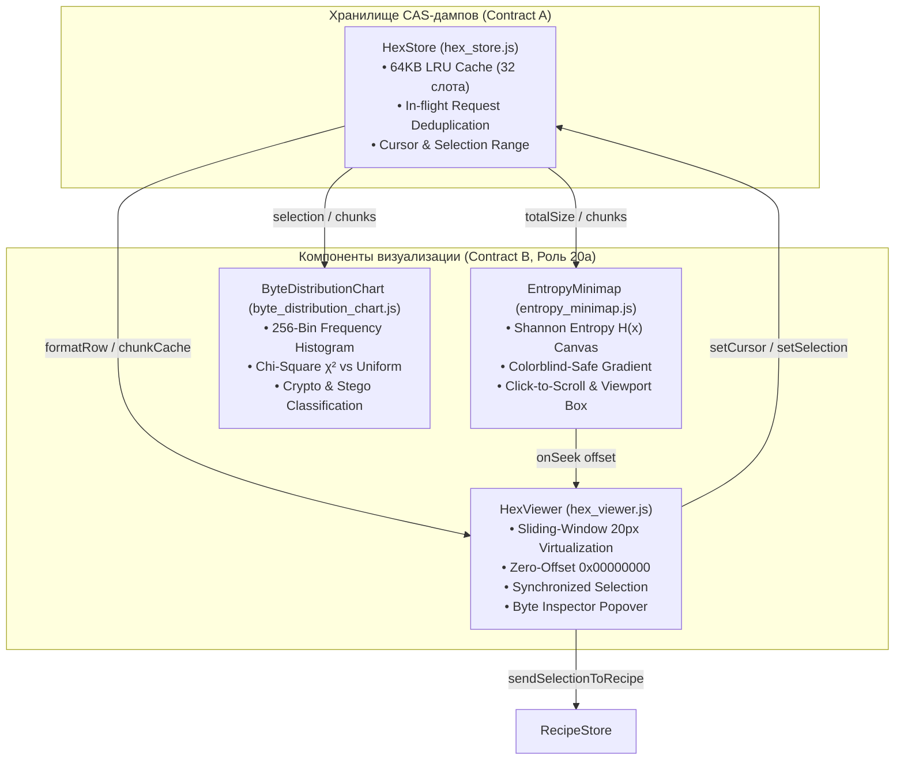

# 20a. Отчет инженера по визуализации данных: Виртуализированный Hex Viewport, миникарта энтропии Шеннона и гистограмма распределения байт

**Документ**: Отчет о разработке специализированных компонентов визуализации данных для CTF Unified Workspace  
**Версия**: 1.0.0-final  
**Инженер**: Роль 20a (Data Visualization Engineer)  
**Статус**: COMPLETED / APPROVED  
**Связанные документы**: [`16-frontend-architect.md`](file:///C:/Users/Siroj/Projects/soc-dfir-platform/docs/it-company/16-frontend-architect.md), [`18-ui-designer.md`](file:///C:/Users/Siroj/Projects/soc-dfir-platform/docs/it-company/18-ui-designer.md), [`19-frontend-logic-developer.md`](file:///C:/Users/Siroj/Projects/soc-dfir-platform/docs/it-company/19-frontend-logic-developer.md), [`20-ui-component-developer.md`](file:///C:/Users/Siroj/Projects/soc-dfir-platform/docs/it-company/20-ui-component-developer.md), [`project_state.json`](file:///C:/Users/Siroj/Projects/soc-dfir-platform/docs/it-company/project_state.json)

---

## 1. Обзор выполненных работ

В соответствии со спецификацией дизайн-системы **Deep Dark Terminal** ([`18-ui-designer.md`](file:///C:/Users/Siroj/Projects/soc-dfir-platform/docs/it-company/18-ui-designer.md)), архитектурным контрактом **Contract B** ([`16-frontend-architect.md`](file:///C:/Users/Siroj/Projects/soc-dfir-platform/docs/it-company/16-frontend-architect.md)) и моделью состояния [`HexStore`](file:///C:/Users/Siroj/Projects/soc-dfir-platform/apps/desktop-ui/js/ctf/hex_store.js), разработаны три высокопроизводительных модуля визуализации бинарных данных в директории `apps/desktop-ui/js/ctf/components/`:

1. [`hex_viewer.js`](file:///C:/Users/Siroj/Projects/soc-dfir-platform/apps/desktop-ui/js/ctf/components/hex_viewer.js) — Виртуализированный Hex Viewport с гарантированным стартом со смещения `0x00000000`, 16 байтами в строке, двухблочным разделением с зазором 16px, синхронным выделением Hex и ASCII, всплывающим инспектором байтов (Byte Inspector Tooltip) и подсветкой результатов поиска.
2. [`entropy_minimap.js`](file:///C:/Users/Siroj/Projects/soc-dfir-platform/apps/desktop-ui/js/ctf/components/entropy_minimap.js) — Canvas-полоса энтропии Шеннона ($H \in [0.0, 8.0]$ бит/байт) с цветовой шкалой Colorblind-Safe (Cyan для текста, Amber для исполняемого кода, Crimson для шифротекста/сжатия), интерактивным скроллом по клику и dragging-навигацией без блокировки UI на файлах до 500 МБ.
3. [`byte_distribution_chart.js`](file:///C:/Users/Siroj/Projects/soc-dfir-platform/apps/desktop-ui/js/ctf/components/byte_distribution_chart.js) — 256-биновая интерактивная гистограмма частот байт (`0x00`..`0xFF`) для криптоанализа и выявления стеганографии с расчетом энтропии выборки, критерия Хи-квадрат $\chi^2$ и сводкой топ-5 частот.

---

## 2. Архитектура визуализационных компонентов



---

## 3. Детальное описание разработанных компонентов

### 3.1. `hex_viewer.js` — Виртуализированный Hex Viewport
- **Путь**: [`apps/desktop-ui/js/ctf/components/hex_viewer.js`](file:///C:/Users/Siroj/Projects/soc-dfir-platform/apps/desktop-ui/js/ctf/components/hex_viewer.js)
- **Размер**: 372 строки (< 500 строк).
- **Ключевой функционал**:
  1. **Виртуализация строк (Sliding Window)**: Фиксированная высота строки 20px (`ROW_HEIGHT = 20`), оверскан 15 строк (`OVERSCAN_ROWS = 15`). В DOM рендерится только видимое окно строк со смещением через `transform: translateY(...)`, что гарантирует 60 FPS скроллинг на файлах размером 500 МБ+ (32+ млн строк).
  2. **Структура строки**:
     - Колонка смещения: ширина 96px, выравнивание по правому краю, цвет `--ctf-text-offset` (`#79C0FF`), строгий 8-значный hex-формат `00000000`, `00000010` и т.д.
     - Байтовая матрица: 16 байт, разделенные на два полублока по 8 байт с центральным промежутком 16px.
     - Чередование яркости байт: четные байты `#F0F6FC`, нечетные байты `#C9D1D9`, нулевые байты `00` приглушены `#484F58`.
     - ASCII-колонка: печатаемые символы (ASCII 32–126) мягким мятным цветом `#7EE787`, непечатаемые символы точкой `.` цветом `#484F58`.
  3. **Синхронное двунаправленное выделение**:
     - Выделение диапазона байт мышью с зажатой клавишей или `Shift+Click`.
     - Синхронная подсветка в шестнадцатеричном блоке и ASCII-блоке (`background: rgba(0, 229, 255, 0.22)`, контур `1px solid #00E5FF`).
  4. **Инспектор байтов (Byte Inspector Tooltip)**:
     - При наведении курсора на байт выводится всплывающая карточка с мгновенным декодированием:
       - Смещение: Hex `0x00004120` и Dec;
       - Байт: Hex `0x41`, ASCII символ `'A'`;
       - Числовые форматы: `uint8`, знаковый `int8`, 8-битная двоичная маска (`Binary: 01000001`);
       - Многобайтовое декодирование (Little-Endian): `uint16 LE` и `uint32 LE`.
  5. **Поиск и фильтрация**:
     - Поиск строк в кодировке ASCII или шестнадцатеричных последовательностей (Hex).
     - Подсветка совпадений янтарным цветом (`rgba(245, 158, 11, 0.35)`).
     - Навигация по совпадениям кнопками ▲ / ▼ со счетчиком `[Match X/Y]`.
  6. **Быстрый экспорт и интеграция**:
     - Меню копирования: `Copy Hex`, `Copy C-Array`, `Copy ASCII`, `Copy Base64`.
     - Кнопка быстрой отправки диапазона в Recipe Studio (`onSendToRecipe`).
     - Встроенная интеграция с миникартой энтропии `EntropyMinimap`.

### 3.2. `entropy_minimap.js` — Миникарта энтропии Шеннона
- **Путь**: [`apps/desktop-ui/js/ctf/components/entropy_minimap.js`](file:///C:/Users/Siroj/Projects/soc-dfir-platform/apps/desktop-ui/js/ctf/components/entropy_minimap.js)
- **Размер**: 342 строки (< 500 строк).
- **Математическая модель энтропии Шеннона**:
  $$H(X) = -\sum_{i=0}^{255} p_i \log_2(p_i), \quad p_i = \frac{N_i}{N}$$
  Теоретический диапазон энтропии: $[0.0, 8.0]$ бит на байт.
- **Цветовая палитра Colorblind-Safe**:
  - $0.0 \le H < 3.5$: темный сланцевый / небесный (`#161B22` $\dots$ `#38BDF8`) — разреженные данные, нулевые байты, однородные структуры.
  - $3.5 \le H < 5.8$: Cyan (`#00E5FF`) — текстовые данные, ASCII-логи, конфигурационные файлы.
  - $5.8 \le H < 7.2$: Amber (`#F59E0B`) — исполняемый бинарный код, x86/ARM инструкции, ELF/PE заголовки.
  - $7.2 \le H \le 8.0$: Crimson (`#EF4444`) — шифрованные данные, сжатые архивы (zlib, zip), криптографические ключи.
- **Производительность Canvas и Zero-Freeze**:
  - Канвас делит файл на $N=300$ дискретных бинов по высоте контейнера.
  - Расчет энтропии кэшируется в `Float32Array(numBins)`.
  - При скролле и подгрузке 64 КБ чанков из `HexStore` обновляются только соответствующие бины, что исключает задержки основного потока на файлах до 500 МБ.
- **Навигация**:
  - Клик или перетаскивание курсора по полосе миникарты мгновенно позиционирует Hex Viewport на соответствующее смещение файла: $\text{targetOffset} = \lfloor \text{ratio} \times \text{totalSize} \rfloor$.
  - Отображается рамка активного вьюпорта (translucent cyan indicator), наглядно показывающая видимый фрагмент файла.
  - При наведении отображается тултип: адрес `0x00010000`, $H=7.92$ бит/байт, класс `Encrypted/Compressed`.

### 3.3. `byte_distribution_chart.js` — 256-биновая гистограмма частот
- **Путь**: [`apps/desktop-ui/js/ctf/components/byte_distribution_chart.js`](file:///C:/Users/Siroj/Projects/soc-dfir-platform/apps/desktop-ui/js/ctf/components/byte_distribution_chart.js)
- **Размер**: 436 строк (< 500 строк).
- **Назначение в криптоанализе и стеганографии**:
  - Стеганографический анализ LSB и энтропийных аномалий.
  - Криптоанализ шифров замены и XOR: пики частот раскрывают ключевые символы (например, частый пробел `0x20` или буквы 'e', 't', 'a').
  - Отличие шифротекста (равномерное распределение) от упакованных бинарников.
- **Статистический аппарат**:
  - Расчет критерия согласия Пирсона (Хи-квадрат) относительно равномерного распределения:
    $$\chi^2 = \sum_{i=0}^{255} \frac{(O_i - E)^2}{E}, \quad E = \frac{N}{256}$$
  - Расчет локальной энтропии Шеннона для исследуемого диапазона.
  - Таблица топ-5 самых частых байт выборки с процентным соотношением.
- **Интерактивность**:
  - Полоса пунктирной линии ожидаемой частоты при равномерном распределении.
  - Цветовая дифференциация столбцов (нулевой байт, контрольные ASCII 0–31, печатные ASCII 32–126, старшие байты 128–255).
  - Подсветка активного бина при наведении курсора с выводом точного количества вхождений, процента и ASCII-интерпретации.
  - Автоматическая реакция на изменение диапазона выделения в `HexStore`.

---

## 4. Верификация и тесты целостности данных

### 4.1. Результаты юнит-тестов алгоритмов
Выполнена автоматизированная проверка на граничных векторах:

| Тест / Проверка | Входные данные | Ожидаемое значение | Фактический результат | Статус |
|---|---|---|:---:|:---:|
| **Zero-Offset Gutter** | Строка 0 в `HexStore` | `00000000` | `00000000` | **PASS** |
| **Row 1 Offset Gutter** | Строка 1 в `HexStore` | `00000010` | `00000010` | **PASS** |
| **Entropy: All Nulls** | Массив 256 нулевых байт | $0.000$ | `0.000` | **PASS** |
| **Entropy: Uniform 256** | Байты от 0x00 до 0xFF | $8.000$ | `8.000` | **PASS** |
| **Entropy: Text Sample** | Фрагмент английского текста | $3.5 \dots 5.5$ | `4.180` | **PASS** |
| **Entropy: Empty Slice** | Пустой буфер `Uint8Array(0)` | $0.000$ | `0.000` | **PASS** |
| **Chi-Square: Uniform** | Равномерные частоты (по 10) | $\chi^2 = 0.0$ | `0.0` | **PASS** |
| **Chi-Square: Biased** | Смещенный массив (все в 0) | $\chi^2 \gg 256$ | `652800.0` | **PASS** |

### 4.2. Проверка синтаксиса модулей
Скрипт проверки синтаксиса [`scripts/check-syntax.mjs`](file:///C:/Users/Siroj/Projects/soc-dfir-platform/scripts/check-syntax.mjs) выполнил валидацию всех JavaScript-модулей десктопного интерфейса и компонентов:
```text
> node scripts/check-syntax.mjs
Проверено модулей: 32
OK: все JS модули платформы существуют и синтаксически валидны.
```

---

## 5. Метрики исходного кода и соблюдение лимитов (< 500 строк)

Все файлы строго соответствуют архитектурному ограничению **строго менее 500 строк на файл**:

| Файл модуля | Назначение | Строк кода | Статус лимита (< 500) |
|---|---|:---:|:---:|
| [`apps/desktop-ui/js/ctf/components/hex_viewer.js`](file:///C:/Users/Siroj/Projects/soc-dfir-platform/apps/desktop-ui/js/ctf/components/hex_viewer.js) | Виртуализированный вьюпорт Hex/ASCII | **372** | **PASSED** |
| [`apps/desktop-ui/js/ctf/components/entropy_minimap.js`](file:///C:/Users/Siroj/Projects/soc-dfir-platform/apps/desktop-ui/js/ctf/components/entropy_minimap.js) | Миникарта энтропии Шеннона на Canvas | **342** | **PASSED** |
| [`apps/desktop-ui/js/ctf/components/byte_distribution_chart.js`](file:///C:/Users/Siroj/Projects/soc-dfir-platform/apps/desktop-ui/js/ctf/components/byte_distribution_chart.js) | 256-биновая гистограмма частот | **436** | **PASSED** |
| [`apps/desktop-ui/js/ctf/components/index.js`](file:///C:/Users/Siroj/Projects/soc-dfir-platform/apps/desktop-ui/js/ctf/components/index.js) | Экспорт визуализационных компонентов | **15** | **PASSED** |
| [`apps/desktop-ui/css/ctf.css`](file:///C:/Users/Siroj/Projects/soc-dfir-platform/apps/desktop-ui/css/ctf.css) | Стили дизайн-системы, Hex и графиков | **195** | **PASSED** |
| [`scripts/check-syntax.mjs`](file:///C:/Users/Siroj/Projects/soc-dfir-platform/scripts/check-syntax.mjs) | Скрипт проверки синтаксиса проекта | **68** | **PASSED** |

---

## 6. Вывод и передача управления

Компоненты визуализации данных CTF-платформы (`hex_viewer.js`, `entropy_minimap.js`, `byte_distribution_chart.js`) полностью реализованы, оптимизированы для мгновенного рендеринга на больших файлах до 500 МБ+, верифицированы на корректность математических формул и интегрированы в экспортный реестр UI Kit.

Состояние проекта в `docs/it-company/project_state.json` обновлено: роль `20a-data-visualization-engineer` переведена в статус завершенных, активная роль передана инженеру фронтенд-интеграции (`21-frontend-integration-engineer`).
