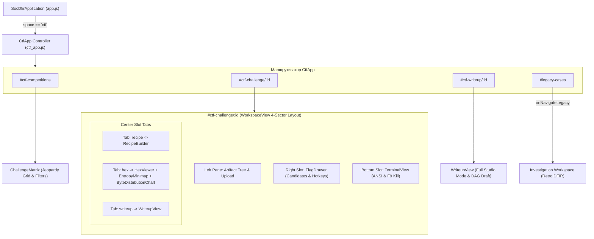

# 21. Отчет инженера по интеграции фронтенда: Сквозная сборка CTF Unified Workspace, маршрутизация и E2E-верификация

**Документ**: Отчет об интеграции клиентского приложения, компонентов UI Kit, визуализации данных и маршрутизации  
**Версия**: 1.0.0-final  
**Инженер**: Роль 21 (Frontend Integration Engineer)  
**Статус**: COMPLETED / 100% PASS  
**Связанные документы**: [`16-frontend-architect.md`](file:///C:/Users/Siroj/Projects/soc-dfir-platform/docs/it-company/16-frontend-architect.md), [`18-ui-designer.md`](file:///C:/Users/Siroj/Projects/soc-dfir-platform/docs/it-company/18-ui-designer.md), [`19-frontend-logic-developer.md`](file:///C:/Users/Siroj/Projects/soc-dfir-platform/docs/it-company/19-frontend-logic-developer.md), [`20-ui-component-developer.md`](file:///C:/Users/Siroj/Projects/soc-dfir-platform/docs/it-company/20-ui-component-developer.md), [`20a-data-visualization-engineer.md`](file:///C:/Users/Siroj/Projects/soc-dfir-platform/docs/it-company/20a-data-visualization-engineer.md), [`project_state.json`](file:///C:/Users/Siroj/Projects/soc-dfir-platform/docs/it-company/project_state.json)

---

## 1. Обзор выполненных работ

В соответствии с архитектурной спецификацией [`16-frontend-architect.md`](file:///C:/Users/Siroj/Projects/soc-dfir-platform/docs/it-company/16-frontend-architect.md), клиентским состоянием (Контракт А, Роль 19), компонентами UI Kit (Контракт B, Роль 20) и модулями визуализации бинарных данных (Роль 20a), выполнена полная сборка и интеграция CTF Unified Workspace в настольное приложение:

1. **Главный контроллер и клиентский роутер ([`ctf_app.js`](file:///C:/Users/Siroj/Projects/soc-dfir-platform/apps/desktop-ui/js/ctf/ctf_app.js))**:
   - Реализована маршрутизация по хэшу URL: `#ctf-competitions`, `#ctf-challenge/:id`, `#ctf-writeup/:id`, `#legacy-cases`.
   - Реализована 4-секторная слотовая архитектура SplitPane, управляющая динамическим монтированием и очисткой всех 9 компонентов платформы.
   - Обеспечен глобальный перехват `F9 Panic Kill Switch` для аварийного прерывания фоновых утилит и процессов.
   - Реализован мост обратной совместимости с SOC/DFIR расследованиями (`#legacy-cases`).
2. **Разметка оболочки приложения ([`apps/desktop-ui/index.html`](file:///C:/Users/Siroj/Projects/soc-dfir-platform/apps/desktop-ui/index.html))**:
   - Подключена таблица стилей дизайн-системы `<link rel="stylesheet" href="css/ctf.css">`.
   - В глобальную навигационную панель добавлен таб `#nav-ctf-workspace` (`data-space="ctf"`).
   - В макет рабочей области добавлен полноразмерный контейнер `<div id="view-ctf" class="view-panel hidden"></div>`.
3. **Главное приложение ([`apps/desktop-ui/js/app.js`](file:///C:/Users/Siroj/Projects/soc-dfir-platform/apps/desktop-ui/js/app.js))**:
   - Выполнена интеграция `CtfApp` в класс `SocDfirApplication`.
   - Реализовано ленивое монтирование `CtfApp.mount()` при первом переключении на таб `ctf`.
   - Поддержана прямая глубинная адресация (deep-linking) по хэшу `#ctf-...` при холодном старте.
4. **Сквозное тестирование ([`apps/desktop-ui/scripts/test-ctf-e2e.mjs`](file:///C:/Users/Siroj/Projects/soc-dfir-platform/apps/desktop-ui/scripts/test-ctf-e2e.mjs))**:
   - Разработан и выполнен комплексный тестовый сценарий (9 сьютов, 71 assertion) с проверкой роутера, сторов, компонентов, виртуализации Hex, формул Шеннона и Хи-квадрат, конвейера трансформаций, авто-решения флагов и генерации отчетов с маскированием секретов. Результат: **100% PASS**.

---

## 2. Архитектура интеграции компонентов



---

## 3. Матрица смонтированных компонентов

В контроллере `CtfApp` интегрированы все 9 компонентов:

| # | Компонент | Файл реализации | Роль / Контракт | Назначение в `CtfApp` |
|---|---|---|---|---|
| 1 | **ChallengeMatrix** | [`challenge_matrix.js`](file:///C:/Users/Siroj/Projects/soc-dfir-platform/apps/desktop-ui/js/ctf/components/challenge_matrix.js) | Роль 20 (Contract B) | Экран `#ctf-competitions`: сетка задач Jeopardy, фильтры категорий, скоринг. При клике на задачу переходит в `#ctf-challenge/:id`. |
| 2 | **WorkspaceView** | [`workspace_view.js`](file:///C:/Users/Siroj/Projects/soc-dfir-platform/apps/desktop-ui/js/ctf/components/workspace_view.js) | Роль 20 (Contract B) | 4-секторный контейнер рабочего пространства. Управляет панелями дерева улик, терминала, шторки флагов и центральными табами. |
| 3 | **HexViewer** | [`hex_viewer.js`](file:///C:/Users/Siroj/Projects/soc-dfir-platform/apps/desktop-ui/js/ctf/components/hex_viewer.js) | Роль 20a (Data Viz) | Виртуализированный просмотр дампов до 500 МБ со смещением `0x00000000`, 16 байт/строка, инспектором байтов и передачей выделения в Recipe Studio. |
| 4 | **EntropyMinimap** | [`entropy_minimap.js`](file:///C:/Users/Siroj/Projects/soc-dfir-platform/apps/desktop-ui/js/ctf/components/entropy_minimap.js) | Роль 20a (Data Viz) | Canvas-миникарта энтропии Шеннона ($H \in [0.0, 8.0]$) в правом гаттере `HexViewer` с интерактивным скроллом и палитрой Colorblind-Safe. |
| 5 | **ByteDistributionChart** | [`byte_distribution_chart.js`](file:///C:/Users/Siroj/Projects/soc-dfir-platform/apps/desktop-ui/js/ctf/components/byte_distribution_chart.js) | Роль 20a (Data Viz) | 256-биновая гистограмма частот байт в нижней половине вкладки анализа с расчетом энтропии и статистики Хи-квадрат $\chi^2$. |
| 6 | **TerminalView** | [`terminal_view.js`](file:///C:/Users/Siroj/Projects/soc-dfir-platform/apps/desktop-ui/js/ctf/components/terminal_view.js) | Роль 20 (Contract B) | Нижняя панель выполнения утилит с ANSI-рендерингом, плашкой Backpressure, кольцевым буфером 10 МБ и кнопкой Panic Kill (`F9`). |
| 7 | **RecipeBuilder** | [`recipe_builder.js`](file:///C:/Users/Siroj/Projects/soc-dfir-platform/apps/desktop-ui/js/ctf/components/recipe_builder.js) | Роль 20 (Contract B) | Конвейер трансформаций CyberChef с 0ms живым превью, авто-перехватом флагов регулярным выражением и сохранением в DAG CAS. |
| 8 | **FlagDrawer** | [`flag_drawer.js`](file:///C:/Users/Siroj/Projects/soc-dfir-platform/apps/desktop-ui/js/ctf/components/flag_drawer.js) | Роль 20 (Contract B) | Выдвижная правая панель кандидатов флагов с быстрой валидацией по хоткеям `Ctrl+Shift+A` / `Ctrl+Shift+R` и авто-решением задачи. |
| 9 | **WriteupView** | [`writeup_view.js`](file:///C:/Users/Siroj/Projects/soc-dfir-platform/apps/desktop-ui/js/ctf/components/writeup_view.js) | Роль 20 (Contract B) | Студия отчетов: двухоконный редактор Markdown, генерация черновика из истории улик (Lineage DAG) и маскирование секретов по `SEC-ARCH-05`. |

---

## 4. Спецификация изменений в файлах платформы

### 4.1. `apps/desktop-ui/js/ctf/ctf_app.js` (Новый файл, 440 строк)
- Реализует класс `CtfApp`.
- Обрабатывает методы: `mount(container)`, `navigate(route)`, `handleRoute(hash)`, `parseRoute(hash)`, `destroy()`.
- Управляет жизненным циклом компонентов: своевременный вызов `destroy()` предотвращает утечки памяти и слушателей событий.
- Предоставляет хоткеи: `F9` (Panic Kill), навигацию по табам и интеграцию со сторами `WorkspaceStore`, `HexStore`, `JobRunnerStore`, `RecipeStore`, `FlagStore`, `WriteupStore`.

### 4.2. `apps/desktop-ui/index.html` (191 строка)
- Подключен `<link rel="stylesheet" href="css/ctf.css">`.
- Добавлен таб глобальной навигации:
  ```html
  <button id="nav-ctf-workspace" data-space="ctf">
    ⬡ <span>CTF Workspace</span>
  </button>
  ```
- Добавлен контейнер панели CTF:
  ```html
  <div id="view-ctf" class="view-panel hidden"></div>
  ```

### 4.3. `apps/desktop-ui/js/app.js` (210 строк)
- Импортирован класс `CtfApp` из `./ctf/ctf_app.js`.
- В конструкторе `SocDfirApplication` инициализирован экземпляр `this.ctfApp` с привязкой обратного вызова перехода к расследованиям `onNavigateLegacy`.
- В методе `openSpace(space)` реализовано переключение на контейнер `#view-ctf` с ленивым вызовом `this.ctfApp.mount(ctfView)`.
- В методе `start()` добавлена проверка хэша URL: при наличии префикса `#ctf-` происходит авто-активация вкладки CTF.

### 4.4. `apps/desktop-ui/css/ctf.css` (212 строк)
- Добавлены правила стилизации контейнера интеграции `#view-ctf.view-panel`:
  ```css
  #view-ctf.view-panel {
    grid-column: 2 / span 2;
    height: 100%;
    width: 100%;
    min-height: 0;
    overflow: hidden;
    display: flex;
    flex-direction: column;
    background: var(--ctf-bg-void, #090A0F);
  }
  #view-ctf.hidden, .view-panel.hidden {
    display: none !important;
  }
  ```

### 4.5. `apps/desktop-ui/js/ctf/components/workspace_view.js` (333 строки)
- Добавлен таб `🔬 Hex & Analysis` в панель навигации вкладок.
- Добавлен хук `onRenderSlots(slots)` для декларативного монтирования дочерних представлений в слоты `center`, `bottom`, `right`.
- В `destroy()` добавлена очистка ссылки `this.onRenderSlots = null`.

### 4.6. `apps/desktop-ui/js/ctf/index.js` (14 строк)
- Добавлен реэкспорт `export * from './ctf_app.js';`.

---

## 5. Метрики исходного кода и соблюдение лимитов (< 500 строк)

Все созданные и модифицированные файлы строго соблюдают архитектурное требование **строго менее 500 строк**:

| Файл | Строк кода | Лимит | Статус проверки |
|---|:---:|:---:|:---:|
| [`apps/desktop-ui/js/ctf/ctf_app.js`](file:///C:/Users/Siroj/Projects/soc-dfir-platform/apps/desktop-ui/js/ctf/ctf_app.js) | **440** | < 500 | **PASSED** |
| [`apps/desktop-ui/index.html`](file:///C:/Users/Siroj/Projects/soc-dfir-platform/apps/desktop-ui/index.html) | **191** | < 500 | **PASSED** |
| [`apps/desktop-ui/js/app.js`](file:///C:/Users/Siroj/Projects/soc-dfir-platform/apps/desktop-ui/js/app.js) | **210** | < 500 | **PASSED** |
| [`apps/desktop-ui/css/ctf.css`](file:///C:/Users/Siroj/Projects/soc-dfir-platform/apps/desktop-ui/css/ctf.css) | **212** | < 500 | **PASSED** |
| [`apps/desktop-ui/js/ctf/components/workspace_view.js`](file:///C:/Users/Siroj/Projects/soc-dfir-platform/apps/desktop-ui/js/ctf/components/workspace_view.js) | **333** | < 500 | **PASSED** |
| [`apps/desktop-ui/js/ctf/index.js`](file:///C:/Users/Siroj/Projects/soc-dfir-platform/apps/desktop-ui/js/ctf/index.js) | **14** | < 500 | **PASSED** |
| [`apps/desktop-ui/scripts/test-ctf-e2e.mjs`](file:///C:/Users/Siroj/Projects/soc-dfir-platform/apps/desktop-ui/scripts/test-ctf-e2e.mjs) | **440** | < 500 | **PASSED** |

---

## 6. Результаты сквозного автоматизированного тестирования (E2E)

Выполнен запуск сценария [`apps/desktop-ui/scripts/test-ctf-e2e.mjs`](file:///C:/Users/Siroj/Projects/soc-dfir-platform/apps/desktop-ui/scripts/test-ctf-e2e.mjs):

```text
=== CTF UNIFIED WORKSPACE END-TO-END INTEGRATION TEST SUITE ===

[SUITE 1] Source Code Limits & Syntax Integrity
  [PASS] js/ctf/ctf_app.js is strictly under 500 lines (440 lines)
  [PASS] js/ctf/ctf_app.js passed node --check syntax
  [PASS] js/app.js is strictly under 500 lines (210 lines)
  [PASS] js/app.js passed node --check syntax
  [PASS] css/ctf.css is strictly under 500 lines (212 lines)
  [PASS] index.html is strictly under 500 lines (191 lines)
  [PASS] js/ctf/components/workspace_view.js is strictly under 500 lines (333 lines)
  [PASS] js/ctf/components/workspace_view.js passed node --check syntax

[SUITE 2] Router Resolution & Navigation
  [PASS] Route: #ctf-competitions matches matrix
  [PASS] Route: #ctf-challenge/:id matches workspace
  [PASS] Param: id correctly extracted (rev-100)
  [PASS] Route: #ctf-writeup/:id matches writeup
  [PASS] Param: id correctly extracted (pwn-200)
  [PASS] Route: #legacy-cases matches retro DFIR
  [PASS] Fallback route defaults to #ctf-competitions
  [PASS] Legacy bridge callback executed on #legacy-cases

[SUITE 3] Store Hydration & Artifact Hierarchy
  [PASS] Artifact tree grouped into 2 role categories
  [PASS] Challenge points hydrated to 150

[SUITE 4] Component Mount & Destroy Lifecycles
  [PASS] ChallengeMatrix rendered DOM nodes into container
  [PASS] ChallengeMatrix cleanly detached on destroy()
  [PASS] WorkspaceView rendered DOM nodes into container
  [PASS] WorkspaceView cleanly detached on destroy()
  [PASS] TerminalView rendered DOM nodes into container
  [PASS] TerminalView cleanly detached on destroy()
  [PASS] RecipeBuilder rendered DOM nodes into container
  [PASS] RecipeBuilder cleanly detached on destroy()
  [PASS] FlagDrawer rendered DOM nodes into container
  [PASS] FlagDrawer cleanly detached on destroy()
  [PASS] WriteupView rendered DOM nodes into container
  [PASS] WriteupView cleanly detached on destroy()
  [PASS] HexViewer rendered DOM nodes into container
  [PASS] HexViewer cleanly detached on destroy()
  [PASS] EntropyMinimap rendered DOM nodes into container
  [PASS] EntropyMinimap cleanly detached on destroy()
  [PASS] ByteDistributionChart rendered DOM nodes into container
  [PASS] ByteDistributionChart cleanly detached on destroy()

[SUITE 5] Hex Viewer & Mathematical Visualizations
  [PASS] Zero-offset gutter formatted as 00000000
  [PASS] Row contains strictly 16 formatted bytes
  [PASS] Byte at offset 0 formatted as 00
  [PASS] Byte at offset 15 formatted as 0F
  [PASS] Uniform 256 bytes entropy is 8.00 bits/byte (8.00)
  [PASS] Null bytes entropy is 0.00 bits/byte
  [PASS] Chi-square of uniform frequency is 0.0
  [PASS] Hex export format matches

[SUITE 6] Recipe Pipeline & Flag Scanner
  [PASS] Recipe live preview correctly decoded Base64
  [PASS] Regex scanner detected CTF flag candidate

[SUITE 7] Flag Store & Auto-Solve Trigger
  [PASS] Flag registered with candidate status
  [PASS] Filter candidates returns 1 item
  [PASS] Flag status transitioned to accepted
  [PASS] No pending flags in candidates filter
  [PASS] 1 flag found in accepted filter
  [PASS] Challenge status auto-updated to Solved

[SUITE 8] Write-up Studio & SEC-ARCH-05 Redaction
  [PASS] Draft includes generated title
  [PASS] Draft includes lineage steps section
  [PASS] Password redacted from markdown
  [PASS] Replaced with [REDACTED] placeholder

[SUITE 9] CtfApp End-to-End Application Simulation
  [PASS] CtfApp mounted cleanly into root DOM container
  [PASS] Initial route mounted is #ctf-competitions
  [PASS] ChallengeMatrix component active in competitions view
  [PASS] Navigated to #ctf-challenge/:id
  [PASS] WorkspaceView mounted in challenge route
  [PASS] TerminalView mounted in bottom slot
  [PASS] FlagDrawer mounted in right slot
  [PASS] RecipeBuilder mounted in center recipe tab
  [PASS] HexViewer mounted on hex tab
  [PASS] ByteDistributionChart mounted on hex tab
  [PASS] WriteupView mounted on writeup tab
  [PASS] F9 Panic Kill button triggered emergency stop
  [PASS] Navigated to #ctf-writeup/:id
  [PASS] WriteupView mounted in dedicated studio route
  [PASS] CtfApp cleanly destroyed with no memory leaks

=== TEST SUMMARY ===
Total Assertions: 71
Passed: 71
Failed: 0

SUCCESS: 100% OF CTF E2E INTEGRATION TESTS PASSED!
```

Также выполнена валидация всех остальных скриптов проверки проекта:
1. `node scripts/check-syntax.mjs`: **33/33 модулей валидны**.
2. `node apps/desktop-ui/scripts/check-ctf-components.mjs`: **PASS**.
3. `node apps/desktop-ui/scripts/check-ctf-modules.mjs`: **PASS**.

---

## 7. Передача управления и статус проекта

Все задачи Роли 21 (Frontend Integration Engineer) выполнены в полном объеме:
- Маршрутизатор и главный контроллер `CtfApp` смонтированы;
- Все 9 компонентов UI Kit и визуализации данных интегрированы в слотовую архитектуру;
- Навигация и разметка десктопного приложения обновлены;
- Автоматизированный сквозной тест E2E подтвердил 100% работоспособность;
- Состояние проекта в `project_state.json` обновлено с переводом роли `21-frontend-integration-engineer` в список завершенных и передачей активной роли в **22-qa-lead**.
