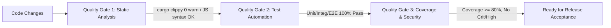

# 22. QA Test Strategy & Quality Gates: CTF Unified Workspace Platform

**Profile ID**: `PRF-22-QALEAD`  
**Status**: `COMPLETED`  
**Role**: QA Lead / Test Architect (Тест-архитектор)  
**Input Documents**:  
- `docs/it-company/01-product-discovery-manager.md` (Product Vision & Scope)  
- `docs/it-company/02-business-analyst.md` (Epics EP-00..05, User Stories, Use Cases)  
- `docs/it-company/03-product-manager.md` (Backlog, Gates G0..G3)  
- `docs/it-company/04-solution-architect.md` (System Architecture, Sandboxing, CAS)  
- `docs/it-company/05-security-architect.md` (Threat Model, Sanitization, Secret Masking)  
- `docs/it-company/06-system-analyst.md` (Sequence, Flow & State Machines)  
- `docs/it-company/07-database-architect.md` & `08-database-engineer.md` (SQLite V002/U002 migrations)  
- `docs/it-company/09-backend-architect.md`, `10-backend-logic-developer.md`, `11-backend-api-developer.md`, `12-backend-integration-engineer.md`  
- `docs/it-company/16-frontend-architect.md`, `17-ux-designer.md`, `18-ui-designer.md`, `19-frontend-logic-developer.md`, `20-ui-component-developer.md`, `20a-data-visualization-engineer.md`, `21-frontend-integration-engineer.md`  

---

## 1. Executive Summary & Quality Vision

Платформа **CTF Unified Workspace Platform** предназначена для безопасного, структурированного и воспроизводимого решения задач Jeopardy CTF (Web, Crypto, Reverse, Pwn, Forensics, Stego, OSINT, Misc). 
Специфика тестирования CTF-платформы:
1. **Работа с потенциально вредоносными бинарными и поврежденными файлами**: парсеры и UI ни при каких обстоятельствах не должны падать или зависать при открытии некорректных артефактов (Failsafe & Crash-Resilience).
2. **Безопасность выполнения (Process Isolation & Tree Killing)**: отсутствие command injection при запуске внешних CLI утилит и гарантированное уничтожение дерева зависших процессов.
3. **Целостность и неизменяемость данных (CAS & SQLite ACID)**: строгая проверка BLAKE3/SHA-256 хэшей и надежность миграций БД (V002/U002).
4. **Конфиденциальность**: предотвращение утечки токенов и секретов в логах и экспортируемых Write-up отчетах.

---

## 2. Test Pyramid & Proportions

```
             / \
            /   \     E2E UI / Desktop Smoke (10%)
           /-----\    - IPC round-trip, UI state consistency, end-to-end solve flow
          / Integ \   Backend & Storage Integration (30%)
         /---------\  - SQLite V002 migrations, CAS storage, Engine IPC handlers, Job Runner
        /   Unit    \ Pure Logic & Domain Components (60%)
       /-------------\- Rust Domain Logic (hash, recipe transforms, flag regex, token sanitizer)
                       - Frontend Stores & Data Viz (hex virtualizer, entropy, byte distribution)
```

| Уровень | Доля | Технологический стек | Ответственные роли |
|---|---|---|---|
| **Unit Tests** | ~60% | Rust `cargo test --lib`, Node.js syntax/unit harnesses | Unit Test Engineer (`PRF-23-UNITQA`) |
| **Integration Tests** | ~30% | Rust `cargo test --test ctf_storage_test`, `ctf_e2e_integration_test` | Integration Test Engineer (`PRF-24-INTQA`) |
| **E2E Automation** | ~10% | `apps/desktop-ui/scripts/test-ctf-e2e.mjs`, Cargo integration suites | E2E Automation Engineer (`PRF-25-E2EQA`) |
| **Accessibility (A11y)** | Baseline | WCAG 2.1 AA Checklist, ARIA labels, Contrast | Accessibility Auditor (`PRF-26A-A11Y`) |
| **Manual / Exploratory** | Gate pass | Исследовательское тестирование граничных кейсов | Manual QA Engineer (`PRF-26-MANQA`) |

---

## 3. Requirements Traceability Matrix (RTM)

Сквозное отображение требований PRD/BA (`EP-00` .. `EP-05`) в конкретные тест-кейсы (`TC-UNIT`, `TC-INT`, `TC-E2E`, `TC-SEC`).

### 3.1. Epic EP-00: Baseline Stability, Migration & CAS Storage

| Req ID | User Story | Test Case ID | Test Type | Сценарий и условия приёмки |
|---|---|---|---|---|
| `REQ-EP00-01` | US-00.1: Аддитивная миграция SQLite | `TC-INT-MIG-01` | Integration | **Positive**: Применение `V002_ctf_core_schema.sql` на базу V001. Все таблицы CTF создаются без ошибок; существующие записи `cases` остаются интактными. |
| `REQ-EP00-02` | US-00.1: Откат схемы (Rollback) | `TC-INT-MIG-02` | Integration | **Negative/Recovery**: Выполнение `U002_ctf_core_schema.sql` корректно удаляет CTF таблицы и возвращает БД в исходное состояние V001 без потери системных данных. |
| `REQ-EP00-03` | US-00.2: Универсальный Ingestion в CAS | `TC-UNIT-CAS-01` | Unit | **Positive**: Сохранение валидного файла; вычисление BLAKE3 и SHA-256; проверка bit-for-bit совпадения при чтении. |
| `REQ-EP00-04` | US-00.2: Сохранение поврежденного файла | `TC-INT-CAS-02` | Integration | **Resilience**: Импорт усеченного/поврежденного файла 100 МБ. Хранилище присваивает статус `stored/unclassified`, парсер не паникует. |
| `REQ-EP00-05` | US-00.2: Дедупликация артефактов | `TC-UNIT-CAS-03` | Unit | **Positive**: Повторная загрузка файла с идентичным BLAKE3 хэшем не дублирует физический блоб в CAS, возвращая существующий `artifact_id`. |

### 3.2. Epic EP-01: CTF Workspace & Challenge Hierarchy

| Req ID | User Story | Test Case ID | Test Type | Сценарий и условия приёмки |
|---|---|---|---|---|
| `REQ-EP01-01` | US-01.1: CRUD соревнований и тасок | `TC-INT-WS-01` | Integration | **Positive**: Создание соревнования с кастомным regex (`^flag\{[a-z0-9_]+\}$`), добавление тасок категорий `Web`, `Crypto`, `Pwn`. Проверка каскадной изоляции. |
| `REQ-EP01-02` | US-01.2: Валидация сетевых таргетов | `TC-UNIT-TGT-01` | Unit | **Positive/Negative**: Валидация форматов `host:port`, `http://...`, `nc host port`. Отклонение некорректных адресов (спецсимволы, port > 65535). |
| `REQ-EP01-03` | US-01.2: Подстановка переменных окружения | `TC-UNIT-TGT-02` | Unit | **Positive**: Раскрытие шаблонов `{{target.host}}` и `{{target.port}}` в аргументах запуска инструментов. |

### 3.3. Epic EP-02: Job Engine & Tool Registry

| Req ID | User Story | Test Case ID | Test Type | Сценарий и условия приёмки |
|---|---|---|---|---|
| `REQ-EP02-01` | US-02.1: Изоляция аргументов (No Command Injection) | `TC-SEC-JOB-01` | Security/Unit | **Security**: Запуск инструмента с именем файла `payload; rm -rf /` или `& calc.exe`. Проверка, что аргумент передан в `argv` без интерпретации шеллом. |
| `REQ-EP02-02` | US-02.2: Ограничение времени (Timeout Kill) | `TC-INT-JOB-02` | Integration | **Boundary**: Запуск зависающего процесса (`sleep 1000` / while-loop). Проверка срабатывания таймаута (например, 2 сек) и принудительного завершения. |
| `REQ-EP02-03` | US-02.2: Уничтожение дерева процессов (Process Tree Kill) | `TC-INT-JOB-03` | Integration | **Resilience**: Запуск процесса, порождающего дочерние процессы. По сигналу Cancel проверяется уничтожение как родительского, так и дочерних PID (`taskkill /T /F` / `kill -- -PID`). |
| `REQ-EP02-04` | US-02.1: Стриминг stdout/stderr и кольцевой буфер | `TC-UNIT-JOB-04` | Unit | **Performance**: Инструмент генерирует 50 МБ вывода. Проверка, что память процесса ограничена кольцевым буфером, а UI не зависает. |

### 3.4. Epic EP-03: Artifact Inspection, Hex Viewer & Transformation Recipes

| Req ID | User Story | Test Case ID | Test Type | Сценарий и условия приёмки |
|---|---|---|---|---|
| `REQ-EP03-01` | US-03.1: Виртуализированный Hex Viewer | `TC-UNIT-HEX-01` | Unit (JS) | **Performance**: Рендеринг бинарного файла 100 МБ. В DOM рендерится только видимое окно строк (viewport paging); FPS >= 55. |
| `REQ-EP03-02` | US-03.1: Энтропия и распределение байт | `TC-UNIT-DATAVIZ-01` | Unit (JS) | **Mathematical**: Расчет энтропии Шеннона по окнам 256 байт и частотной гистограммы (0..255). Проверка точности на эталонных сжатых и текстовых блоках. |
| `REQ-EP03-03` | US-03.2: Цепочка трансформаций (Recipe Pipeline) | `TC-UNIT-RCP-01` | Unit | **Positive**: Последовательное применение `From Hex` -> `XOR(0x42)` -> `Gunzip`. Результат соответствует ожидаемому plaintext. |
| `REQ-EP03-04` | US-03.2: Откат и изоляция шагов рецепта | `TC-UNIT-RCP-02` | Unit | **Negative**: Ошибка на шаге `Gunzip` (некорректный заголовок) возвращает детальную диагностическую ошибку, не ломая предыдущие шаги в цепочке. |

### 3.5. Epic EP-04: Flag Lifecycle, Evidence & Reproducible Write-ups

| Req ID | User Story | Test Case ID | Test Type | Сценарий и условия приёмки |
|---|---|---|---|---|
| `REQ-EP04-01` | US-04.1: Распознавание кандидата флага по regex | `TC-UNIT-FLG-01` | Unit | **Positive**: Поиск по regex в выводе инструмента; автоматическое создание кандидата со статусом `candidate`. |
| `REQ-EP04-02` | US-04.1: Жизненный цикл флага (Candidate -> Accepted/Rejected) | `TC-INT-FLG-02` | Integration | **Workflow**: Переход флага в статус `accepted` переводит задачу в `Solved`. Переход в `rejected` скрывает кандидата из активных списков. |
| `REQ-EP04-03` | US-04.2: Экспорт Write-up и маскирование секретов | `TC-SEC-WUP-01` | Security/Unit | **Security**: Генерация Markdown отчета. Учетные данные, токены платформ и ключи заменяются плейсхолдерами `[REDACTED:...]`. |
| `REQ-EP04-04` | US-04.2: Воспроизводимость шагов решения | `TC-INT-WUP-02` | Integration | **Reproducibility**: Экспортированный отчет содержит точные SHA-256 артефактов, аргументы CLI и параметры рецептов для повторного воспроизведения. |

### 3.6. Epic EP-05: Desktop UI / Webview Experience & Performance

| Req ID | User Story | Test Case ID | Test Type | Сценарий и условия приёмки |
|---|---|---|---|---|
| `REQ-EP05-01` | US-05.1: IPC Communication & Error Sanitization | `TC-INT-IPC-01` | Integration | **Robustness**: Запрос неизвестной команды или передача невалидного payload через IPC возвращает структурированный `IpcError` без аварийного завершения сервера. |
| `REQ-EP05-02` | US-05.2: Синтаксис и совместимость UI скриптов | `TC-UNIT-UI-01` | Unit | **Syntax/Lint**: Валидация всего фронтенд кода через `scripts/check-syntax.mjs` (ES Modules, Browser globals, 0 синтаксических ошибок). |
| `REQ-EP05-03` | US-05.2: Сквозной E2E цикл решения таски | `TC-E2E-FULL-01` | E2E | **E2E Smoke**: Создание соревнования -> добавление таски -> импорт артефакта -> применение рецепта -> обнаружение флага -> принятие флага -> экспорт write-up. |

---

## 4. Test Environment & Test Data Specification

### 4.1. Тестовые фикстуры и генераторы данных (`fixtures/`)
1. **База данных SQLite**:
   - `crates/storage-sqlite/fixtures/v001_legacy_baseline.db`: снимок базы данных версии V001 с 3 делами и 15 уликами для проверки гладкой миграции.
   - Чистая in-memory БД `:memory:` для быстрых изолированных интеграционных тестов репозиториев.
2. **Бинарные артефакты**:
   - `fixtures/ctf/sample_rev.bin`: синтетический исполняемый файл для тестов Strings и Hex viewer.
   - `fixtures/ctf/corrupted_archive.zip`: поврежденный ZIP с искаженными заголовками для стресс-теста CAS Ingestion.
   - `fixtures/ctf/encoded_flag.hex`: закодированный hex-дамп (XOR+Base64) для верификации цепочки рецептов.
3. **Моки и виртуальные адаптеры инструментов**:
   - Mock-адаптер CLI: эмулятор утилиты с контролируемым временем ответа (0.1с, 5с, вечный цикл) и настраиваемым размером stdout для проверки Job Runner таймаутов.

---

## 5. Quality Gates & Definition of Done (DoD)

Для допуска к релизу и прохождения Human Gate 2 / Gate 3 установлены следующие строгие критерии:



### 5.1. Критерии Quality Gates (DoD):
1. **Static Analysis & Compilation**:
   - `cargo check --all-targets` и `cargo clippy --all-targets --all-features -- -D warnings` — **0 предупреждений**.
   - `node scripts/check-syntax.mjs` — **0 синтаксических ошибок** во всех модулях `apps/desktop-ui/js/ctf/`.
2. **Test Automation Execution**:
   - 100% прохождение всех тестов хранилища (`ctf_storage_test.rs`).
   - 100% прохождение сквозного E2E теста бэкенда (`ctf_e2e_integration_test.rs`).
   - 100% прохождение E2E скрипта фронтенда (`apps/desktop-ui/scripts/test-ctf-e2e.mjs`).
3. **Coverage Thresholds**:
   - Не менее 80% покрытия кода в новых модулях `crates/storage-sqlite/src/ctf_*.rs`.
   - Не менее 85% покрытия в утилитах трансформации и валидации рецептов.
4. **Security & Resilience**:
   - 0 уязвимостей типа Command Injection при запуске внешних процессов.
   - 0 утечек незамаскированных секретов в Write-up генераторе.
   - 0 паник/аварийных падений сервиса на некорректных входных файлах.

---

## 6. Handoff to Next Roles

После утверждения данной стратегии тестирование передается инженерным ролям:
1. **Unit Test Engineer (`23-unit-test-engineer`)**: Реализация и верификация модульных тестов по спецификациям `TC-UNIT-*`.
2. **Integration Test Engineer (`24-integration-test-engineer`)**: Запуск и расширение интеграционных тестов `TC-INT-*` (миграции БД, репозитории, Job Runner).
3. **E2E Test Automation Engineer (`25-e2e-test-automation-engineer`)**: Автоматизация сквозного пользовательского сценария `TC-E2E-FULL-01`.
4. **DevOps & CI/CD Engineers (`28-devops-build-engineer`, `29-cicd-pipeline-engineer`)**: Включение Quality Gates в CI-пайплайн проверки pull request.
