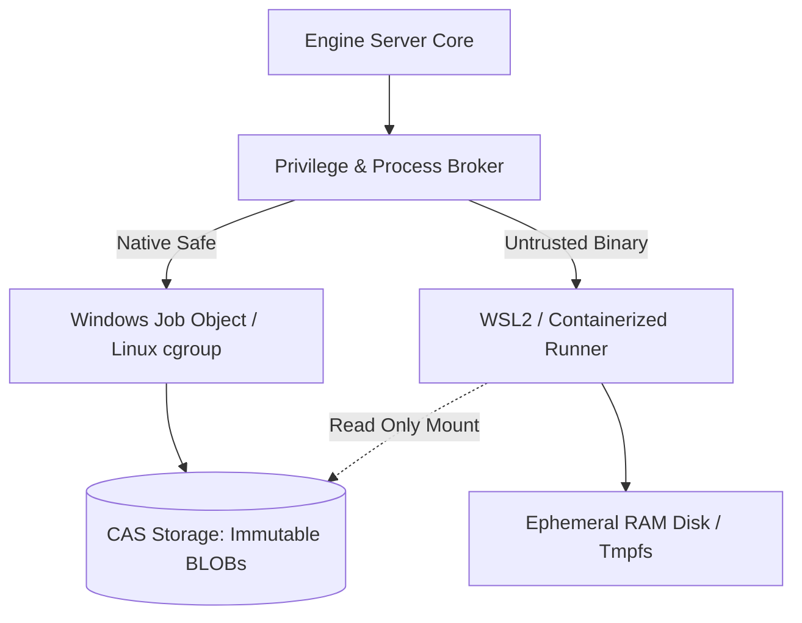

# 27. Infrastructure Architecture Specification: CTF Unified Workspace Platform

**Profile ID**: `PRF-27-INFRAARCH`  
**Status**: `COMPLETED`  
**Role**: Infrastructure Architect (Архитектор инфраструктуры)  
**Input Documents**:  
- `docs/it-company/00-requirements-contract.md` (NFR, isolation, platforms)  
- `docs/it-company/04-solution-architect.md` (System components & CAS layout)  
- `docs/it-company/05-security-architect.md` (Sandboxing & process containment)  
- `docs/it-company/08-database-engineer.md` (SQLite WAL & backup strategy)  

---

## 1. Runtime Pattern & Topology Selection

Для платформы CTF Unified Workspace выбран **Гибридный двухуровневый Runtime Pattern**:

1. **Primary Desktop Pattern: `native_desktop_runtime`**:
   - Ядро бэкенда компилируется в нативный автономный бинарный сервис `engine-server` (Rust).
   - Локальная межпроцессная связь через высокоскоростной IPC сокет / Named Pipe (`\\.\pipe\soc-dfir-engine` на Windows, `/tmp/soc-dfir-engine.sock` на Unix) либо локальный Loopback HTTP сервер (`127.0.0.1:8080`).
   - Фронтенд работает в среде Desktop Shell / Webview2 с нулевым внешним оверхедом и прямым доступом к аппаратному ускорению отрисовки Hex Canvas.

2. **Containerized Headless Pattern: `docker_compose_headless`**:
   - Для серверных развертываний, CI/CD верификации и headless-режима CTF-соревнований: легковесный Docker-контейнер на базе `debian:bookworm-slim` с предустановленными зависимостями (`tshark`, `strings`, `binwalk`, `python3-pwntools`).

---

## 2. Спецификация песочниц и изоляции исполнения (Runner Isolation)

- **Windows Native Isolation**:
  - Исполнение через Windows Job Objects с ограничением CPU Rate, лимитом Commit Memory (макс. 2 ГБ на процесс) и запретом порождения дочерних процессов вне дерева.
- **Linux / WSL2 Containerized Isolation**:
  - Запуск через изоляцию `namespaces` (pid, net, mnt) и `seccomp-bpf` фильтры.
  - Тома артефактов монтируются строго в режиме `read-only` (`:ro`). Выходные данные пишутся в одноразовый `tmpfs`.

---

## 3. Health Probes Contract

Сервер экспортирует диагностические эндпоинты жизнеспособности (доступны по HTTP `127.0.0.1:8080` и через IPC-вызов `system.health`):

1. **Liveness Probe (`/health/live`)**:
   - `HTTP 200 OK`: `{"status": "alive", "uptime_sec": 1420}`
   - Возвращает `alive` пока цикл событий Tokio и поток IPC активны.
2. **Readiness Probe (`/health/ready`)**:
   - `HTTP 200 OK`: `{"status": "ready", "checks": {"sqlite_wal": "connected", "cas_storage": "writable", "job_queue": "ready"}}`
   - `HTTP 503 Service Unavailable`: если файл БД заблокирован либо дисковый накопитель CAS переполнен (>95% диска).

---

## 4. Disaster Recovery & Данные (RPO / RTO)

- **RPO (Recovery Point Objective)**: **0 секунд**. SQLite WAL в режиме `synchronous = NORMAL` гарантирует сохранение всех закоммиченных транзакций при внезапном сбое питания или падении процесса.
- **RTO (Recovery Time Objective)**: **< 2 секунд**. Холодный рестарт `engine-server` с автоматическим накатыванием WAL и верификацией целостности хранилища.
- **Бэкап**: Периодический горячий снимок БД через команду `VACUUM INTO 'backups/app_{timestamp}.db'` каждые 4 часа и перед накатом миграций.
